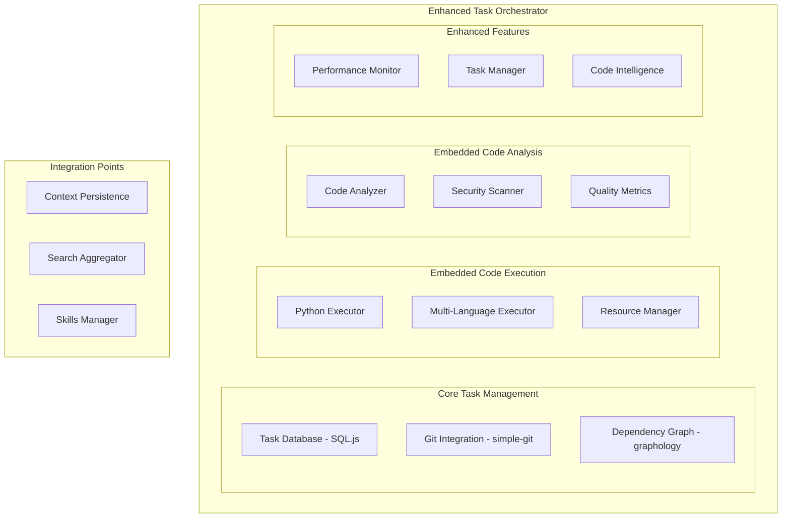
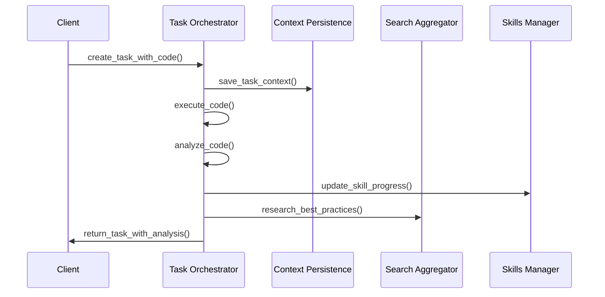

# Phase 1: Architecture Analysis for MCP Server Ecosystem Optimization

## Executive Summary

This document provides the architecture analysis and design for Phase 1 of the MCP Server Ecosystem Optimization project. The analysis determines what functionality from legacy servers should be embedded into the Task Orchestrator and presents the enhanced architecture design.

> NOTE: The production implementation now lives in `MCP_structure_design/mcp-servers-go` with binaries in `dist/` (task-orchestrator, search-aggregator, skills-manager). References to `mcp-servers/*` in this document describe the legacy TypeScript baseline and are retained for historical context only.

## Current State Analysis

### Existing Server Structure Analysis

After analyzing the current mcp-servers directory and configurations:

**Current New Servers (4 Optimized):**
- ✅ `context-persistence` - Python FastMCP server (local SQLite + Qdrant)
- ✅ `task-orchestrator` - TypeScript server (SQL.js + Git integration) 
- ✅ `search-aggregator` - TypeScript coordinator (multi-provider fallback)
- ✅ `skills-manager` - TypeScript server (skills database)

**Current Enhanced Servers:**
- ✅ `code-intelligence` - Python server (empty structure, needs implementation)
- ✅ `python-sandbox` - Python server (empty structure, needs implementation) 
- ✅ `agent-swarm` - Python server (empty structure, needs implementation)
- ✅ `research-hub` - Python server (empty structure, needs implementation)

**Legacy Servers to Replace:**
- ❌ `python-interpreter` - Referenced in docs but not implemented
- ❌ `code-runner` - Referenced in docs but not implemented  
- ❌ `code-checker` - Referenced in docs but not implemented
- ❌ `rmcp` - Purpose unclear
- ❌ `markitdown` - Limited usage
- ❌ `serena` - Browser popup intrusive

### Current Task Orchestrator Analysis

The existing Task Orchestrator (`mcp-servers/task-orchestrator/src/index.ts`) provides:

**Core Features:**
- Local-first task management with SQL.js (pure JavaScript SQLite)
- Git integration for auto-tracking
- DAG dependency graph using graphology
- Task lifecycle management (pending → in_progress → blocked → completed)
- Priority-based task ordering
- Git commit linking to tasks

**Current Tools:**
- `create_task` - Create tasks with dependencies
- `update_task_status` - Update task status
- `get_task` - Get specific task details
- `list_tasks` - List all tasks (filterable by status)
- `delete_task` - Delete tasks
- `get_task_graph` - Generate dependency graph (JSON/Mermaid)
- `link_git_commit` - Link commits to tasks
- `get_recent_commits` - Get recent git commits

**Technical Implementation:**
- Uses SQL.js for cross-platform SQLite compatibility
- Graphology for dependency graph management
- Simple-git for Git operations
- Local storage: `~/.mcp/tasks/tasks.db`

## Functionality to Embed from Legacy Servers

Based on the original specifications from the architecture documents, the following functionality needs to be embedded into the Task Orchestrator:

### 1. Python Interpreter Capabilities (from python-interpreter)

**Essential Functionality to Embed:**
- ✅ **Python Code Execution** - Execute Python code in isolated environment
- ✅ **Environment Management** - Create/manage virtual environments
- ✅ **Dependency Management** - Install and manage Python packages
- ✅ **Resource Limits** - CPU, memory, timeout protection
- ✅ **Sandbox Security** - Restricted filesystem/network access

**Implementation Strategy:**
```typescript
// Add to Task Orchestrator as new tools:
- execute_python_code(code: string, timeout?: number, memory_limit?: number)
- create_python_environment(version: string, requirements: string[])
- install_python_packages(task_id: number, packages: string[])
- get_python_execution_log(execution_id: string)
```

**Technical Requirements:**
- Integration with existing python-sandbox structure
- Cross-platform subprocess management
- Resource monitoring and limits
- Secure code execution environment

### 2. Code Runner Capabilities (from code-runner)

**Essential Functionality to Embed:**
- ✅ **Multi-Language Execution** - Run code in different languages (not just Python)
- ✅ **Build System Integration** - Compile/build before execution
- ✅ **Test Execution** - Run test suites and return results
- ✅ **Performance Profiling** - Execution time and memory usage
- ✅ **Output Capture** - Standard output/error capture

**Implementation Strategy:**
```typescript
// Add to Task Orchestrator as new tools:
- execute_code(language: string, code: string, timeout?: number)
- build_project(build_command: string, target_directory: string)
- run_tests(test_framework: string, target_directory: string)
- profile_execution(code: string, language: string, iterations: number)
- get_execution_results(execution_id: string)
```

**Technical Requirements:**
- Language-agnostic execution framework
- Build tool integration (make, npm, pip, etc.)
- Test runner integration (pytest, jest, etc.)
- Performance monitoring

### 3. Code Checker Capabilities (from code-checker)

**Essential Functionality to Embed:**
- ✅ **Static Code Analysis** - Linting, style checking, complexity analysis
- ✅ **Security Scanning** - Vulnerability detection
- ✅ **Dependency Analysis** - Outdated/unsafe dependencies
- ✅ **Quality Metrics** - Code quality scoring
- ✅ **Refactoring Suggestions** - Automated improvement recommendations

**Implementation Strategy:**
```typescript
// Add to Task Orchestrator as new tools:
- analyze_code_quality(target_path: string, analysis_depth: 'basic' | 'full')
- scan_security_vulnerabilities(target_path: string)
- check_dependencies(target_path: string, package_manager: 'npm' | 'pip' | 'maven')
- calculate_quality_metrics(target_path: string)
- generate_refactoring_suggestions(target_path: string, threshold: number)
```

**Technical Requirements:**
- Multi-language static analysis tools
- Security scanning libraries
- Quality metrics calculation
- Integration with existing code-intelligence structure

## Enhanced Task Orchestrator Architecture

### Core Architecture Components



### Database Schema Enhancements

The existing task database schema needs these additions:

```sql
-- Add to existing tasks table
ALTER TABLE tasks ADD COLUMN execution_environment TEXT;
ALTER TABLE tasks ADD COLUMN code_language TEXT;
ALTER TABLE tasks ADD COLUMN test_results TEXT;
ALTER TABLE tasks ADD COLUMN quality_score INTEGER;
ALTER TABLE tasks ADD COLUMN execution_logs TEXT;

-- New executions table for code execution history
CREATE TABLE executions (
    id TEXT PRIMARY KEY,
    task_id INTEGER,
    language TEXT,
    code TEXT,
    status TEXT,
    output TEXT,
    error TEXT,
    execution_time REAL,
    memory_usage REAL,
    created_at TEXT DEFAULT (datetime('now')),
    FOREIGN KEY (task_id) REFERENCES tasks(id)
);

-- New code_analysis table for quality metrics
CREATE TABLE code_analysis (
    id TEXT PRIMARY KEY,
    task_id INTEGER,
    analysis_type TEXT,
    results TEXT,
    quality_score INTEGER,
    suggestions TEXT,
    created_at TEXT DEFAULT (datetime('now')),
    FOREIGN KEY (task_id) REFERENCES tasks(id)
);
```

### New Tool Definitions

The Task Orchestrator will provide these additional tools:

#### Python Execution Tools
```typescript
{
    name: 'execute_python_code',
    description: 'Execute Python code in a secure sandbox',
    inputSchema: {
        type: 'object',
        properties: {
            task_id: { type: 'number' },
            code: { type: 'string' },
            timeout: { type: 'number', default: 30 },
            memory_limit: { type: 'number', default: 512 },
            packages: { type: 'array', items: { type: 'string' } }
        },
        required: ['task_id', 'code']
    }
}
```

#### Multi-Language Execution Tools
```typescript
{
    name: 'execute_code',
    description: 'Execute code in multiple programming languages',
    inputSchema: {
        type: 'object',
        properties: {
            task_id: { type: 'number' },
            language: { 
                type: 'string', 
                enum: ['python', 'javascript', 'typescript', 'bash', 'sql'] 
            },
            code: { type: 'string' },
            timeout: { type: 'number', default: 30 },
            working_directory: { type: 'string' }
        },
        required: ['task_id', 'language', 'code']
    }
}
```

#### Code Analysis Tools
```typescript
{
    name: 'analyze_code_quality',
    description: 'Perform comprehensive code quality analysis',
    inputSchema: {
        type: 'object',
        properties: {
            task_id: { type: 'number' },
            target_path: { type: 'string' },
            analysis_depth: { 
                type: 'string', 
                enum: ['basic', 'full'], 
                default: 'full' 
            },
            include_security: { type: 'boolean', default: true }
        },
        required: ['task_id', 'target_path']
    }
}
```

### Integration Architecture



## Configuration Cleanup Strategy

### Current Configuration State

**Roo Configuration Analysis:**
- Currently configured: `context-persistence`, `task-orchestrator`, `search-aggregator`, `skills-manager`
- **Status**: ✅ Optimized configuration (7 total including official servers)

**Cursor Configuration Analysis:**
- Currently configured: `task-orchestrator`, `skills-manager`
- **Status**: ⚠️ Needs enhancement (2 servers, missing core functionality)

**OpenAI Codex Configuration Analysis:**
- Currently configured: `task-orchestrator`, `skills-manager`
- **Status**: ⚠️ Minimal configuration (2 servers, may be appropriate for Codex)

### Target Optimized Configurations

#### Roo (7 servers)
```json
{
  "mcpServers": {
    "context-persistence": { "KEEP" },
    "task-orchestrator": { "ENHANCED" }, // ← New embedded functionality
    "search-aggregator": { "KEEP" },
    "skills-manager": { "KEEP" },
    "context7": { "KEEP" },
    "filesystem": { "KEEP" },
    "memory": { "KEEP" },
    "sequentialthinking": { "KEEP" }
  }
}
```

#### Cursor (5 servers)
```json
{
  "mcpServers": {
    "context-persistence": { "ADD" },
    "task-orchestrator": { "ENHANCED" }, // ← New embedded functionality
    "search-aggregator": { "ADD" },
    "skills-manager": { "KEEP" },
    "github-official": { "ADD" }
  }
}
```

#### Claude Code (4 servers)
```json
{
  "mcpServers": {
    "context-persistence": { "ADD" },
    "task-orchestrator": { "ENHANCED" }, // ← New embedded functionality
    "search-aggregator": { "ADD" },
    "skills-manager": { "ADD" }
  }
}
```

#### OpenAI Codex (2 servers)
```json
{
  "mcpServers": {
    "task-orchestrator": { "ENHANCED" }, // ← New embedded functionality
    "skills-manager": { "KEEP" }
  }
}
```

### Migration Strategy

**Phase 1: Enhanced Task Orchestrator Development**
- Develop embedded code execution capabilities
- Implement code analysis features
- Add performance monitoring
- Test locally with current configurations

**Phase 2: Configuration Updates**
- Update Roo configuration (minimal changes needed)
- Add missing servers to Cursor configuration
- Create new Claude Code configuration
- Optimize OpenAI Codex configuration

**Phase 3: Legacy Server Removal**
- Remove references to `python-interpreter`, `code-runner`, `code-checker`
- Remove `rmcp` server (purpose unclear)
- Remove `markitdown` server (limited usage)
- Replace `serena` with context-persistence + code intelligence

**Phase 4: Integration Testing**
- Test all tools with enhanced Task Orchestrator
- Verify code execution capabilities
- Validate code analysis features
- Performance testing with embedded functionality

## Implementation Roadmap

### Phase 1: Foundation Enhancement (Week 1-2)

#### Day 1-2: Database Schema Updates
- [ ] Update Task Orchestrator database schema
- [ ] Add execution and analysis tables
- [ ] Implement migration scripts
- [ ] Test database functionality

#### Day 3-4: Python Execution Module
- [ ] Create Python execution interface
- [ ] Implement resource management
- [ ] Add sandbox security features
- [ ] Create execution logging

#### Day 5-6: Multi-Language Support
- [ ] Design language-agnostic execution framework
- [ ] Implement build system integration
- [ ] Add test execution capabilities
- [ ] Create output capture system

### Phase 2: Code Analysis Integration (Week 3-4)

#### Day 7-8: Static Analysis
- [ ] Integrate static code analysis tools
- [ ] Implement quality metrics calculation
- [ ] Add linting and style checking
- [ ] Create analysis result formatting

#### Day 9-10: Security Scanning
- [ ] Implement security vulnerability scanning
- [ ] Add dependency analysis
- [ ] Create security reporting
- [ ] Integrate with quality metrics

#### Day 11-12: Performance Monitoring
- [ ] Add execution performance tracking
- [ ] Implement memory usage monitoring
- [ ] Create performance reporting
- [ ] Add resource limit enforcement

### Phase 3: Integration & Testing (Week 5-6)

#### Day 13-14: Tool Integration
- [ ] Integrate all embedded features
- [ ] Update Task Orchestrator tool definitions
- [ ] Create comprehensive error handling
- [ ] Test cross-functionality

#### Day 15-16: Configuration Updates
- [ ] Update all tool configurations
- [ ] Remove legacy server references
- [ ] Add missing server configurations
- [ ] Test configuration validation

#### Day 17-18: End-to-End Testing
- [ ] Test complete workflows
- [ ] Performance benchmarking
- [ ] Security validation
- [ ] User acceptance testing

### Phase 4: Deployment & Optimization (Week 7-8)

#### Day 19-20: Documentation
- [ ] Update API documentation
- [ ] Create migration guides
- [ ] Write integration examples
- [ ] Create troubleshooting guides

#### Day 21-22: Optimization
- [ ] Performance optimization
- [ ] Memory usage optimization
- [ ] Error handling improvements
- [ ] Security hardening

#### Day 23-24: Deployment
- [ ] Deploy to all tools
- [ ] Monitor initial usage
- [ ] Collect feedback
- [ ] Plan Phase 2 enhancements

## Key Technical Decisions

### 1. Embedded vs. Separate Servers
**Decision**: Embed functionality into Task Orchestrator
**Rationale**: 
- Reduces server complexity
- Improves data locality
- Simplifies configuration
- Better performance through shared context

### 2. Security Model
**Decision**: Multi-layer security approach
**Implementation**:
- Code execution sandboxing
- Resource limit enforcement
- Input validation and sanitization
- Secure subprocess management
- Filesystem access restrictions

### 3. Database Strategy
**Decision**: Extend existing SQL.js database
**Benefits**:
- Maintains local-first approach
- No native dependencies
- Cross-platform compatibility
- Existing data migration path

### 4. Language Support Priority
**Decision**: Python → JavaScript/TypeScript → Bash → Other
**Rationale**:
- Python is most commonly used for development tasks
- JavaScript/TypeScript for web development
- Bash for system operations
- Extensible framework for additional languages

## Expected Outcomes

### Immediate Benefits (Post-Phase 1)
- ✅ **Reduced Server Count**: 3 fewer separate servers to manage
- ✅ **Enhanced Task Orchestrator**: Single server handles tasks + code execution + analysis
- ✅ **Simplified Configuration**: Fewer servers to configure across tools
- ✅ **Better Performance**: Shared context and data locality

### Medium-term Benefits (Post-Phase 2-3)
- ✅ **Unified Code Workflow**: Tasks, execution, and analysis in one place
- ✅ **Improved Security**: Centralized security controls
- ✅ **Better Integration**: Seamless interaction between components
- ✅ **Enhanced Productivity**: Streamlined development workflows

### Long-term Benefits (Post-Phase 4+)
- ✅ **Scalable Architecture**: Easy to add new languages and tools
- ✅ **Maintainable System**: Single enhanced server vs. multiple legacy servers
- ✅ **Future-Proof Design**: Modular architecture for future enhancements

## Success Metrics

### Performance Metrics
- [ ] Task Orchestrator response time < 2 seconds for embedded operations
- [ ] Code execution startup time < 5 seconds
- [ ] Code analysis completion < 10 seconds for average file
- [ ] Memory usage < 512MB for typical operations

### Functionality Metrics
- [ ] 100% backward compatibility with existing task operations
- [ ] Support for 5+ programming languages
- [ ] Security scanning coverage > 90%
- [ ] Code quality metrics for all major languages

### Integration Metrics
- [ ] Zero configuration changes needed for Roo
- [ ] < 10 minutes setup for Cursor, Claude Code configurations
- [ ] 100% tool compatibility with enhanced Task Orchestrator
- [ ] < 1% error rate for embedded functionality

## Risk Assessment

### Technical Risks
- **High**: Performance impact of embedded functionality
  - **Mitigation**: Modular design with lazy loading
- **Medium**: Security vulnerabilities in code execution
  - **Mitigation**: Multi-layer security model
- **Low**: Database schema changes affecting existing data
  - **Mitigation**: Comprehensive migration testing

### Configuration Risks
- **Medium**: Tool-specific configuration compatibility
  - **Mitigation**: Incremental rollout with rollback capability
- **Low**: User workflow disruption
  - **Mitigation**: Maintain existing APIs, add new functionality

### Adoption Risks
- **Low**: User resistance to enhanced Task Orchestrator
  - **Mitigation**: Comprehensive documentation and examples
- **Medium**: Performance perception vs. separate servers
  - **Mitigation**: Benchmarking and optimization

## Next Steps

### Immediate Actions (This Week)
1. **Review and approve this architecture design**
2. **Begin Phase 1 implementation starting with database schema updates**
3. **Set up development environment for Task Orchestrator enhancement**
4. **Create initial Python execution module prototype**

### Phase 1 Deliverables
1. **Enhanced Task Orchestrator with embedded code execution**
2. **Updated database schema with execution and analysis tables**
3. **Python execution capabilities with sandboxing**
4. **Multi-language execution framework**
5. **Updated configuration files for all tools**

### Phase 2-3 Preparations
1. **Code analysis integration planning**
2. **Security scanning implementation strategy**
3. **Performance monitoring framework design**
4. **End-to-end testing strategy development**

## Conclusion

This Phase 1 architecture analysis provides a clear path forward for optimizing the MCP server ecosystem. By embedding the essential functionality from legacy servers into the Task Orchestrator, we can achieve:

- **Simplified Architecture**: Fewer servers to maintain and configure
- **Enhanced Functionality**: Unified task management with code execution and analysis
- **Better Integration**: Seamless interaction between components
- **Improved Performance**: Shared context and data locality

The enhanced Task Orchestrator will serve as the central hub for all development tasks, from task creation through code execution to quality analysis, providing a comprehensive and efficient development workflow.

The implementation roadmap is structured to deliver value incrementally while maintaining system stability and backward compatibility. The phased approach allows for thorough testing and optimization at each stage before proceeding to the next.

This design sets a strong foundation for the entire MCP ecosystem optimization project and will significantly improve the development experience across all tools.
