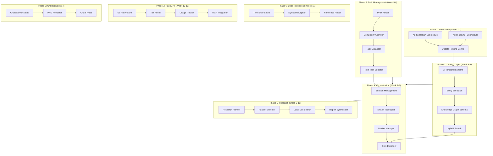

# Implementation Roadmap

## Dependency Graph



## Detailed Phase Breakdown

### Phase 1: Third-Party Additions (Foundation)

**Duration:** 1-2 weeks
**Effort:** Low
**Risk:** Low

| Task | Subtasks | Dependencies | Est. Hours |
|------|----------|--------------|------------|
| Add Atlassian MCP | Clone submodule, Docker setup, Config | None | 4 |
| Add FastMCP | Clone submodule, Verify install | None | 2 |
| Update Agent-Swarm Routing | Add keywords, Tool mapping | Submodules | 4 |
| Test Integration | End-to-end Jira/Confluence tests | All above | 4 |

**Deliverables:**
- `src/mcp-servers/external/atlassian-mcp/`
- `src/mcp-servers/external/fastmcp/`
- Updated `mcp-bridge.ts` with Atlassian routing
- Integration tests

---

### Phase 2: Context-Persistence Enhancements (from Graphiti)

**Duration:** 2 weeks
**Effort:** Medium-High
**Risk:** Medium (schema migrations)

| Task | Subtasks | Dependencies | Est. Hours |
|------|----------|--------------|------------|
| Bi-Temporal Schema | Add event_time, valid_from/until | None | 8 |
| Migration Script | Migrate existing data | Schema | 4 |
| Entity Model | Create Entity table, indexes | Schema | 6 |
| Relationship Model | Create Relationship table | Entity | 6 |
| Episode Model | Create Episode table | Schema | 4 |
| Entity Extractor | Pattern matching, NER | Models | 12 |
| Relationship Extractor | Co-occurrence analysis | Entity | 8 |
| BM25 Index | Keyword search index | None | 6 |
| Hybrid Search | Merge semantic + keyword + graph | All above | 12 |
| New Tools | 5 new MCP tools | All above | 8 |

**Deliverables:**
- Updated SQLAlchemy models
- Migration script
- `EntityExtractor` class
- `HybridSearch` class
- New tools: `extract_entities`, `create_relationship`, `query_knowledge_graph`, `search_hybrid`, `get_point_in_time_context`

**Testing:**
- Unit tests for extraction accuracy
- Integration tests for hybrid search
- Performance benchmarks for query latency

---

### Phase 3: Task-Orchestrator Enhancements (from Task-Master)

**Duration:** 2 weeks
**Effort:** Medium
**Risk:** Low

| Task | Subtasks | Dependencies | Est. Hours |
|------|----------|--------------|------------|
| PRD Parser | Regex patterns, Section extraction | None | 12 |
| Task Generator | PRD items to tasks | Parser | 8 |
| Dependency Inferrer | Keyword-based inference | Generator | 6 |
| Complexity Analyzer | Factor assessment, Scoring | None | 10 |
| Effort Estimator | PERT-like calculation | Analyzer | 4 |
| Task Expander | Recursive subtask generation | Complexity | 12 |
| Next Task Selector | Scoring, Recommendations | Dependencies | 10 |
| New Tools | 5 new MCP tools | All above | 8 |

**Deliverables:**
- `PRDParser` class
- `ComplexityAnalyzer` class
- `TaskExpander` class
- `NextTaskSelector` class
- New tools: `parse_prd`, `analyze_complexity`, `expand_task`, `get_next_task`, `get_project_complexity_report`

---

### Phase 4: Agent-Swarm Enhancements (from Claude-Flow)

**Duration:** 2 weeks
**Effort:** High
**Risk:** Medium (orchestration complexity)

| Task | Subtasks | Dependencies | Est. Hours |
|------|----------|--------------|------------|
| Session Schema | Tables, indexes | None | 4 |
| Session Manager | Create, pause, resume | Schema | 12 |
| Checkpoint System | Save/restore state | Session | 8 |
| Topology Base Class | Abstract interface | None | 4 |
| Hierarchical Topology | Queen/worker pattern | Base | 8 |
| Mesh Topology | Peer-to-peer routing | Base | 6 |
| Star Topology | Hub-spoke routing | Base | 6 |
| Worker Manager | Spawn, coordinate, aggregate | Topologies | 12 |
| Working Memory Tier | In-memory storage | None | 4 |
| Episodic Memory Tier | SQLite session storage | None | 6 |
| Persistent Memory Tier | Qdrant integration | Context-Persistence | 8 |
| Memory Promotion | Tier migration logic | All tiers | 6 |
| New Tools | 7 new MCP tools | All above | 10 |

**Deliverables:**
- `SwarmSession` management
- `SwarmTopology` implementations
- `WorkerManager` class
- `TieredMemory` class
- New tools: `swarm_session_create`, `swarm_session_resume`, `swarm_session_checkpoint`, `spawn_worker_agents`, `coordinate_parallel_tasks`, `memory_store_tiered`, `memory_search_tiered`

---

### Phase 5: Search-Aggregator Enhancements (from GPT-Researcher)

**Duration:** 2 weeks
**Effort:** Medium-High
**Risk:** Medium (external API reliability)

| Task | Subtasks | Dependencies | Est. Hours |
|------|----------|--------------|------------|
| Research Planner | Question generation | None | 10 |
| Search Strategy | Provider selection | Planner | 6 |
| Parallel Executor | Concurrent searches | Strategy | 12 |
| Source Validator | Reliability scoring | Executor | 8 |
| Local Doc Search | PDF/Markdown parsing | None | 12 |
| Finding Extractor | Content analysis | Validator | 8 |
| Theme Clusterer | Finding organization | Extractor | 6 |
| Report Synthesizer | Markdown generation | Clusterer | 10 |
| Citation Formatter | Reference management | Synthesizer | 4 |
| New Tools | 5 new MCP tools | All above | 8 |

**Deliverables:**
- `DeepResearcher` class
- `ResearchPlanner` class
- `ParallelExecutor` class
- `ReportSynthesizer` class
- `LocalDocumentSearch` class
- New tools: `deep_research`, `generate_research_plan`, `search_local_documents`, `generate_report`, `validate_sources`

---

### Phase 6: Code Intelligence (from Serena)

**Duration:** 1 week
**Effort:** Medium
**Risk:** Low

| Task | Subtasks | Dependencies | Est. Hours |
|------|----------|--------------|------------|
| Tree-Sitter Setup | Install parsers | None | 4 |
| Python Grammar | Parser config | Setup | 2 |
| TypeScript Grammar | Parser config | Setup | 2 |
| Go Grammar | Parser config | Setup | 2 |
| Rust Grammar | Parser config | Setup | 2 |
| Symbol Finder | Query patterns | Grammars | 8 |
| Reference Finder | Usage tracking | Symbol | 8 |
| Code Outliner | AST traversal | Symbol | 6 |
| New Tools | 5 new MCP tools | All above | 6 |

**Deliverables:**
- `TreeSitterAnalyzer` class
- Language parser configurations
- New tools: `find_symbol`, `find_references`, `get_code_outline`, `analyze_semantic_structure`, `insert_after_symbol`

---

### Phase 7: NanoGPT Go Proxy

**Duration:** 2 weeks
**Effort:** High
**Risk:** Medium (new language/service)

| Task | Subtasks | Dependencies | Est. Hours |
|------|----------|--------------|------------|
| Project Setup | Go modules, structure | None | 4 |
| Config Loader | YAML parsing | Setup | 4 |
| SQLite Storage | Usage tables | Setup | 6 |
| HTTP Router | Mux setup | Setup | 4 |
| Auth Middleware | API key validation | Router | 4 |
| Tier Router | Free/paid selection | Storage | 12 |
| Quota Tracker | Usage recording | Storage | 8 |
| Chat Handler | OpenAI-compatible | Tier | 10 |
| Completions Handler | Text completions | Chat | 4 |
| Embeddings Handler | Embedding API | Chat | 4 |
| Models Handler | List models | Storage | 4 |
| Management Endpoints | Usage, budget | All | 6 |
| Dockerfile | Container setup | All | 4 |
| MCP Integration | Agent-swarm client | All | 8 |
| New Tools | 3 new MCP tools | Integration | 4 |

**Deliverables:**
- Complete Go proxy service
- Dockerfile for deployment
- `NanoGPTClient` for agent-swarm
- New tools: `nanogpt_list_models`, `nanogpt_get_usage`, `nanogpt_set_budget`

---

### Phase 8: Chart Generator

**Duration:** 1 week
**Effort:** Medium
**Risk:** Low

| Task | Subtasks | Dependencies | Est. Hours |
|------|----------|--------------|------------|
| Server Setup | MCP boilerplate | None | 4 |
| PNG Renderer | Chart.js + canvas | Setup | 8 |
| Theme System | Light/dark/presentation | Renderer | 4 |
| Bar Chart | Vertical/horizontal | Theme | 4 |
| Line Chart | Single/multi series | Theme | 4 |
| Pie Chart | Pie/donut | Theme | 4 |
| Scatter Chart | Points, trend lines | Theme | 4 |
| Gantt Chart | Timeline bars | Theme | 6 |
| Heatmap | Color matrices | Theme | 4 |
| New Tools | 6 new MCP tools | All charts | 6 |

**Deliverables:**
- `chart-generator` MCP server
- `PNGRenderer` class
- Theme configurations
- New tools: `create_bar_chart`, `create_line_chart`, `create_pie_chart`, `create_scatter_chart`, `create_gantt_chart`, `create_heatmap`

---

## Resource Requirements

### Development Environment
- Node.js 18+ (TypeScript servers)
- Python 3.11+ (Context-persistence, FastMCP)
- Go 1.21+ (NanoGPT proxy)
- Docker (Atlassian MCP, deployment)

### Dependencies to Add

**NPM Packages:**
```json
{
  "tree-sitter": "^0.21.0",
  "tree-sitter-python": "^0.21.0",
  "tree-sitter-typescript": "^0.21.0",
  "tree-sitter-go": "^0.21.0",
  "tree-sitter-rust": "^0.21.0",
  "chart.js": "^4.4.0",
  "chartjs-node-canvas": "^4.1.6",
  "canvas": "^2.11.2",
  "rank-bm25": "^1.0.0"
}
```

**Python Packages:**
```
rank-bm25>=0.2.2
pdfplumber>=0.10.0
```

**Go Modules:**
```
github.com/gorilla/mux v1.8.1
github.com/mattn/go-sqlite3 v1.14.22
gopkg.in/yaml.v3 v3.0.1
```

---

## Risk Mitigation

| Risk | Probability | Impact | Mitigation |
|------|-------------|--------|------------|
| Schema migration issues | Medium | High | Backup before migration, test on copy |
| External API rate limits | Medium | Medium | Implement caching, fallback providers |
| Go proxy complexity | Low | Medium | Start simple, iterate |
| Tree-sitter compatibility | Low | Low | Test each language separately |
| Performance degradation | Medium | Medium | Benchmark each phase |

---

## Success Metrics

### Phase Completion Criteria

| Phase | Success Criteria |
|-------|------------------|
| 1 | Atlassian tools accessible via delegate, FastMCP installed |
| 2 | Entity extraction >70% accuracy, Hybrid search <50ms p95 |
| 3 | PRD parsing >80% task coverage, Complexity scoring correlates with actual effort |
| 4 | Session resume works, 3+ topologies functional |
| 5 | Deep research produces cited reports, Local search finds relevant docs |
| 6 | Symbol finding works for 4 languages, Reference accuracy >90% |
| 7 | Free tier prioritized, Budget enforcement works |
| 8 | All chart types render as PNG, Presentation theme looks professional |

### Overall Project KPIs

1. **Tool Count:** 14 → 50+ MCP tools
2. **Agent Capabilities:** 7 → 12+ specialized agent types
3. **Search Depth:** Single query → Multi-phase research
4. **Memory Persistence:** Session-only → Cross-session with temporal queries
5. **Code Intelligence:** Text-based → Semantic AST-based
6. **LLM Cost Efficiency:** No tracking → Free tier optimization + budget control

---

## Quick Start Commands

After implementation, the enhanced system will support:

```bash
# Start all services
./scripts/start-services.sh

# Run deep research
claude delegate "Research best practices for microservices architecture" --depth 4

# Parse a PRD and create tasks
claude delegate "Parse PRD from docs/product-requirements.md and create tasks"

# Get next recommended task
claude get_next_task --project myproject

# Create session for complex project
claude swarm_session_create --project myproject --topology hierarchical

# Generate a Gantt chart
claude create_gantt_chart --tasks tasks.json --output ~/presentations/timeline.png

# Check NanoGPT usage
claude nanogpt_get_usage
```

---

## File Changes Summary

| Area | New Files | Modified Files |
|------|-----------|----------------|
| Third-Party | 2 submodules | `mcp-bridge.ts` |
| Context | 3 (models, extraction, search) | `server.py`, `models.py` |
| Task | 4 (parser, analyzer, expander, selector) | `index.ts` |
| Agent-Swarm | 5 (sessions, topologies, workers, memory) | `index.ts`, `agent-storage.ts` |
| Search | 5 (planner, executor, synthesizer, local, validator) | `index.ts` |
| Code | 1 (tree-sitter-analyzer) | `index.ts` |
| NanoGPT | 12 (complete Go service) | None (new) |
| Charts | 8 (server, renderer, chart types) | None (new) |

**Total New Files:** ~40
**Total Modified Files:** ~10
