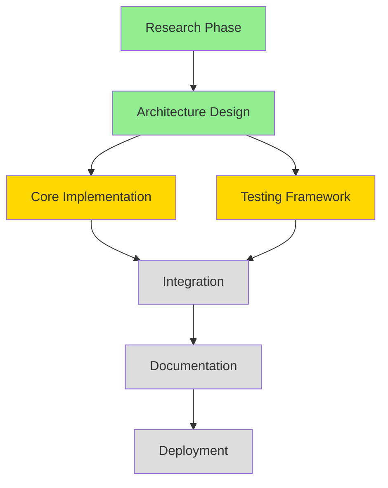
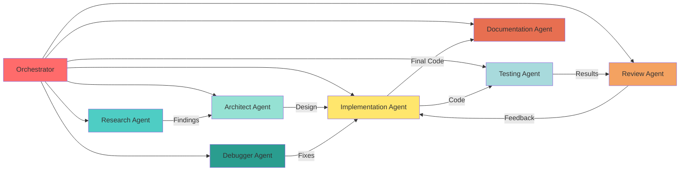

# MCP Agent System Enhancement Architecture

## Executive Summary

This document outlines a comprehensive plan to enhance your Model Context Protocol (MCP) agent system for coding, addressing context management, task persistence, research capabilities, and multi-agent orchestration.

## Current State Analysis

### Cursor MCP Setup
**Strengths:**
- Python interpreter with isolated environment (`/Users/ceverson/Documents/code`)
- Code execution via Deno (`code-runner`)
- Code checking capabilities (`code-checker`)
- GitHub integration for repository operations
- Browser automation (Playwright)

**Issues:**
- `serena` server opens browser UI (`http://127.0.0.1:24287/dashboard`) - intrusive
- `rmcp` purpose unclear - needs evaluation
- `markitdown` - limited usage context

### Roo MCP Setup
**Strengths:**
- Documentation retrieval (`context7`)
- Filesystem access to Development directory
- Memory persistence (`memory`)
- Sequential thinking for complex reasoning
- Perplexity for research (currently broken - 401 error)

**Issues:**
- Perplexity API key not configured in environment
- Limited to 5 MCP servers
- No task persistence mechanism
- No automated history tracking
- No multi-agent orchestration

### Critical Problems Identified

1. **Context Loss**: AI models losing context due to shrinking context windows
2. **Task Management**: No auto-updating task lists with full history
3. **Research Gaps**: Perplexity broken, limited research capabilities
4. **Serena UI Intrusion**: Browser popup is disruptive
5. **History Tracking**: No comprehensive conversation/decision logging
6. **Agent Coordination**: No multi-agent system for complex workflows

## Proposed Architecture

### 1. Enhanced Context & History Management System

#### Component: `context-persistence-mcp`
**Purpose**: Maintain full conversation history, task state, and decision logs

**Features:**
- SQLite database for persistent storage
- Automatic conversation checkpointing
- Task state snapshots with versioning
- Decision trail logging
- Context summarization for context window optimization
- Automatic context restoration on session start

**Implementation:**
```python
# Tools provided:
- save_context_checkpoint(conversation_id, content, metadata)
- load_context_history(conversation_id, limit)
- summarize_context(conversation_id, compression_ratio)
- search_history(query, filters)
- export_session(conversation_id, format)
```

**Database Schema:**
```sql
CREATE TABLE conversations (
    id TEXT PRIMARY KEY,
    started_at TIMESTAMP,
    project_path TEXT,
    mode TEXT
);

CREATE TABLE messages (
    id INTEGER PRIMARY KEY,
    conversation_id TEXT,
    timestamp TIMESTAMP,
    role TEXT,
    content TEXT,
    tokens INTEGER,
    FOREIGN KEY (conversation_id) REFERENCES conversations(id)
);

CREATE TABLE decisions (
    id INTEGER PRIMARY KEY,
    conversation_id TEXT,
    timestamp TIMESTAMP,
    decision_type TEXT,
    context TEXT,
    outcome TEXT,
    FOREIGN KEY (conversation_id) REFERENCES conversations(id)
);

CREATE TABLE tasks (
    id INTEGER PRIMARY KEY,
    conversation_id TEXT,
    created_at TIMESTAMP,
    updated_at TIMESTAMP,
    status TEXT,
    description TEXT,
    dependencies TEXT,
    FOREIGN KEY (conversation_id) REFERENCES conversations(id)
);
```

### 2. Advanced Task Management System

#### Component: `task-orchestrator-mcp`
**Purpose**: Persistent, auto-updating task management with dependency tracking

**Features:**
- Task lifecycle management (created → in-progress → blocked → completed)
- Dependency graph tracking
- Automatic task state updates based on code changes
- Git integration for task-commit correlation
- Progress estimation and reporting
- Task priority adjustment based on blockers

**Implementation:**
```typescript
// Tools provided:
- create_task(description, dependencies, priority, estimated_effort)
- update_task_status(task_id, status, notes)
- get_task_graph(show_completed)
- analyze_blockers(task_id)
- suggest_next_task(context)
- generate_progress_report()
- sync_with_git(repo_path)
```

**Task Graph Structure:**


### 3. Serena Replacement: Unified Code Analysis Server

#### Component: `code-intelligence-mcp`
**Purpose**: Replace Serena with non-intrusive, comprehensive code analysis

**Why Replace Serena:**
- Browser UI is disruptive to workflow
- Need lightweight, API-only interface
- Better integration with other MCP tools

**Features:**
- Static code analysis (AST parsing, complexity metrics)
- Dependency graph visualization (in-memory, no browser)
- Code quality scoring
- Refactoring suggestions
- Security vulnerability scanning
- Performance profiling integration
- Test coverage analysis

**Implementation:**
```python
# Tools provided:
- analyze_codebase(path, depth, metrics)
- get_dependency_graph(format='json')
- check_code_quality(file_path, rules)
- suggest_refactorings(file_path, threshold)
- scan_vulnerabilities(dependencies)
- estimate_technical_debt(path)
```

**Technologies:**
- `tree-sitter` for AST parsing
- `radon` for complexity metrics
- `bandit` for security scanning
- `coverage.py` for test coverage
- Custom ML model for refactoring suggestions

### 4. Enhanced Python Environment Testing

#### Component: `python-sandbox-mcp`
**Purpose**: Secure, isolated Python execution with comprehensive testing

**Features:**
- Multiple Python version support (3.8, 3.9, 3.10, 3.11, 3.12)
- Virtual environment management
- Dependency isolation
- Test execution with coverage
- Security sandboxing (restricted filesystem, network)
- Performance profiling
- Memory leak detection

**Implementation:**
```python
# Tools provided:
- create_venv(python_version, requirements)
- execute_code(code, venv_id, timeout, resource_limits)
- run_tests(test_path, venv_id, coverage)
- profile_performance(code, venv_id, iterations)
- check_memory_leaks(code, venv_id, iterations)
- validate_dependencies(requirements_file)
```

**Security Model:**
- Use `seccomp` on Linux / `sandbox-exec` on macOS
- Restrict filesystem access to project directory
- Network access requires explicit permission
- CPU/memory limits enforced
- Timeout protection

### 5. Comprehensive Research System

#### Component: `research-hub-mcp`
**Purpose**: Multi-source research with caching and synthesis

**Why Multiple Sources:**
- Perplexity API is unreliable (401 errors)
- Need redundancy and cross-validation
- Different sources for different research types

**Features:**
- Multi-provider fallback (Perplexity → Brave Search → DuckDuckGo)
- Research result caching
- Source credibility scoring
- Automatic synthesis and summarization
- Code example extraction
- Documentation lookup
- Academic paper search
- Stack Overflow integration

**Implementation:**
```typescript
// Tools provided:
- research_topic(query, sources, depth)
- search_code_examples(language, functionality)
- lookup_documentation(library, version)
- find_solutions(error_message, context)
- validate_sources(claim, evidence_threshold)
- synthesize_findings(research_ids)
```

**Provider Hierarchy:**
1. **Primary**: Perplexity (when API works)
2. **Secondary**: Brave Search API
3. **Tertiary**: DuckDuckGo + web scraping
4. **Specialized**: 
   - DevDocs for documentation
   - GitHub Code Search for examples
   - Stack Overflow API for Q&A

### 6. Multi-Agent Orchestration Framework

#### Component: `agent-swarm-mcp`
**Purpose**: Coordinate specialized agents for complex coding tasks

**Inspired by**: agency-agents framework

**Agent Types:**
1. **Research Agent**: Information gathering and validation
2. **Architect Agent**: Design and planning
3. **Implementation Agent**: Code writing
4. **Testing Agent**: Test creation and execution
5. **Review Agent**: Code review and quality checks
6. **Documentation Agent**: Documentation generation
7. **Debugger Agent**: Error investigation and fixing

**Orchestration Model:**


**Features:**
- Task decomposition and delegation
- Agent communication protocol
- Shared context management
- Conflict resolution
- Progress monitoring
- Automatic escalation on blockers

**Implementation:**
```python
# Tools provided:
- create_agent_team(task, agents)
- delegate_subtask(agent_type, task, context)
- get_team_status()
- resolve_conflict(agent1, agent2, context)
- escalate_blocker(task_id, reason)
- synthesize_results(agent_results)
```

### 7. Unified Configuration Management

#### Component: Centralized MCP Registry

**Purpose**: Single source of truth for all MCP configurations

**Structure:**
```json
{
  "profiles": {
    "cursor": {
      "servers": ["python-sandbox", "code-intelligence", "task-orchestrator", "research-hub"]
    },
    "roo": {
      "servers": ["context-persistence", "agent-swarm", "task-orchestrator", "research-hub"]
    },
    "claude-code": {
      "servers": ["all"]
    }
  },
  "servers": {
    "context-persistence": {
      "command": "python",
      "args": ["-m", "mcp_servers.context_persistence"],
      "config": {
        "db_path": "~/.mcp/context.db",
        "max_history": 10000,
        "compression_enabled": true
      }
    }
  }
}
```

**Benefits:**
- Consistent configuration across tools
- Easy enable/disable of servers
- Profile-based activation
- Version management
- Dependency tracking

## Implementation Roadmap

### Phase 1: Foundation (Week 1-2)
1. Set up project structure for MCP servers
2. Implement `context-persistence-mcp` core
3. Fix Perplexity API configuration
4. Create basic `task-orchestrator-mcp`

### Phase 2: Core Enhancement (Week 3-4)
5. Implement `code-intelligence-mcp` (Serena replacement)
6. Enhance `python-sandbox-mcp` with security features
7. Build `research-hub-mcp` with multi-source support
8. Integrate all servers with Cursor

### Phase 3: Advanced Features (Week 5-6)
9. Implement `agent-swarm-mcp` orchestration
10. Add agent communication protocols
11. Build unified configuration system
12. Create monitoring and debugging tools

### Phase 4: Integration & Testing (Week 7-8)
13. End-to-end testing of all components
14. Performance optimization
15. Documentation
16. Migration from current setup

## Detailed Component Specifications

### Context Persistence MCP

**File Structure:**
```
mcp-servers/
└── context-persistence/
    ├── pyproject.toml
    ├── src/
    │   └── context_persistence/
    │       ├── __init__.py
    │       ├── server.py
    │       ├── storage.py
    │       ├── summarization.py
    │       └── models.py
    └── tests/
```

**Dependencies:**
```toml
[tool.poetry.dependencies]
python = "^3.10"
mcp = "^1.0.0"
sqlalchemy = "^2.0"
tiktoken = "^0.7"
anthropic = "^0.25"  # for summarization
```

**Key Algorithms:**
1. **Context Summarization**: Use hierarchical summarization to compress long conversations
2. **Smart Retrieval**: Vector embeddings for semantic search of history
3. **Checkpoint Strategy**: Save after every N messages or M tokens

### Task Orchestrator MCP

**File Structure:**
```
mcp-servers/
└── task-orchestrator/
    ├── package.json
    ├── src/
    │   ├── index.ts
    │   ├── task-manager.ts
    │   ├── dependency-graph.ts
    │   ├── git-integration.ts
    │   └── types.ts
    └── tests/
```

**Dependencies:**
```json
{
  "dependencies": {
    "@modelcontextprotocol/sdk": "^1.0.0",
    "simple-git": "^3.20",
    "graphology": "^0.25",
    "sqlite3": "^5.1"
  }
}
```

**Features:**
- DAG (Directed Acyclic Graph) for task dependencies
- Critical path analysis
- Automatic task status inference from git commits
- Burndown chart generation

### Code Intelligence MCP

**File Structure:**
```
mcp-servers/
└── code-intelligence/
    ├── pyproject.toml
    ├── src/
    │   └── code_intelligence/
    │       ├── __init__.py
    │       ├── server.py
    │       ├── analyzer.py
    │       ├── metrics.py
    │       ├── refactoring.py
    │       └── security.py
    └── tests/
```

**Dependencies:**
```toml
[tool.poetry.dependencies]
python = "^3.10"
mcp = "^1.0.0"
tree-sitter = "^0.20"
tree-sitter-python = "^0.20"
radon = "^6.0"
bandit = "^1.7"
pylint = "^3.0"
```

**Analysis Capabilities:**
- Cyclomatic complexity (McCabe)
- Maintainability index
- Halstead metrics
- Code duplication detection
- Dependency analysis
- Security vulnerability scanning

### Python Sandbox MCP

**File Structure:**
```
mcp-servers/
└── python-sandbox/
    ├── pyproject.toml
    ├── src/
    │   └── python_sandbox/
    │       ├── __init__.py
    │       ├── server.py
    │       ├── sandbox.py
    │       ├── profiler.py
    │       └── venv_manager.py
    └── tests/
```

**Security Implementation:**
```python
import resource
import signal
from contextlib import contextmanager

@contextmanager
def sandboxed_execution(timeout=30, memory_limit=512*1024*1024):
    """Execute code with resource limits"""
    # Set resource limits
    resource.setrlimit(resource.RLIMIT_CPU, (timeout, timeout))
    resource.setrlimit(resource.RLIMIT_AS, (memory_limit, memory_limit))
    
    # Set timeout signal
    signal.signal(signal.SIGALRM, timeout_handler)
    signal.alarm(timeout)
    
    try:
        yield
    finally:
        signal.alarm(0)
```

### Research Hub MCP

**File Structure:**
```
mcp-servers/
└── research-hub/
    ├── package.json
    ├── src/
    │   ├── index.ts
    │   ├── providers/
    │   │   ├── perplexity.ts
    │   │   ├── brave.ts
    │   │   ├── duckduckgo.ts
    │   │   └── specialized.ts
    │   ├── cache.ts
    │   ├── synthesizer.ts
    │   └── types.ts
    └── tests/
```

**Provider Interface:**
```typescript
interface ResearchProvider {
  name: string;
  priority: number;
  search(query: string, options: SearchOptions): Promise<SearchResult[]>;
  isAvailable(): Promise<boolean>;
}

class ProviderChain {
  async search(query: string): Promise<SearchResult[]> {
    for (const provider of this.providers) {
      if (await provider.isAvailable()) {
        try {
          return await provider.search(query);
        } catch (error) {
          console.warn(`Provider ${provider.name} failed, trying next`);
        }
      }
    }
    throw new Error('All providers failed');
  }
}
```

### Agent Swarm MCP

**File Structure:**
```
mcp-servers/
└── agent-swarm/
    ├── pyproject.toml
    ├── src/
    │   └── agent_swarm/
    │       ├── __init__.py
    │       ├── server.py
    │       ├── orchestrator.py
    │       ├── agents/
    │       │   ├── base.py
    │       │   ├── research.py
    │       │   ├── architect.py
    │       │   ├── implementation.py
    │       │   ├── testing.py
    │       │   ├── review.py
    │       │   └── documentation.py
    │       └── communication.py
    └── tests/
```

**Agent Communication Protocol:**
```python
from dataclasses import dataclass
from enum import Enum

class MessageType(Enum):
    REQUEST = "request"
    RESPONSE = "response"
    NOTIFICATION = "notification"
    ESCALATION = "escalation"

@dataclass
class AgentMessage:
    sender: str
    receiver: str
    type: MessageType
    content: dict
    context: dict
    timestamp: float

class Agent:
    async def handle_message(self, message: AgentMessage) -> AgentMessage:
        """Process incoming message and return response"""
        pass
    
    async def execute_task(self, task: Task) -> TaskResult:
        """Execute assigned task"""
        pass
```

## Integration Strategy

### Cursor Integration

**Updated `~/.cursor/mcp.json`:**
```json
{
  "mcpServers": {
    "context-persistence": {
      "command": "python",
      "args": ["-m", "mcp_servers.context_persistence"],
      "env": {
        "DB_PATH": "/Users/ceverson/.mcp/context.db"
      }
    },
    "task-orchestrator": {
      "command": "/Users/ceverson/MCP_Advanced_Multi_Agent_Ecosystem/MCP_structure_design/mcp-servers-go/dist/task-orchestrator",
      "args": [],
      "env": {
        "MCP_DATABASE_DIR": "/Users/ceverson/.mcp/tasks",
        "MCP_LOG_LEVEL": "info"
      }
    },
    "code-intelligence": {
      "command": "python",
      "args": ["-m", "mcp_servers.code_intelligence"],
      "env": {
        "ANALYSIS_DEPTH": "full"
      }
    },
    "python-sandbox": {
      "command": "python",
      "args": ["-m", "mcp_servers.python_sandbox"],
      "env": {
        "SANDBOX_DIR": "/Users/ceverson/Documents/code",
        "ALLOWED_PYTHONS": "3.10,3.11,3.12"
      }
    },
    "research-hub": {
      "command": "node",
      "args": ["/Users/ceverson/mcp-servers/research-hub/dist/index.js"],
      "env": {
        "PERPLEXITY_API_KEY": "${PERPLEXITY_API_KEY}",
        "BRAVE_API_KEY": "${BRAVE_API_KEY}",
        "CACHE_DIR": "/Users/ceverson/.mcp/research-cache"
      }
    },
    "github-official": {
      "command": "npx",
      "args": ["-y", "@modelcontextprotocol/server-github"],
      "env": {
        "GITHUB_PERSONAL_ACCESS_TOKEN": "github_pat_..."
      }
    }
  }
}
```

### Roo Integration

**Updated Roo MCP settings:**
```json
{
  "mcpServers": {
    "agent-swarm": {
      "command": "python",
      "args": ["-m", "mcp_servers.agent_swarm"]
    },
    "task-orchestrator": {
      "command": "/Users/ceverson/MCP_Advanced_Multi_Agent_Ecosystem/MCP_structure_design/mcp-servers-go/dist/task-orchestrator",
      "args": [],
      "env": {
        "MCP_DATABASE_DIR": "/Users/ceverson/.mcp/tasks",
        "MCP_LOG_LEVEL": "info"
      }
    },
    "context-persistence": {
      "command": "python",
      "args": ["-m", "mcp_servers.context_persistence"]
    },
    "research-hub": {
      "command": "node",
      "args": ["/Users/ceverson/mcp-servers/research-hub/dist/index.js"]
    },
    "filesystem": {
      "command": "npx",
      "args": ["-y", "@modelcontextprotocol/server-filesystem", "~/Development"]
    }
  }
}
```

## Configuration Management

### Environment Variables

Create `~/.mcp/env`:
```bash
# API Keys
export PERPLEXITY_API_KEY="pplx-..."
export BRAVE_API_KEY="..."
export GITHUB_PERSONAL_ACCESS_TOKEN="github_pat_..."

# Paths
export MCP_SERVER_PATH="/Users/ceverson/mcp-servers"
export MCP_DATA_PATH="/Users/ceverson/.mcp"
export MCP_CACHE_PATH="/Users/ceverson/.mcp/cache"

# Configuration
export MCP_LOG_LEVEL="info"
export MCP_MAX_HISTORY=10000
export MCP_CONTEXT_WINDOW=200000
```

### Server Configuration

Create `~/.mcp/config.yaml`:
```yaml
global:
  log_level: info
  data_dir: ~/.mcp
  cache_dir: ~/.mcp/cache

servers:
  context-persistence:
    enabled: true
    db_path: ~/.mcp/context.db
    max_history: 10000
    compression:
      enabled: true
      threshold: 100000
    
  task-orchestrator:
    enabled: true
    db_path: ~/.mcp/tasks.db
    git_integration: true
    auto_update: true
    
  code-intelligence:
    enabled: true
    analysis_depth: full
    metrics:
      - complexity
      - maintainability
      - security
    thresholds:
      complexity: 10
      maintainability: 65
    
  python-sandbox:
    enabled: true
    allowed_versions:
      - "3.10"
      - "3.11"
      - "3.12"
    resource_limits:
      cpu_time: 30
      memory: 512M
      processes: 10
    
  research-hub:
    enabled: true
    providers:
      - name: perplexity
        priority: 1
        api_key_env: PERPLEXITY_API_KEY
      - name: brave
        priority: 2
        api_key_env: BRAVE_API_KEY
      - name: duckduckgo
        priority: 3
    cache:
      enabled: true
      ttl: 86400
    
  agent-swarm:
    enabled: true
    agents:
      - research
      - architect
      - implementation
      - testing
      - review
      - documentation
      - debugger
    orchestration:
      max_concurrent: 3
      timeout: 300
```

## Monitoring & Debugging

### Logging Strategy

**Centralized Logging:**
```python
import logging
from pathlib import Path

def setup_logging():
    log_dir = Path.home() / '.mcp' / 'logs'
    log_dir.mkdir(parents=True, exist_ok=True)
    
    logging.basicConfig(
        level=logging.INFO,
        format='%(asctime)s [%(name)s] %(levelname)s: %(message)s',
        handlers=[
            logging.FileHandler(log_dir / 'mcp.log'),
            logging.StreamHandler()
        ]
    )
```

### Metrics Collection

**Performance Metrics:**
- Tool execution time
- API response times
- Cache hit rates
- Agent task completion times
- Context window usage
- Token consumption

**Health Checks:**
```python
async def health_check():
    return {
        "status": "healthy",
        "servers": {
            "context-persistence": await check_db_connection(),
            "research-hub": await check_api_availability(),
        },
        "metrics": {
            "uptime": get_uptime(),
            "requests_per_minute": get_rpm(),
            "average_response_time": get_avg_response_time()
        }
    }
```

## Security Considerations

### API Key Management
- Never hardcode API keys
- Use environment variables
- Consider using `keyring` or OS keychain
- Rotate keys regularly

### Sandbox Security
- Restrict filesystem access
- Network isolation
- Resource limits (CPU, memory, time)
- Process isolation
- Input validation

### Data Privacy
- Local storage of context and history
- Encryption at rest for sensitive data
- Secure API communication (HTTPS only)
- User consent for data collection

## Performance Optimization

### Caching Strategy
1. **Research Results**: Cache for 24 hours
2. **Code Analysis**: Cache until file modification
3. **Context Summaries**: Cache with invalidation on new messages
4. **Dependency Graphs**: Cache until dependency changes

### Resource Management
- Lazy loading of MCP servers
- Connection pooling
- Background processing for non-critical tasks
- Batch API requests when possible

## Migration Plan

### Phase 1: Parallel Operation
1. Keep existing setup running
2. Install new MCP servers alongside
3. Gradual testing and validation

### Phase 2: Data Migration
1. Export existing data from Serena
2. Import into new code-intelligence system
3. Migrate any cached research results

### Phase 3: Cutover
1. Update configurations to use new servers
2. Disable old servers
3. Monitor for issues

### Phase 4: Cleanup
1. Remove old server installations
2. Archive old configuration files
3. Document new setup

## Success Metrics

### Context Management
- 100% conversation history retention
- Context restoration in < 2 seconds
- No context loss across sessions

### Task Management
- Automatic task status updates
- Dependency tracking accuracy > 95%
- Progress reports generated automatically

### Code Intelligence
- Analysis completion in < 5 seconds for average file
- Zero browser popups
- Security vulnerability detection > 90%

### Research
- Multi-provider fallback works 99.9% of time
- Research results synthesized automatically
- Cache hit rate > 60%

### Agent Orchestration
- Task decomposition for complex problems
- Agent collaboration for multi-step tasks
- Automatic escalation on blockers

## Next Steps

1. Review and approve this architecture
2. Set up development environment for MCP servers
3. Begin Phase 1 implementation
4. Establish testing framework
5. Create documentation for each component

## Questions to Address

1. **Perplexity API**: Do you have a valid API key? If not, should we prioritize Brave Search?
2. **Serena Data**: Do you want to export any existing data before replacing?
3. **Python Versions**: Which Python versions are most important for your work?
4. **Priority**: Which component should we build first?
5. **Resources**: Are there any resource constraints (disk space, API quotas)?
6. **Git Integration**: Which git operations are most valuable for task tracking?
