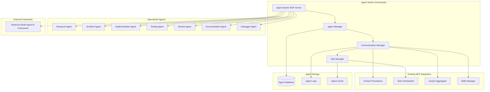

# Phase 1: Multi-Agent AI Framework Integration Analysis

## Executive Summary

This document provides a comprehensive analysis for integrating sophisticated multi-agent capabilities into your existing Model Context Protocol (MCP) server ecosystem. Based on the Advanced Multi-Agent AI Framework at https://github.com/Mnehmos/Advanced-Multi-Agent-AI-Framework, this analysis outlines how to enhance your current TypeScript/Python local-first architecture with advanced agent orchestration.

## Current MCP Ecosystem Analysis

### Existing Server Architecture

Your current MCP ecosystem consists of **5 production-ready servers**:

1. **Context Persistence** (Python/Qdrant)
   - Local conversation history with semantic search
   - SQLite + Qdrant vector storage
   - FastMCP implementation

2. **Task Orchestrator** (TypeScript)
   - DAG-based task management
   - Git integration for auto-tracking
   - Code execution and analysis capabilities

3. **Search Aggregator** (TypeScript)
   - Multi-provider fallback (Perplexity, Brave, Google, DuckDuckGo)
   - Local caching system
   - Rate limiting and synthesis

4. **Skills Manager** (TypeScript)
   - Skill inventory and learning goals
   - OpenSkills and SkillsMP integration
   - Task-skill correlation

5. **GitHub OAuth2** (TypeScript/Node.js)
   - Repository operations
   - Session management
   - API integration

### Technology Stack Assessment

**Languages & Frameworks:**
- Python: FastMCP, SQLAlchemy, Qdrant, transformers
- TypeScript: Official MCP SDK, Express, SQLite3
- Storage: SQLite (local), Qdrant (vector), file system

**Architecture Patterns:**
- Local-first design (no cloud dependencies for core data)
- Provider-agnostic interfaces
- Event-driven communication
- Resource-constrained execution

## Multi-Agent Framework Integration Design

### Core Integration Principles

1. **Local-First Agent Storage**: All agent data stored locally in `~/.mcp/agents/`
2. **MCP Protocol Compliance**: Use standard MCP tools and resources
3. **Language Flexibility**: Support both Python and TypeScript agents
4. **Event-Driven Orchestration**: Leverage existing task dependency system

### Proposed Multi-Agent Architecture



## Integration Strategy

### Phase 1: Foundation Layer (Week 1-2)

#### 1.1 Agent Swarm MCP Server
**New TypeScript MCP Server**: `mcp-servers/agent-swarm/`

**Core Components:**
```typescript
// Agent Swarm Orchestrator
interface AgentOrchestrator {
  createAgent(type: AgentType, config: AgentConfig): Promise<Agent>;
  delegateTask(agentId: string, task: Task): Promise<TaskResult>;
  coordinateAgents(task: ComplexTask): Promise<AgentResult[]>;
  resolveConflicts(agent1: Agent, agent2: Agent): Promise<Resolution>;
}

// Agent Communication Protocol
interface AgentMessage {
  from: string;
  to: string;
  type: MessageType;
  content: any;
  context: TaskContext;
  timestamp: number;
}
```

**Storage Structure:**
```
~/.mcp/agents/
├── database/           # Agent state and history
│   ├── agents.db      # SQLite agent registry
│   ├── tasks.db       # Agent task tracking
│   └── messages.db    # Inter-agent communication
├── logs/              # Agent execution logs
├── cache/             # Agent result caching
└── configs/           # Agent configurations
```

#### 1.2 Enhanced Task Orchestrator Integration
**Extend existing Task Orchestrator with agent capabilities:**

```typescript
// New agent-related tools
- create_agent_task(description, agent_type, dependencies)
- assign_task_to_agent(task_id, agent_id, priority)
- get_agent_workload(agent_id)
- coordinate_agent_team(task_id, agent_types)
- escalate_agent_blocker(task_id, reason)
```

#### 1.3 Context Persistence Agent Memory
**Extend Context Persistence to track agent interactions:**

```python
# New agent-related tools
- save_agent_conversation(agent_id, messages, task_id)
- get_agent_history(agent_id, task_id, limit)
- search_agent_memory(query, agent_types)
- link_agents_to_task(task_id, agent_ids)
```

### Phase 2: Agent Implementation (Week 3-4)

#### 2.1 Specialized Agent Types

**Research Agent** (Python)
```python
# Integrates with Search Aggregator
- research_topic(query, depth, sources)
- validate_information(claim, sources)
- synthesize_findings(research_ids)
- extract_code_examples(language, functionality)
```

**Architect Agent** (Python)
```python
# Uses Context Persistence for design patterns
- analyze_requirements(requirements)
- design_architecture(constraints)
- create_technical_specifications(architecture)
- validate_design_against_requirements(spec, requirements)
```

**Implementation Agent** (TypeScript)
```typescript
// Extends Task Orchestrator code execution
- write_code(specification, language)
- refactor_code(code, improvements)
- optimize_performance(code, metrics)
- generate_tests(specification, code)
```

#### 2.2 Framework Integration Layer

**Adapter Pattern for Advanced Multi-Agent AI Framework:**

```typescript
class FrameworkAdapter {
  private framework: any; // Advanced Multi-Agent AI Framework instance
  
  constructor(frameworkPath: string) {
    this.framework = this.loadFramework(frameworkPath);
  }
  
  // Adapt framework agents to MCP protocol
  adaptAgent(frameworkAgent: any): Agent {
    return {
      id: frameworkAgent.id,
      type: this.mapFrameworkType(frameworkAgent.type),
      capabilities: this.mapFrameworkCapabilities(frameworkAgent.capabilities),
      mcpTools: this.generateMCPTools(frameworkAgent),
      communication: this.adaptCommunication(frameworkAgent.communication)
    };
  }
  
  // Synchronize agent states
  syncAgentState(agentId: string): AgentState {
    const frameworkState = this.framework.getAgentState(agentId);
    return this.mcpStateMapper.map(frameworkState);
  }
}
```

### Phase 3: Advanced Features (Week 5-6)

#### 3.1 Agent Communication Protocol

**Message Routing System:**
```typescript
// Agent message routing
interface MessageRouter {
  route(message: AgentMessage): Promise<void>;
  broadcast(message: AgentMessage, recipients: AgentType[]): Promise<void>;
  requestResponse(message: AgentMessage, timeout: number): Promise<AgentMessage>;
}

// Communication patterns
- Direct messaging between specific agents
- Broadcast to agent types (all Research Agents)
- Pub/sub for event-driven coordination
- Task delegation with acknowledgment
```

#### 3.2 Conflict Resolution System

**Agent Conflict Resolution:**
```typescript
enum ConflictType {
  RESOURCE_CONTENTION = "resource_contention",
  TASK_OVERLAP = "task_overlap",
  COMMUNICATION_DEADLOCK = "communication_deadlock",
  CAPABILITY_MISMATCH = "capability_mismatch"
}

interface ConflictResolver {
  detectConflict(agent1: Agent, agent2: Agent): ConflictType;
  resolveResourceContention(agents: Agent[], resource: any): Resolution;
  delegateTaskOverlap(task: Task, agents: Agent[]): Agent;
  resolveCommunicationDeadlock(agents: Agent[]): void;
}
```

#### 3.3 Learning and Adaptation

**Agent Learning System:**
```python
# Agent performance tracking and improvement
- track_agent_performance(agent_id, task_results)
- adapt_agent_behavior(agent_id, performance_data)
- share_knowledge_between_agents(agent_ids, knowledge)
- optimize_agent_coordination(agent_team, outcomes)
```

## Integration with Existing Tool Ecosystem

### Roo Integration
**Enhanced Roo MCP Configuration:**
```json
{
  "mcpServers": {
    "agent-swarm": {
      "command": "node",
      "args": ["/Users/ceverson/mcp-servers/agent-swarm/dist/index.js"],
      "env": {
        "AGENTS_DB": "/Users/ceverson/.mcp/agents/database/agents.db"
      }
    },
    "task-orchestrator": {
      "command": "node",
      "args": ["/Users/ceverson/MCP_Advanced_Multi_Agent_Ecosystem/MCP_structure_design/mcp-servers-go/dist/task-orchestrator"],
      "env": {
        "ENABLE_AGENT_COORDINATION": "true"
      }
    }
  }
}
```

### Cursor Integration
**Enhanced Cursor MCP Configuration:**
```json
{
  "mcpServers": {
    "agent-swarm": {
      "command": "node",
      "args": ["/Users/ceverson/mcp-servers/agent-swarm/dist/index.js"]
    },
    "context-persistence": {
      "command": "python3",
      "args": ["-m", "mcp_servers.context_persistence"],
      "env": {
        "ENABLE_AGENT_MEMORY": "true"
      }
    }
  }
}
```

## New MCP Tools for Multi-Agent Coordination

### Core Agent Management Tools

1. **create_agent**
   - Register new agent in swarm
   - Define agent type and capabilities
   - Set initial configuration

2. **delegate_task**
   - Assign task to specific agent or agent type
   - Set priority and dependencies
   - Track task progress

3. **coordinate_team**
   - Create agent team for complex task
   - Define roles and responsibilities
   - Set coordination parameters

4. **resolve_conflict**
   - Detect and resolve agent conflicts
   - Resource contention handling
   - Task overlap resolution

5. **get_agent_status**
   - Get current agent workload
   - Performance metrics
   - Active tasks and progress

6. **share_knowledge**
   - Share insights between agents
   - Update collective knowledge base
   - Learn from task outcomes

### Enhanced Task Tools

7. **create_agent_task**
   - Create task specifically for agent execution
   - Define required agent capabilities
   - Set success criteria

8. **escalate_blocker**
   - Agent can escalate complex blockers
   - Request help from specialized agents
   - Trigger conflict resolution

9. **synthesize_results**
   - Combine results from multiple agents
   - Resolve conflicting outputs
   - Generate final deliverable

## Storage and Configuration Requirements

### Database Schema Extensions

**Agent Registry Table:**
```sql
CREATE TABLE agents (
    id TEXT PRIMARY KEY,
    type TEXT NOT NULL,
    name TEXT NOT NULL,
    capabilities TEXT, -- JSON array
    status TEXT DEFAULT 'idle',
    current_task_id TEXT,
    performance_metrics TEXT, -- JSON
    created_at TIMESTAMP DEFAULT CURRENT_TIMESTAMP,
    last_active TIMESTAMP
);
```

**Agent Tasks Table:**
```sql
CREATE TABLE agent_tasks (
    id TEXT PRIMARY KEY,
    agent_id TEXT,
    task_description TEXT,
    status TEXT DEFAULT 'pending',
    priority INTEGER DEFAULT 0,
    dependencies TEXT, -- JSON array
    result TEXT, -- JSON
    started_at TIMESTAMP,
    completed_at TIMESTAMP,
    FOREIGN KEY (agent_id) REFERENCES agents(id)
);
```

**Agent Communication Table:**
```sql
CREATE TABLE agent_messages (
    id TEXT PRIMARY KEY,
    from_agent_id TEXT,
    to_agent_id TEXT,
    message_type TEXT,
    content TEXT, -- JSON
    context TEXT, -- JSON
    timestamp TIMESTAMP DEFAULT CURRENT_TIMESTAMP
);
```

### Configuration Management

**Agent Configuration File:** `~/.mcp/config/agents.yaml`
```yaml
agents:
  research:
    max_concurrent: 3
    timeout: 300
    capabilities:
      - web_search
      - document_analysis
      - synthesis
    
  architect:
    max_concurrent: 2
    timeout: 600
    capabilities:
      - system_design
      - pattern_recognition
      - specification_writing
      
  implementation:
    max_concurrent: 5
    timeout: 1800
    capabilities:
      - code_generation
      - refactoring
      - testing

coordination:
  max_team_size: 5
  conflict_resolution_timeout: 30
  knowledge_sharing_interval: 3600
```

## Technology Compatibility Assessment

### Framework Integration Compatibility

**Language Alignment:**
- ✅ Python agents: Direct integration with Context Persistence and existing Python infrastructure
- ✅ TypeScript agents: Leverage existing TypeScript MCP patterns and Task Orchestrator
- ✅ Mixed teams: Agent communication protocol bridges language differences

**Storage Compatibility:**
- ✅ SQLite: Universal compatibility for agent state
- ✅ File system: Natural for agent configurations and logs
- ✅ Qdrant: Potential for agent memory and knowledge vectors

**Protocol Compliance:**
- ✅ MCP tools: Standard interface for agent capabilities
- ✅ MCP resources: Agent status and results access
- ✅ Local-first: Aligns with existing architecture

### Performance Considerations

**Resource Management:**
- Agent execution limits (CPU, memory, time)
- Concurrent agent limits per type
- Automatic agent cleanup and Garbage collection
- Performance monitoring and optimization

**Scalability:**
- Agent pool scaling based on workload
- Load balancing across agent types
- Priority-based task scheduling
- Resource contention management

## Impact Assessment on Existing Ecosystem

### Positive Impacts

1. **Enhanced Task Orchestration**
   - Agents can automatically update task status
   - Complex task decomposition and delegation
   - Intelligent task prioritization

2. **Improved Context Persistence**
   - Agent memory adds to conversation context
   - Cross-session agent knowledge retention
   - Pattern recognition across projects

3. **Smarter Research Hub**
   - Research agents coordinate with search providers
   - Automated information synthesis
   - Quality validation across sources

4. **Advanced Skills Management**
   - Agents can recommend skill improvements
   - Automatic skill gap analysis for tasks
   - Learning path optimization

### Potential Challenges

1. **Complexity Management**
   - Additional coordination overhead
   - Potential for agent conflicts
   - Debugging multi-agent interactions

2. **Resource Consumption**
   - Multiple agent instances running
   - Increased memory and CPU usage
   - Storage requirements for agent data

3. **Configuration Complexity**
   - More configuration options
   - Agent-specific settings
   - Coordination parameters

### Mitigation Strategies

1. **Gradual Integration**
   - Start with single-agent scenarios
   - Incremental feature rollout
   - Comprehensive testing at each stage

2. **Resource Controls**
   - Strict agent resource limits
   - Automatic agent lifecycle management
   - Performance monitoring and alerts

3. **Configuration Management**
   - Sensible defaults for all settings
   - Configuration validation
   - Migration tools for updates

## Implementation Roadmap

### Phase 1: Foundation (Weeks 1-2)
- [ ] Create Agent Swarm MCP server structure
- [ ] Implement basic agent registry and management
- [ ] Extend Task Orchestrator with agent coordination
- [ ] Set up agent storage infrastructure

### Phase 2: Core Agents (Weeks 3-4)
- [ ] Implement Research Agent with Search Aggregator integration
- [ ] Create Architect Agent with Context Persistence integration
- [ ] Build Implementation Agent extending Task Orchestrator
- [ ] Develop basic agent communication protocol

### Phase 3: Advanced Features (Weeks 5-6)
- [ ] Implement conflict resolution system
- [ ] Add learning and adaptation capabilities
- [ ] Create advanced team coordination features
- [ ] Build performance monitoring and optimization

### Phase 4: Integration & Testing (Weeks 7-8)
- [ ] End-to-end testing with existing MCP servers
- [ ] Performance optimization and resource tuning
- [ ] Documentation and user guides
- [ ] Migration tools and deployment scripts

## Success Metrics

### Functionality Metrics
- [ ] Agent task completion rate > 90%
- [ ] Conflict resolution success rate > 85%
- [ ] Agent communication reliability > 95%
- [ ] Cross-agent knowledge sharing effectiveness

### Performance Metrics
- [ ] Agent orchestration overhead < 10% of task time
- [ ] Agent startup time < 2 seconds
- [ ] Memory usage per agent < 100MB
- [ ] Storage growth rate manageable

### User Experience Metrics
- [ ] Seamless integration with existing tools
- [ ] Intuitive agent management interface
- [ ] Clear agent status and progress visibility
- [ ] Easy configuration and customization

## Risk Assessment and Mitigation

### Technical Risks
1. **Framework Compatibility Issues**
   - Risk: Advanced Multi-Agent AI Framework may have incompatible APIs
   - Mitigation: Create comprehensive adapter layer, test early

2. **Performance Degradation**
   - Risk: Agent coordination may slow down task execution
   - Mitigation: Performance monitoring, optimization, fallback modes

3. **Resource Exhaustion**
   - Risk: Too many agents consuming system resources
   - Mitigation: Strict resource limits, automatic scaling controls

### Operational Risks
1. **Configuration Complexity**
   - Risk: Too many configuration options confuse users
   - Mitigation: Sensible defaults, comprehensive documentation

2. **Debugging Complexity**
   - Risk: Hard to debug multi-agent interactions
   - Mitigation: Comprehensive logging, debugging tools, monitoring

## Next Steps and Recommendations

### Immediate Actions (This Week)
1. **Validate Framework Access**
   - Clone and examine the Advanced Multi-Agent AI Framework repository
   - Understand the framework's architecture and APIs
   - Identify integration points and compatibility requirements

2. **Create Proof of Concept**
   - Build minimal Agent Swarm MCP server
   - Test basic agent creation and task delegation
   - Validate communication with existing MCP servers

3. **Resource Planning**
   - Assess system resources for agent hosting
   - Plan storage requirements for agent data
   - Design monitoring and logging strategy

### Medium-term Goals (Next Month)
1. **Full Integration**
   - Complete agent implementation for all agent types
   - Integrate with all existing MCP servers
   - Implement advanced coordination features

2. **Optimization**
   - Performance tuning and resource optimization
   - User interface improvements
   - Documentation completion

### Long-term Vision (Next Quarter)
1. **Advanced Features**
   - Machine learning for agent optimization
   - Cross-project agent knowledge sharing
   - Automated agent improvement and evolution

## Conclusion

The integration of multi-agent capabilities into your existing MCP ecosystem represents a significant opportunity to enhance your AI development workflow. The local-first architecture, combined with the Advanced Multi-Agent AI Framework, will provide sophisticated agent orchestration while maintaining privacy and control.

The phased implementation approach ensures minimal disruption to existing functionality while gradually adding powerful new capabilities. The comprehensive testing and validation process will ensure reliability and performance.

This integration will transform your MCP ecosystem from a collection of useful tools into an intelligent, coordinated agent swarm capable of handling complex development tasks with minimal human intervention.

## Appendices

### Appendix A: MCP Tool Definitions for Agents

#### Agent Management Tools
```typescript
// Tool: create_agent
{
  name: "create_agent",
  description: "Create and register a new agent in the swarm",
  inputSchema: {
    type: "object",
    properties: {
      agent_type: { enum: ["research", "architect", "implementation", "testing", "review", "documentation", "debugger"] },
      name: { type: "string" },
      capabilities: { type: "array", items: { type: "string" } },
      configuration: { type: "object" }
    },
    required: ["agent_type", "name"]
  }
}

// Tool: delegate_task
{
  name: "delegate_task",
  description: "Assign a task to a specific agent or agent type",
  inputSchema: {
    type: "object",
    properties: {
      task_description: { type: "string" },
      agent_id: { type: "string" },
      agent_type: { type: "string" },
      priority: { type: "number", default: 0 },
      dependencies: { type: "array", items: { type: "string" } },
      timeout: { type: "number", default: 300 }
    },
    required: ["task_description"]
  }
}
```

### Appendix B: Agent Communication Protocol

#### Message Types
```typescript
enum MessageType {
  TASK_DELEGATION = "task_delegation",
  TASK_UPDATE = "task_update",
  KNOWLEDGE_SHARE = "knowledge_share",
  CONFLICT_ESCALATION = "conflict_escalation",
  RESOURCE_REQUEST = "resource_request",
  STATUS_UPDATE = "status_update"
}

interface AgentMessage {
  id: string;
  from: string;
  to: string;
  type: MessageType;
  content: any;
  context: {
    task_id?: string;
    priority: number;
    timestamp: number;
  };
  metadata: {
    requires_response: boolean;
    timeout?: number;
    retry_count: number;
  };
}
```

This comprehensive analysis provides the foundation for integrating sophisticated multi-agent capabilities into your existing MCP ecosystem while maintaining the local-first, privacy-focused design principles.