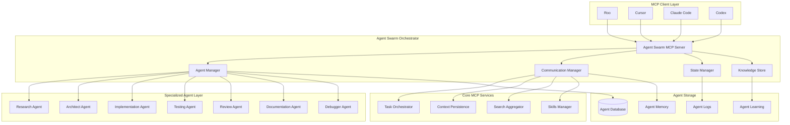

# Phase 2: Multi-Agent AI Framework - Detailed Technical Architecture

## Executive Summary

This document provides comprehensive technical specifications for implementing a sophisticated multi-agent AI framework as an MCP server, designed for deep integration with your existing ecosystem. The architecture supports all 7 specialized agent types with hybrid execution, comprehensive learning, and full interoperability with Task Orchestrator, Context Persistence, Search Aggregator, and Skills Manager.

## Table of Contents

1. [System Architecture Overview](#system-architecture-overview)
2. [Agent Specifications](#agent-specifications)
3. [Storage and Data Models](#storage-and-data-models)
4. [Communication Protocols](#communication-protocols)
5. [Integration Architecture](#integration-architecture)
6. [Learning and Adaptation System](#learning-and-adaptation-system)
7. [Security and Resource Management](#security-and-resource-management)
8. [API and Tool Specifications](#api-and-tool-specifications)

---

## System Architecture Overview

### High-Level Architecture



### Technology Stack

**Core Technologies:**
- **Language**: TypeScript (consistent with existing servers)
- **Database**: SQLite with sql.js (local-first)
- **Communication**: Event-driven with message queues
- **Process Management**: Node.js child processes for agent isolation
- **Storage**: Local filesystem for agent memory and learning

**Integration Pattern:**
- **MCP Tools**: Standard interface for agent capabilities
- **MCP Resources**: Agent status and memory access
- **Inter-server Communication**: Direct MCP tool calls
- **Event System**: Cross-server event notifications

### Directory Structure

```
mcp-servers/
└── agent-swarm/
    ├── package.json
    ├── tsconfig.json
    ├── src/
    │   ├── index.ts                    # Main server entry
    │   ├── orchestrator/
    │   │   ├── agent-manager.ts        # Agent lifecycle management
    │   │   ├── communication.ts        # Inter-agent communication
    │   │   ├── state-manager.ts        # State persistence
    │   │   └── conflict-resolver.ts    # Conflict resolution
    │   ├── agents/
    │   │   ├── base/
    │   │   │   ├── agent.ts            # Base agent class
    │   │   │   ├── capabilities.ts     # Capability definitions
    │   │   │   └── memory.ts           # Agent memory interface
    │   │   ├── research/
    │   │   │   ├── agent.ts            # Research Agent
    │   │   │   └── tools.ts            # Research-specific tools
    │   │   ├── architect/
    │   │   │   ├── agent.ts            # Architect Agent
    │   │   │   └── tools.ts            # Architecture tools
    │   │   ├── implementation/
    │   │   │   ├── agent.ts            # Implementation Agent
    │   │   │   └── tools.ts            # Code generation tools
    │   │   ├── testing/
    │   │   │   ├── agent.ts            # Testing Agent
    │   │   │   └── tools.ts            # Testing tools
    │   │   ├── review/
    │   │   │   ├── agent.ts            # Review Agent
    │   │   │   └── tools.ts            # Review tools
    │   │   ├── documentation/
    │   │   │   ├── agent.ts            # Documentation Agent
    │   │   │   └── tools.ts            # Doc generation tools
    │   │   └── debugger/
    │   │       ├── agent.ts            # Debugger Agent
    │   │       └── tools.ts            # Debugging tools
    │   ├── integration/
    │   │   ├── task-orchestrator.ts    # TO integration
    │   │   ├── context-persistence.ts  # CP integration
    │   │   ├── search-aggregator.ts    # SA integration
    │   │   └── skills-manager.ts       # SKM integration
    │   ├── learning/
    │   │   ├── performance-tracker.ts  # Performance metrics
    │   │   ├── knowledge-sharing.ts    # Cross-agent learning
    │   │   ├── adaptation-engine.ts    # Behavior adaptation
    │   │   └── pattern-recognition.ts  # Pattern analysis
    │   ├── storage/
    │   │   ├── database.ts             # SQLite operations
    │   │   ├── memory.ts               # Agent memory storage
    │   │   ├── learning.ts             # Learning data storage
    │   │   └── cache.ts                # Result caching
    │   ├── security/
    │   │   ├── sandbox.ts              # Agent sandboxing
    │   │   ├── permissions.ts          # Resource permissions
    │   │   └── validation.ts           # Input validation
    │   └── types/
    │       ├── agents.ts               # Agent interfaces
    │       ├── communication.ts        # Message types
    │       └── integration.ts          # Integration types
    └── tests/
        ├── integration/
        ├── agents/
        └── learning/
```

---

## Agent Specifications

### Base Agent Architecture

#### Core Agent Interface

```typescript
interface BaseAgent {
  // Agent Identity
  id: string;
  type: AgentType;
  name: string;
  version: string;
  status: AgentStatus;
  
  // Capabilities
  capabilities: AgentCapability[];
  maxConcurrentTasks: number;
  resourceLimits: ResourceLimits;
  
  // Execution
  currentTasks: Task[];
  performanceMetrics: PerformanceMetrics;
  learningData: LearningData;
  
  // Memory
  longTermMemory: AgentMemory;
  shortTermMemory: AgentMemory;
  sharedMemory: SharedMemory;
  
  // Communication
  messageQueue: MessageQueue;
  eventHandlers: EventHandler[];
}

type AgentType = 
  | 'research'
  | 'architect' 
  | 'implementation'
  | 'testing'
  | 'review'
  | 'documentation'
  | 'debugger';

enum AgentStatus {
  IDLE = 'idle',
  BUSY = 'busy',
  LEARNING = 'learning',
  ERROR = 'error',
  MAINTENANCE = 'maintenance'
}
```

#### Agent Lifecycle Management

```typescript
class AgentManager {
  private agents: Map<string, BaseAgent> = new Map();
  private agentProcesses: Map<string, ChildProcess> = new Map();
  private loadBalancer: LoadBalancer;
  private healthMonitor: HealthMonitor;
  
  async createAgent(config: AgentConfig): Promise<BaseAgent> {
    // 1. Validate configuration
    // 2. Allocate resources
    // 3. Initialize agent process
    // 4. Register in agent registry
    // 5. Setup communication channels
    // 6. Start health monitoring
  }
  
  async executeTask(agentId: string, task: Task): Promise<TaskResult> {
    // 1. Find available agent
    // 2. Validate agent capabilities
    // 3. Create task execution context
    // 4. Execute task with monitoring
    // 5. Record performance metrics
    // 6. Update agent learning data
  }
  
  async coordinateTeam(team: AgentTeam): Promise<TeamResult> {
    // 1. Analyze team composition
    // 2. Create coordination plan
    // 3. Setup inter-agent communication
    // 4. Monitor team execution
    // 5. Handle conflicts and escalations
  }
}
```

### 1. Research Agent

**Purpose**: Information gathering, validation, and synthesis

```typescript
class ResearchAgent extends BaseAgent {
  capabilities: AgentCapability[] = [
    'web_search',
    'document_analysis',
    'fact_checking',
    'data_synthesis',
    'source_validation',
    'trend_analysis'
  ];
  
  async researchTopic(
    query: string,
    depth: ResearchDepth = 'standard',
    sources: SourceType[] = ['web', 'academic', 'news']
  ): Promise<ResearchResult> {
    // 1. Query understanding and expansion
    // 2. Multi-source search (Search Aggregator)
    // 3. Document analysis and extraction
    // 4. Fact checking and validation
    // 5. Synthesis and summary generation
    // 6. Learning from research patterns
  }
  
  async validateInformation(
    claims: string[],
    evidence: Evidence[]
  ): Promise<ValidationResult> {
    // 1. Cross-reference claims with evidence
    // 2. Assess source credibility
    // 3. Identify contradictions
    // 4. Generate confidence scores
    // 5. Update knowledge base
  }
  
  async synthesizeFindings(
    researchIds: string[]
  ): Promise<SynthesisResult> {
    // 1. Collect research data
    // 2. Identify patterns and themes
    // 3. Resolve conflicting information
    // 4. Generate insights and recommendations
    // 5. Create comprehensive summary
  }
}
```

**Research Agent Tools**:
- `research_topic` - Comprehensive research on a topic
- `validate_information` - Fact-check and validate claims
- `synthesize_findings` - Combine multiple research sources
- `extract_code_examples` - Find relevant code samples
- `analyze_trends` - Identify patterns and trends

### 2. Architect Agent

**Purpose**: System design, planning, and specification creation

```typescript
class ArchitectAgent extends BaseAgent {
  capabilities: AgentCapability[] = [
    'system_design',
    'architecture_patterns',
    'requirement_analysis',
    'technology_selection',
    'scalability_planning',
    'risk_assessment'
  ];
  
  async analyzeRequirements(
    requirements: Requirement[],
    constraints: Constraint[]
  ): Promise<RequirementAnalysis> {
    // 1. Parse and categorize requirements
    // 2. Identify dependencies and conflicts
    // 3. Assess feasibility and risks
    // 4. Generate clarification questions
    // 5. Create requirement trace matrix
  }
  
  async designArchitecture(
    analysis: RequirementAnalysis,
    technologyStack: Technology[]
  ): Promise<ArchitectureDesign> {
    // 1. Select appropriate architectural patterns
    // 2. Design system components and interfaces
    // 3. Plan data flow and integration points
    // 4. Address scalability and performance
    // 5. Create architectural diagrams
  }
  
  async createTechnicalSpecs(
    design: ArchitectureDesign
  ): Promise<TechnicalSpecification> {
    // 1. Generate detailed technical requirements
    // 2. Define API specifications
    // 3. Create implementation guidelines
    // 4. Specify testing and deployment strategies
    // 5. Document architectural decisions
  }
}
```

**Architect Agent Tools**:
- `analyze_requirements` - Parse and analyze project requirements
- `design_architecture` - Create system architecture design
- `create_technical_specs` - Generate detailed technical specifications
- `validate_design` - Check design against requirements
- `estimate_complexity` - Assess project complexity and timeline

### 3. Implementation Agent

**Purpose**: Code generation, refactoring, and development support

```typescript
class ImplementationAgent extends BaseAgent {
  capabilities: AgentCapability[] = [
    'code_generation',
    'code_refactoring',
    'pattern_implementation',
    'testing_generation',
    'documentation_generation',
    'performance_optimization'
  ];
  
  async writeCode(
    specification: TechnicalSpecification,
    language: ProgrammingLanguage
  ): Promise<CodeOutput> {
    // 1. Parse specification requirements
    // 2. Generate code structure and patterns
    // 3. Implement core functionality
    // 4. Add error handling and logging
    // 5. Generate unit tests
    // 6. Create documentation
  }
  
  async refactorCode(
    code: string,
    improvements: RefactoringGoal[]
  ): Promise<RefactoringResult> {
    // 1. Analyze current code structure
    // 2. Identify improvement opportunities
    // 3. Apply refactoring patterns
    // 4. Maintain functionality integrity
    // 5. Update tests and documentation
  }
  
  async optimizePerformance(
    code: string,
    metrics: PerformanceMetric[]
  ): Promise<OptimizationResult> {
    // 1. Profile code performance
    // 2. Identify bottlenecks
    // 3. Apply optimization techniques
    // 4. Benchmark improvements
    // 5. Update performance documentation
  }
}
```

**Implementation Agent Tools**:
- `write_code` - Generate code from specifications
- `refactor_code` - Improve existing code
- `optimize_performance` - Performance optimization
- `generate_tests` - Create test suites
- `validate_code` - Check code quality and correctness

### 4. Testing Agent

**Purpose**: Test creation, execution, and quality assurance

```typescript
class TestingAgent extends BaseAgent {
  capabilities: AgentCapability[] = [
    'test_generation',
    'test_execution',
    'coverage_analysis',
    'defect_detection',
    'performance_testing',
    'security_testing'
  ];
  
  async generateTests(
    code: string,
    testTypes: TestType[]
  ): Promise<TestSuite> {
    // 1. Analyze code structure and logic
    // 2. Generate edge case tests
    // 3. Create integration tests
    // 4. Generate performance benchmarks
    // 5. Create test documentation
  }
  
  async executeTests(
    testSuite: TestSuite,
    environment: TestEnvironment
  ): Promise<TestExecutionResult> {
    // 1. Setup test environment
    // 2. Execute test suite
    // 3. Collect coverage metrics
    // 4. Analyze failure patterns
    // 5. Generate test reports
  }
  
  async analyzeCoverage(
    testResults: TestExecutionResult,
    coverageTargets: CoverageTarget[]
  ): Promise<CoverageAnalysis> {
    // 1. Calculate coverage metrics
    // 2. Identify untested code paths
    // 3. Assess test quality
    // 4. Recommend additional tests
    // 5. Update testing strategy
  }
}
```

**Testing Agent Tools**:
- `generate_tests` - Create comprehensive test suites
- `execute_tests` - Run tests and collect results
- `analyze_coverage` - Assess test coverage quality
- `detect_defects` - Identify potential bugs
- `benchmark_performance` - Performance testing

### 5. Review Agent

**Purpose**: Code review, quality assessment, and improvement suggestions

```typescript
class ReviewAgent extends BaseAgent {
  capabilities: AgentCapability[] = [
    'code_review',
    'quality_assessment',
    'security_analysis',
    'best_practice_checking',
    'documentation_review',
    'compliance_checking'
  ];
  
  async reviewCode(
    code: string,
    standards: CodeStandard[]
  ): Promise<CodeReview> {
    // 1. Analyze code structure and patterns
    // 2. Check against coding standards
    // 3. Identify potential issues
    // 4. Suggest improvements
    // 5. Generate review report
  }
  
  async assessQuality(
    code: string,
    criteria: QualityCriteria[]
  ): Promise<QualityAssessment> {
    // 1. Measure code complexity
    // 2. Assess maintainability
    // 3. Check test coverage
    // 4. Analyze documentation quality
    // 5. Calculate overall quality score
  }
  
  async checkSecurity(
    code: string,
    securityRules: SecurityRule[]
  ): Promise<SecurityAnalysis> {
    // 1. Scan for security vulnerabilities
    // 2. Check authentication/authorization
    // 3. Validate input handling
    // 4. Assess data protection
    // 5. Generate security report
  }
}
```

**Review Agent Tools**:
- `review_code` - Comprehensive code review
- `assess_quality` - Code quality metrics
- `check_security` - Security vulnerability scanning
- `validate_standards` - Compliance checking
- `suggest_improvements` - Enhancement recommendations

### 6. Documentation Agent

**Purpose**: Documentation generation, maintenance, and organization

```typescript
class DocumentationAgent extends BaseAgent {
  capabilities: AgentCapability[] = [
    'api_documentation',
    'user_guide_creation',
    'technical_writing',
    'diagram_generation',
    'content_organization',
    'documentation_maintenance'
  ];
  
  async generateAPIDocs(
    code: string,
    format: DocFormat = 'markdown'
  ): Promise<APIDocumentation> {
    // 1. Extract API definitions from code
    // 2. Generate parameter documentation
    // 3. Create usage examples
    // 4. Document error handling
    // 5. Generate interactive documentation
  }
  
  async createUserGuide(
    featureSet: Feature[],
    audience: UserAudience
  ): Promise<UserGuide> {
    // 1. Analyze user needs and use cases
    // 2. Create step-by-step instructions
    // 3. Generate screenshots and examples
    // 4. Organize content logically
    // 5. Create searchable index
  }
  
  async maintainDocs(
    documentation: Documentation,
    codeChanges: CodeChange[]
  ): Promise<DocumentationUpdate> {
    // 1. Detect outdated documentation
    // 2. Update affected sections
    // 3. Cross-reference changes
    // 4. Validate documentation accuracy
    // 5. Version documentation
  }
}
```

**Documentation Agent Tools**:
- `generate_api_docs` - Create API documentation
- `create_user_guide` - User manual creation
- `maintain_docs` - Keep documentation updated
- `generate_diagrams` - Create visual diagrams
- `organize_content` - Structure documentation

### 7. Debugger Agent

**Purpose**: Error investigation, debugging, and problem resolution

```typescript
class DebuggerAgent extends BaseAgent {
  capabilities: AgentCapability[] = [
    'error_analysis',
    'log_analysis',
    'stack_trace_analysis',
    'performance_debugging',
    'memory_leak_detection',
    'root_cause_analysis'
  ];
  
  async investigateError(
    error: Error,
    context: ExecutionContext
  ): Promise<ErrorAnalysis> {
    // 1. Analyze error message and stack trace
    // 2. Correlate with source code
    // 3. Identify failure patterns
    // 4. Research similar issues
    // 5. Generate fix recommendations
  }
  
  async analyzeLogs(
    logs: LogEntry[],
    timeRange: TimeRange
  ): Promise<LogAnalysis> {
    // 1. Parse and structure log entries
    // 2. Identify error patterns
    // 3. Correlate events across services
    // 4. Detect anomalies
    // 5. Generate insights
  }
  
  async detectMemoryLeaks(
    memorySnapshots: MemorySnapshot[]
  ): Promise<MemoryAnalysis> {
    // 1. Compare memory usage over time
    // 2. Identify leak patterns
    // 3. Pinpoint allocation sources
    // 4. Suggest remediation strategies
    // 5. Monitor fix effectiveness
  }
}
```

**Debugger Agent Tools**:
- `investigate_error` - Analyze and debug errors
- `analyze_logs` - Parse and analyze log files
- `detect_memory_leaks` - Memory issue detection
- `profile_performance` - Performance debugging
- `trace_execution` - Execution flow analysis

---

## Storage and Data Models

### Database Schema

#### Agent Registry Table
```sql
CREATE TABLE agents (
    id TEXT PRIMARY KEY,
    name TEXT NOT NULL,
    type TEXT NOT NULL,
    version TEXT NOT NULL,
    status TEXT NOT NULL DEFAULT 'idle',
    capabilities TEXT NOT NULL, -- JSON array
    max_concurrent_tasks INTEGER DEFAULT 1,
    resource_limits TEXT NOT NULL, -- JSON
    created_at TIMESTAMP DEFAULT CURRENT_TIMESTAMP,
    last_active TIMESTAMP,
    performance_metrics TEXT, -- JSON
    learning_config TEXT -- JSON
);
```

#### Agent Tasks Table
```sql
CREATE TABLE agent_tasks (
    id TEXT PRIMARY KEY,
    agent_id TEXT NOT NULL,
    team_id TEXT,
    task_type TEXT NOT NULL,
    description TEXT NOT NULL,
    input_data TEXT, -- JSON
    output_data TEXT, -- JSON
    status TEXT NOT NULL DEFAULT 'pending',
    priority INTEGER DEFAULT 0,
    dependencies TEXT, -- JSON array of task IDs
    started_at TIMESTAMP,
    completed_at TIMESTAMP,
    execution_time REAL,
    error_message TEXT,
    result_quality REAL,
    FOREIGN KEY (agent_id) REFERENCES agents(id)
);
```

#### Agent Communication Table
```sql
CREATE TABLE agent_messages (
    id TEXT PRIMARY KEY,
    from_agent_id TEXT NOT NULL,
    to_agent_id TEXT,
    message_type TEXT NOT NULL,
    content TEXT NOT NULL, -- JSON
    context TEXT, -- JSON
    priority INTEGER DEFAULT 0,
    timestamp TIMESTAMP DEFAULT CURRENT_TIMESTAMP,
    processed_at TIMESTAMP,
    FOREIGN KEY (from_agent_id) REFERENCES agents(id),
    FOREIGN KEY (to_agent_id) REFERENCES agents(id)
);
```

#### Agent Memory Table
```sql
CREATE TABLE agent_memory (
    id TEXT PRIMARY KEY,
    agent_id TEXT NOT NULL,
    memory_type TEXT NOT NULL, -- short_term, long_term, shared
    category TEXT NOT NULL, -- task, learning, interaction, context
    key TEXT NOT NULL,
    value TEXT NOT NULL, -- JSON
    importance REAL DEFAULT 0.5, -- 0-1 importance score
    created_at TIMESTAMP DEFAULT CURRENT_TIMESTAMP,
    last_accessed TIMESTAMP,
    access_count INTEGER DEFAULT 0,
    expires_at TIMESTAMP,
    FOREIGN KEY (agent_id) REFERENCES agents(id)
);
```

#### Agent Learning Table
```sql
CREATE TABLE agent_learning (
    id TEXT PRIMARY KEY,
    agent_id TEXT NOT NULL,
    learning_type TEXT NOT NULL, -- performance, pattern, feedback
    data TEXT NOT NULL, -- JSON learning data
    confidence REAL DEFAULT 0.5, -- 0-1 confidence in learning
    success_rate REAL, -- historical success rate
    applied_at TIMESTAMP,
    effectiveness REAL, -- how effective this learning has been
    created_at TIMESTAMP DEFAULT CURRENT_TIMESTAMP,
    FOREIGN KEY (agent_id) REFERENCES agents(id)
);
```

#### Agent Teams Table
```sql
CREATE TABLE agent_teams (
    id TEXT PRIMARY KEY,
    name TEXT NOT NULL,
    description TEXT,
    team_type TEXT NOT NULL, -- research, implementation, review, etc.
    status TEXT NOT NULL DEFAULT 'active',
    members TEXT NOT NULL, -- JSON array of agent IDs
    coordination_rules TEXT, -- JSON
    performance_metrics TEXT, -- JSON
    created_at TIMESTAMP DEFAULT CURRENT_TIMESTAMP,
    disbanded_at TIMESTAMP
);
```

#### Knowledge Sharing Table
```sql
CREATE TABLE knowledge_sharing (
    id TEXT PRIMARY KEY,
    from_agent_id TEXT NOT NULL,
    to_agent_id TEXT,
    knowledge_type TEXT NOT NULL, -- pattern, insight, solution
    content TEXT NOT NULL, -- JSON knowledge content
    context TEXT, -- JSON application context
    shared_at TIMESTAMP DEFAULT CURRENT_TIMESTAMP,
    acknowledged_at TIMESTAMP,
    applied_at TIMESTAMP,
    effectiveness REAL,
    FOREIGN KEY (from_agent_id) REFERENCES agents(id),
    FOREIGN KEY (to_agent_id) REFERENCES agents(id)
);
```

### Memory Management Strategy

#### Memory Hierarchy
```typescript
interface MemoryHierarchy {
  // Immediate access memory (current task context)
  workingMemory: Map<string, any>;
  
  // Short-term memory (recent interactions, last 10-20 tasks)
  shortTermMemory: AgentMemory[];
  
  // Long-term memory (learned patterns, important knowledge)
  longTermMemory: AgentMemory[];
  
  // Shared memory (cross-agent knowledge base)
  sharedMemory: SharedMemory;
}

class AgentMemoryManager {
  async storeMemory(
    agentId: string,
    type: MemoryType,
    category: MemoryCategory,
    key: string,
    value: any,
    importance: number = 0.5,
    ttl?: number
  ): Promise<void> {
    // 1. Serialize value
    // 2. Calculate importance score
    // 3. Store in appropriate memory layer
    // 4. Update memory indices
    // 5. Trigger memory cleanup if needed
  }
  
  async retrieveMemory(
    agentId: string,
    category: MemoryCategory,
    key: string
  ): Promise<any> {
    // 1. Check working memory first
    // 2. Query short-term memory
    // 3. Search long-term memory
    // 4. Check shared memory
    // 5. Return most relevant result
  }
  
  async cleanupMemory(agentId: string): Promise<CleanupResult> {
    // 1. Remove expired memories
    // 2. Compress long-term memory
    // 3. Archive old learning data
    // 4. Update memory statistics
  }
}
```

#### Learning Data Structure
```typescript
interface LearningData {
  // Performance metrics
  performanceHistory: PerformanceMetric[];
  successPatterns: SuccessPattern[];
  failurePatterns: FailurePattern[];
  
  // Knowledge acquisition
  learnedSkills: LearnedSkill[];
  discoveredPatterns: DiscoveredPattern[];
  effectiveStrategies: EffectiveStrategy[];
  
  // Adaptation data
  behaviorAdaptations: BehaviorAdaptation[];
  preferenceChanges: PreferenceChange[];
  capabilityEnhancements: CapabilityEnhancement[];
}

interface PerformanceMetric {
  taskType: string;
  successRate: number; // 0-1
  averageExecutionTime: number; // milliseconds
  qualityScore: number; // 0-100
  resourceUsage: ResourceUsage;
  timestamp: string;
}
```

---

## Communication Protocols

### Inter-Agent Communication

#### Message Types and Structure
```typescript
interface AgentMessage {
  // Message identification
  id: string;
  from: string; // agent ID
  to?: string; // specific agent or null for broadcast
  
  // Message metadata
  type: MessageType;
  priority: MessagePriority;
  timestamp: string;
  correlationId?: string; // for request-response pairs
  
  // Content
  content: MessageContent;
  context: MessageContext;
  
  // Delivery tracking
  requiresResponse: boolean;
  timeout?: number;
  retryCount: number;
  maxRetries: number;
}

enum MessageType {
  // Task coordination
  TASK_DELEGATION = 'task_delegation',
  TASK_UPDATE = 'task_update',
  TASK_COMPLETION = 'task_completion',
  
  // Knowledge sharing
  KNOWLEDGE_SHARE = 'knowledge_share',
  LEARNING_UPDATE = 'learning_update',
  PATTERN_DISCOVERY = 'pattern_discovery',
  
  // Conflict resolution
  CONFLICT_ESCALATION = 'conflict_escalation',
  RESOURCE_REQUEST = 'resource_request',
  COORDINATION_REQUEST = 'coordination_request',
  
  // System management
  HEALTH_CHECK = 'health_check',
  STATUS_UPDATE = 'status_update',
  CAPABILITY_ANNOUNCEMENT = 'capability_announcement'
}

enum MessagePriority {
  LOW = 0,
  NORMAL = 1,
  HIGH = 2,
  URGENT = 3,
  CRITICAL = 4
}
```

#### Communication Manager
```typescript
class CommunicationManager {
  private messageQueue: PriorityQueue<AgentMessage> = new PriorityQueue();
  private agentConnections: Map<string, AgentConnection> = new Map();
  private messageRouter: MessageRouter;
  private deliveryTracker: DeliveryTracker;
  
  async sendMessage(message: AgentMessage): Promise<DeliveryResult> {
    // 1. Validate message format
    // 2. Check sender permissions
    // 3. Route to appropriate recipients
    // 4. Queue for delivery
    // 5. Track delivery status
  }
  
  async broadcast(
    fromAgent: string,
    messageType: MessageType,
    content: any,
    recipients?: string[]
  ): Promise<BroadcastResult> {
    // 1. Get target agents
    // 2. Filter by capabilities
    // 3. Create individual messages
    // 4. Queue for delivery
    // 5. Track broadcast completion
  }
  
  async requestResponse(
    request: AgentMessage,
    timeout: number = 30000
  ): Promise<AgentMessage | null> {
    // 1. Send request message
    // 2. Set up response listener
    // 3. Wait for response or timeout
    // 4. Clean up listeners
    // 5. Return response or null
  }
}
```

### Cross-Server Integration Protocol

#### Task Orchestrator Integration
```typescript
class TaskOrchestratorIntegration {
  async delegateTaskToAgent(
    taskId: number,
    agentType: AgentType,
    requirements: TaskRequirements
  ): Promise<DelegationResult> {
    // 1. Create agent task in agent swarm
    // 2. Update task orchestrator with agent assignment
    // 3. Setup progress monitoring
    // 4. Handle task completion
    // 5. Update task status in orchestrator
  }
  
  async updateTaskFromAgent(
    agentTaskId: string,
    status: TaskStatus,
    progress: number,
    result?: any
  ): Promise<void> {
    // 1. Map agent task to orchestrator task
    // 2. Update task status and progress
    // 3. Log agent contribution
    // 4. Trigger downstream actions
  }
  
  async requestTaskAnalysis(taskId: number): Promise<TaskAnalysis> {
    // 1. Get task details from orchestrator
    // 2. Analyze required capabilities
    // 3. Recommend agent types
    // 4. Estimate complexity
    // 5. Return analysis results
  }
}
```

#### Context Persistence Integration
```typescript
class ContextPersistenceIntegration {
  async saveAgentContext(
    agentId: string,
    taskId: string,
    context: AgentContext
  ): Promise<void> {
    // 1. Serialize agent context
    // 2. Store in context persistence
    // 3. Link to conversation/task
    // 4. Enable semantic search
  }
  
  async loadAgentHistory(
    agentId: string,
    contextType: ContextType
  ): Promise<AgentContext[]> {
    // 1. Query context persistence
    // 2. Filter by agent and type
    // 3. Return relevant contexts
    // 4. Update access patterns
  }
  
  async shareContext(
    fromAgent: string,
    toAgent: string,
    context: AgentContext
  ): Promise<void> {
    // 1. Load context from persistence
    // 2. Adapt context for recipient
    // 3. Store in recipient's memory
    // 4. Log sharing activity
  }
}
```

---

## Integration Architecture

### Deep Integration Points

#### With Task Orchestrator
```typescript
interface TaskOrchestratorIntegration {
  // Automatic task creation based on agent capabilities
  autoCreateAgentTasks: boolean;
  
  // Task delegation patterns
  delegationStrategy: 'capability_based' | 'load_balanced' | 'specialized';
  
  // Progress monitoring
  trackAgentProgress: boolean;
  updateInterval: number; // seconds
  
  // Conflict resolution
  escalateToAgents: boolean;
  conflictThreshold: number; // percentage
}

class TaskAgentBridge {
  async onTaskCreated(task: Task): Promise<void> {
    // 1. Analyze task requirements
    // 2. Determine if agent involvement is beneficial
    // 3. Create agent task if appropriate
    // 4. Monitor execution
    // 5. Update task status based on agent results
  }
  
  async onTaskCompleted(task: Task): Promise<void> {
    // 1. Collect agent execution data
    // 2. Update agent performance metrics
    // 3. Store learning data
    // 4. Trigger knowledge sharing
  }
}
```

#### With Context Persistence
```typescript
interface ContextPersistenceIntegration {
  // Context storage
  storeAgentConversations: boolean;
  storeAgentDecisions: boolean;
  storeAgentLearning: boolean;
  
  // Context retrieval
  enableSemanticSearch: boolean;
  contextWindowSize: number;
  relevanceThreshold: number;
  
  // Context sharing
  allowCrossAgentContext: boolean;
  contextAdaptation: boolean;
}

class ContextAgentBridge {
  async onAgentDecision(agentId: string, decision: AgentDecision): Promise<void> {
    // 1. Store decision in context persistence
    // 2. Link to current task/conversation
    // 3. Enable future retrieval
    // 4. Trigger context sharing if relevant
  }
  
  async onAgentLearning(agentId: string, learning: AgentLearning): Promise<void> {
    // 1. Store learning data
    // 2. Cross-reference with other agents
    // 3. Update knowledge base
    // 4. Trigger relevant knowledge sharing
  }
}
```

#### With Search Aggregator
```typescript
interface SearchAggregatorIntegration {
  // Research agent capabilities
  researchQueryOptimization: boolean;
  multiSourceSynthesis: boolean;
  resultValidation: boolean;
  
  // Caching strategy
  cacheAgentQueries: boolean;
  queryResultTTL: number; // seconds
  maxCacheSize: number; // MB
}

class SearchAgentBridge {
  async onResearchRequest(agentId: string, query: string): Promise<ResearchResult> {
    // 1. Optimize query for agent capabilities
    // 2. Route through search aggregator
    // 3. Synthesize results
    // 4. Cache for future use
    // 5. Return formatted results
  }
  
  async onResearchComplete(agentId: string, result: ResearchResult): Promise<void> {
    // 1. Store research in agent memory
    // 2. Update shared knowledge
    // 3. Invalidate cache if outdated
    // 4. Trigger follow-up research if needed
  }
}
```

#### With Skills Manager
```typescript
interface SkillsManagerIntegration {
  // Skill tracking
  trackAgentSkills: boolean;
  skillAcquisitionFromTasks: boolean;
  skillGapIdentification: boolean;
  
  // Learning coordination
  coordinateLearningPaths: boolean;
  shareSkillDiscoveries: boolean;
  skillValidation: boolean;
}

class SkillsAgentBridge {
  async onSkillDiscovered(agentId: string, skill: DiscoveredSkill): Promise<void> {
    // 1. Validate skill with skills manager
    // 2. Update agent capabilities
    // 3. Share discovery with relevant agents
    // 4. Update learning recommendations
  }
  
  async onSkillGapsIdentified(agentId: string, gaps: SkillGap[]): Promise<void> {
    // 1. Store gap analysis
    // 2. Create learning recommendations
    // 3. Update agent training priorities
    // 4. Coordinate skill development
  }
}
```

---

## Learning and Adaptation System

### Performance Tracking

#### Metrics Collection
```typescript
class PerformanceTracker {
  async trackTaskExecution(
    agentId: string,
    task: Task,
    result: TaskResult
  ): Promise<void> {
    // 1. Record execution time and resource usage
    // 2. Assess result quality
    // 3. Compare against historical performance
    // 4. Update agent metrics
    // 5. Trigger learning if performance deviates
  }
  
  async analyzePerformanceTrends(
    agentId: string,
    timeRange: TimeRange
  ): Promise<PerformanceAnalysis> {
    // 1. Collect historical performance data
    // 2. Identify trends and patterns
    // 3. Calculate improvement rates
    // 4. Predict future performance
    // 5. Generate recommendations
  }
}
```

#### Learning Engine
```typescript
class LearningEngine {
  async extractPatterns(
    agentId: string,
    experienceData: ExperienceData
  ): Promise<LearnedPattern[]> {
    // 1. Analyze successful task executions
    // 2. Identify common success patterns
    // 3. Extract effective strategies
    // 4. Validate pattern reliability
    // 5. Store in agent's learning memory
  }
  
  async adaptBehavior(
    agentId: string,
    performanceData: PerformanceData
  ): Promise<BehaviorAdaptation> {
    // 1. Compare current vs. optimal behavior
    // 2. Identify adaptation opportunities
    // 3. Generate behavior modifications
    // 4. Test adaptations in simulation
    // 5. Apply successful adaptations
  }
}
```

### Knowledge Sharing System

#### Cross-Agent Learning
```typescript
class KnowledgeSharing {
  async discoverShareableKnowledge(
    agentId: string
  ): Promise<ShareableKnowledge[]> {
    // 1. Analyze agent's learned patterns
    // 2. Identify valuable knowledge
    // 3. Assess relevance to other agents
    // 4. Prepare knowledge for sharing
    // 5. Queue for distribution
  }
  
  async shareKnowledge(
    fromAgentId: string,
    toAgentIds: string[],
    knowledge: ShareableKnowledge
  ): Promise<ShareResult> {
    // 1. Format knowledge for recipients
    // 2. Validate compatibility
    // 3. Distribute knowledge
    // 4. Track acceptance and application
    // 5. Measure effectiveness
  }
  
  async integrateSharedKnowledge(
    agentId: string,
    knowledge: SharedKnowledge
  ): Promise<IntegrationResult> {
    // 1. Assess knowledge relevance
    // 2. Integrate with existing knowledge
    // 3. Test integrated knowledge
    // 4. Update agent capabilities
    // 5. Share successful integrations
  }
}
```

### Pattern Recognition

#### Pattern Discovery
```typescript
class PatternRecognition {
  async discoverTaskPatterns(
    agentId: string,
    taskHistory: TaskHistory
  ): Promise<TaskPattern[]> {
    // 1. Cluster similar tasks
    // 2. Identify common execution patterns
    // 3. Extract success/failure indicators
    // 4. Calculate pattern reliability
    // 5. Generate pattern documentation
  }
  
  async predictTaskSuccess(
    agentId: string,
    newTask: Task
  ): Promise<SuccessPrediction> {
    // 1. Match task to known patterns
    // 2. Apply pattern success rates
    // 3. Consider current agent state
    // 4. Account for contextual factors
    // 5. Return confidence score and recommendations
  }
}
```

---

## Security and Resource Management

### Agent Sandboxing

#### Resource Limits
```typescript
interface ResourceLimits {
  maxMemoryMB: number;        // Maximum memory usage
  maxCPUTimeMs: number;       // Maximum CPU time
  maxDiskSpaceMB: number;     // Maximum disk space
  maxNetworkCalls: number;    // Maximum network requests
  maxFileHandles: number;     // Maximum open files
  executionTimeoutMs: number; // Task execution timeout
  maxConcurrentTasks: number; // Maximum parallel tasks
}

class ResourceManager {
  async allocateResources(
    agentId: string,
    requirements: ResourceRequirements
  ): Promise<ResourceAllocation> {
    // 1. Check available system resources
    // 2. Calculate allocation based on agent type
    // 3. Set up resource monitoring
    // 4. Apply limits and quotas
    // 5. Return allocation details
  }
  
  async enforceLimits(agentId: string): Promise<EnforcementResult> {
    // 1. Monitor resource usage
    // 2. Check against allocated limits
    // 3. Trigger alerts for violations
    // 4. Apply throttling if needed
    // 5. Log enforcement actions
  }
}
```

#### Security Isolation
```typescript
class SecurityManager {
  async createSandbox(agentId: string): Promise<Sandbox> {
    // 1. Create isolated process
    // 2. Set up restricted environment
    // 3. Configure file system access
    // 4. Set network restrictions
    // 5. Enable monitoring and logging
  }
  
  async validateInput(agentId: string, input: any): Promise<ValidationResult> {
    // 1. Check input size and format
    // 2. Scan for malicious content
    // 3. Validate against allowed patterns
    // 4. Check resource requirements
    // 5. Return validation result
  }
}
```

### Permission System

#### Access Control
```typescript
interface AgentPermissions {
  fileSystemAccess: FileSystemPermissions;
  networkAccess: NetworkPermissions;
  integrationAccess: IntegrationPermissions;
  resourceAccess: ResourcePermissions;
}

class PermissionManager {
  async checkPermission(
    agentId: string,
    resource: string,
    action: string
  ): Promise<boolean> {
    // 1. Get agent permissions
    // 2. Check resource access rules
    // 3. Validate action against policies
    // 4. Consider contextual factors
    // 5. Return permission decision
  }
}
```

---

## API and Tool Specifications

### Core Agent Management Tools

#### 1. create_agent
Create and register a new agent in the swarm.

```typescript
{
  name: "create_agent",
  description: "Create and register a new agent in the swarm",
  inputSchema: {
    type: "object",
    properties: {
      agent_type: {
        type: "string",
        enum: ["research", "architect", "implementation", "testing", "review", "documentation", "debugger"],
        description: "Type of agent to create"
      },
      name: {
        type: "string",
        description: "Custom name for the agent"
      },
      capabilities: {
        type: "array",
        items: { type: "string" },
        description: "Additional capabilities beyond default"
      },
      resource_limits: {
        type: "object",
        description: "Custom resource limits"
      },
      learning_config: {
        type: "object",
        description: "Learning and adaptation configuration"
      }
    },
    required: ["agent_type"]
  }
}
```

#### 2. delegate_task
Assign a task to a specific agent or agent type.

```typescript
{
  name: "delegate_task",
  description: "Assign a task to a specific agent or agent type",
  inputSchema: {
    type: "object",
    properties: {
      task_description: {
        type: "string",
        description: "Detailed task description"
      },
      agent_id: {
        type: "string",
        description: "Specific agent ID (mutual exclusive with agent_type)"
      },
      agent_type: {
        type: "string",
        enum: ["research", "architect", "implementation", "testing", "review", "documentation", "debugger"],
        description: "Type of agent to assign to"
      },
      priority: {
        type: "number",
        description: "Task priority (0-10, higher = more important)",
        default: 5
      },
      dependencies: {
        type: "array",
        items: { type: "string" },
        description: "Task IDs this task depends on"
      },
      timeout: {
        type: "number",
        description: "Task timeout in seconds",
        default: 300
      },
      input_data: {
        type: "object",
        description: "Additional input data for the task"
      }
    },
    required: ["task_description"]
  }
}
```

#### 3. coordinate_team
Create and manage agent teams for complex tasks.

```typescript
{
  name: "coordinate_team",
  description: "Create and manage agent teams for complex tasks",
  inputSchema: {
    type: "object",
    properties: {
      team_name: {
        type: "string",
        description: "Name for the agent team"
      },
      team_type: {
        type: "string",
        enum: ["research", "development", "review", "mixed"],
        description: "Type of team based on task type"
      },
      agent_types: {
        type: "array",
        items: { type: "string" },
        description: "Types of agents to include in team"
      },
      coordination_rules: {
        type: "object",
        description: "Rules for team coordination and communication"
      },
      max_team_size: {
        type: "number",
        description: "Maximum number of agents in team",
        default: 5
      }
    },
    required: ["team_name", "agent_types"]
  }
}
```

#### 4. resolve_conflict
Handle agent conflicts and resource contention.

```typescript
{
  name: "resolve_conflict",
  description: "Detect and resolve agent conflicts and resource contention",
  inputSchema: {
    type: "object",
    properties: {
      conflict_type: {
        type: "string",
        enum: ["resource_contention", "task_overlap", "communication_deadlock", "capability_mismatch"],
        description: "Type of conflict to resolve"
      },
      involved_agents: {
        type: "array",
        items: { type: "string" },
        description: "IDs of agents involved in conflict"
      },
      context: {
        type: "object",
        description: "Additional context about the conflict"
      },
      resolution_strategy: {
        type: "string",
        enum: ["automatic", "escalate", "manual"],
        description: "Preferred resolution strategy"
      }
    },
    required: ["conflict_type", "involved_agents"]
  }
}
```

### Learning and Adaptation Tools

#### 5. share_knowledge
Share insights and learning between agents.

```typescript
{
  name: "share_knowledge",
  description: "Share knowledge and insights between agents",
  inputSchema: {
    type: "object",
    properties: {
      from_agent_id: {
        type: "string",
        description: "Agent sharing the knowledge"
      },
      to_agent_ids: {
        type: "array",
        items: { type: "string" },
        description: "Agents to share knowledge with"
      },
      knowledge_type: {
        type: "string",
        enum: ["pattern", "insight", "solution", "skill", "strategy"],
        description: "Type of knowledge being shared"
      },
      content: {
        type: "object",
        description: "Knowledge content to share"
      },
      context: {
        type: "object",
        description: "Context for applying this knowledge"
      },
      priority: {
        type: "number",
        description: "Priority of this knowledge sharing",
        default: 5
      }
    },
    required: ["from_agent_id", "knowledge_type", "content"]
  }
}
```

#### 6. adapt_behavior
Adapt agent behavior based on performance data.

```typescript
{
  name: "adapt_behavior",
  description: "Adapt agent behavior based on performance analysis",
  inputSchema: {
    type: "object",
    properties: {
      agent_id: {
        type: "string",
        description: "Agent to adapt"
      },
      performance_data: {
        type: "object",
        description: "Recent performance data for analysis"
      },
      adaptation_goals: {
        type: "array",
        items: { type: "string" },
        description: "Goals for the adaptation"
      },
      adaptation_scope: {
        type: "string",
        enum: ["task_selection", "execution_strategy", "learning_rate", "communication"],
        description: "Scope of behavior adaptation"
      }
    },
    required: ["agent_id", "adaptation_goals"]
  }
}
```

### Monitoring and Management Tools

#### 7. get_agent_status
Get comprehensive status of an agent or all agents.

```typescript
{
  name: "get_agent_status",
  description: "Get comprehensive status of agent(s)",
  inputSchema: {
    type: "object",
    properties: {
      agent_id: {
        type: "string",
        description: "Specific agent ID (omit for all agents)"
      },
      include_metrics: {
        type: "boolean",
        description: "Include performance metrics",
        default: true
      },
      include_learning: {
        type: "boolean",
        description: "Include learning data",
        default: true
      },
      include_memory: {
        type: "boolean",
        description: "Include memory statistics",
        default: false
      }
    }
  }
}
```

#### 8. monitor_team_performance
Monitor and analyze team performance.

```typescript
{
  name: "monitor_team_performance",
  description: "Monitor and analyze agent team performance",
  inputSchema: {
    type: "object",
    properties: {
      team_id: {
        type: "string",
        description: "Team ID to monitor"
      },
      time_range: {
        type: "object",
        description: "Time range for analysis"
      },
      metrics: {
        type: "array",
        items: { type: "string" },
        description: "Specific metrics to analyze"
      }
    },
    required: ["team_id"]
  }
}
```

This comprehensive technical architecture provides the foundation for implementing a sophisticated multi-agent AI framework with deep integration capabilities, comprehensive learning, and hybrid execution models. The design emphasizes local-first principles while enabling powerful cross-server coordination and knowledge sharing.