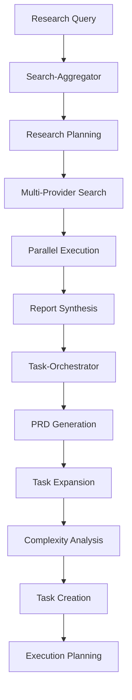
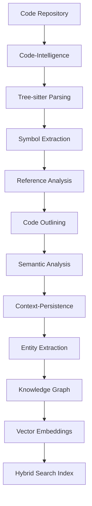
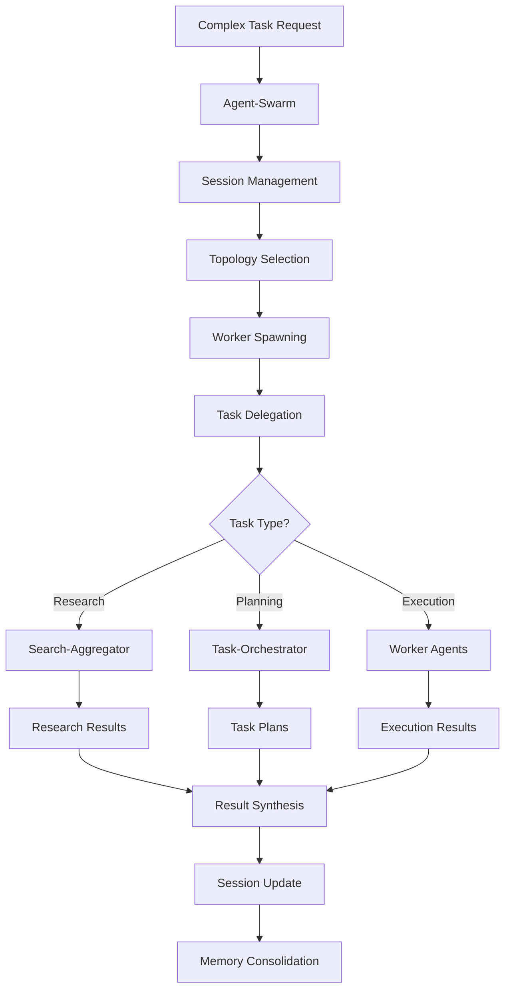
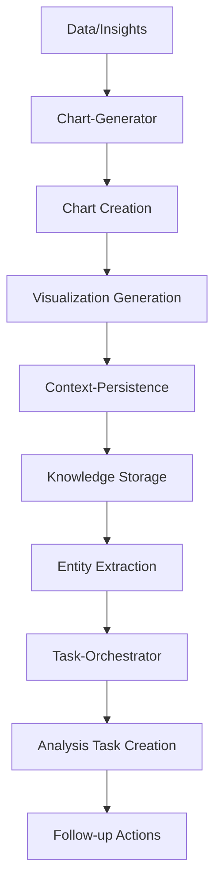

# Cross-Phase Workflows

## Overview

The MCP Advanced Multi-Agent Ecosystem enables powerful cross-phase workflows that combine the capabilities of multiple MCP servers to solve complex problems. These workflows leverage the strengths of each phase to create comprehensive solutions that would be impossible with individual servers working in isolation.

### Key Benefits

- **Synergistic Capabilities**: Combine specialized functions from multiple phases
- **Data Flow Optimization**: Seamless data transfer between related services
- **Intelligent Orchestration**: Automatic routing and task delegation
- **Enhanced Problem Solving**: Multi-perspective analysis and solution generation
- **Scalable Architecture**: Distributed processing across specialized components

## Workflow Patterns

### 1. Research → Tasks Workflow (Phase 8 → Phase 7)

This workflow transforms research findings into actionable tasks, enabling systematic execution of research-driven initiatives.

#### Architecture Diagram



#### Workflow Steps

1. **Research Initiation**
   - User submits research query to Search-Aggregator
   - Research planning identifies information needs
   - Multi-provider search strategy is developed

2. **Information Gathering**
   - Parallel execution across search providers
   - Local document search integration
   - Real-time result aggregation and filtering

3. **Knowledge Synthesis**
   - Report synthesis consolidates findings
   - Key insights and recommendations extracted
   - Actionable items identified

4. **Task Generation**
   - Research findings converted to PRD format
   - Task expansion breaks down complex items
   - Complexity analysis estimates effort and dependencies

5. **Execution Planning**
   - Tasks prioritized and scheduled
   - Resource allocation determined
   - Monitoring and tracking established

#### Implementation Example

```typescript
// Research → Tasks Workflow Implementation
class ResearchToTasksWorkflow {
  constructor(
    private searchClient: SearchAggregatorClient,
    private taskClient: TaskOrchestratorClient
  ) {}

  async executeResearchToTasks(query: string): Promise<WorkflowResult> {
    try {
      // Phase 1: Research Planning and Execution
      const researchPlan = await this.searchClient.planResearch({
        query,
        depth: 'comprehensive',
        sources: ['web', 'local', 'academic'],
        maxResults: 50
      });

      const researchResults = await this.searchClient.executeParallelSearch({
        plan: researchPlan,
        providers: ['brave', 'tavily', 'perplexity'],
        timeout: 300000 // 5 minutes
      });

      // Phase 2: Report Synthesis
      const report = await this.searchClient.synthesizeReport({
        results: researchResults,
        format: 'executive_summary',
        includeActionItems: true,
        includeRecommendations: true
      });

      // Phase 3: Task Generation from Research
      const prd = await this.taskClient.parsePRD({
        content: report.actionableContent,
        source: 'research_findings',
        metadata: {
          researchId: researchResults.id,
          query: query,
          timestamp: new Date().toISOString()
        }
      });

      // Phase 4: Task Expansion and Analysis
      const expandedTasks = await this.taskClient.expandTasks({
        tasks: prd.tasks,
        expansionLevel: 'detailed',
        includeDependencies: true
      });

      const complexityAnalysis = await this.taskClient.analyzeComplexity({
        tasks: expandedTasks.tasks,
        factors: ['effort', 'risk', 'dependencies', 'resources']
      });

      // Phase 5: Task Creation and Planning
      const createdTasks = await this.taskClient.createTasks({
        tasks: complexityAnalysis.analyzedTasks,
        priority: 'medium',
        assignTo: 'auto',
        includeSubtasks: true
      });

      return {
        success: true,
        researchResults: researchResults,
        synthesizedReport: report,
        createdTasks: createdTasks,
        workflowId: this.generateWorkflowId(),
        executionTime: this.calculateExecutionTime()
      };

    } catch (error) {
      return {
        success: false,
        error: error.message,
        workflowId: this.generateWorkflowId()
      };
    }
  }
}
```

#### Use Cases

- **Market Research**: Convert market analysis into product development tasks
- **Technical Research**: Transform technical findings into implementation tasks
- **Competitive Analysis**: Generate strategic initiatives from competitive research
- **Academic Research**: Create research execution plans from literature reviews

#### Performance Considerations

- **Research Timeout**: Set appropriate timeouts for comprehensive research
- **Task Granularity**: Balance between too granular and too coarse tasks
- **Dependency Management**: Handle complex task dependencies efficiently
- **Resource Allocation**: Optimize task assignment based on team capacity

### 2. Code Analysis → Knowledge Workflow (Phase 10 → Phase 6)

This workflow extracts insights from code analysis and stores them in the knowledge graph for future reference and learning.

#### Architecture Diagram



#### Workflow Steps

1. **Code Analysis Initiation**
   - Repository or codebase specified for analysis
   - Language-specific parsers selected
   - Analysis scope and depth defined

2. **Structural Analysis**
   - Tree-sitter parsing creates AST representations
   - Symbols, functions, and classes extracted
   - Reference relationships mapped

3. **Semantic Understanding**
   - Code outlines generated for structure understanding
   - Semantic patterns and relationships identified
   - Design patterns and architecture detected

4. **Knowledge Extraction**
   - Entities extracted from code analysis results
   - Relationships between entities established
   - Context and metadata captured

5. **Knowledge Storage**
   - Knowledge graph updated with code insights
   - Vector embeddings created for semantic search
   - Hybrid search indexes updated

#### Implementation Example

```typescript
// Code Analysis → Knowledge Workflow Implementation
class CodeToKnowledgeWorkflow {
  constructor(
    private codeClient: CodeIntelligenceClient,
    private contextClient: ContextPersistenceClient
  ) {}

  async analyzeAndStoreKnowledge(
    repositoryPath: string,
    languages: string[]
  ): Promise<WorkflowResult> {
    try {
      // Phase 1: Code Structure Analysis
      const codeStructure = await this.codeClient.analyzeRepository({
        path: repositoryPath,
        languages: languages,
        includeTests: true,
        depth: 'full'
      });

      // Phase 2: Symbol and Reference Analysis
      const symbols = await this.codeClient.findSymbols({
        repository: repositoryPath,
        types: ['function', 'class', 'interface', 'variable'],
        includeReferences: true,
        includeDefinitions: true
      });

      const references = await this.codeClient.findReferences({
        repository: repositoryPath,
        symbols: symbols.symbols,
        includeIndirect: true,
        maxDepth: 3
      });

      // Phase 3: Code Outlining and Semantic Analysis
      const outlines = await this.codeClient.generateOutlines({
        repository: repositoryPath,
        includeDocumentation: true,
        includeComments: true,
        semanticAnalysis: true
      });

      // Phase 4: Entity Extraction from Code Analysis
      const entities = await this.contextClient.extractEntities({
        text: JSON.stringify({
          structure: codeStructure,
          symbols: symbols,
          references: references,
          outlines: outlines
        }),
        entityTypes: ['code_component', 'design_pattern', 'architecture', 'dependency'],
        context: {
          repository: repositoryPath,
          languages: languages,
          analysisType: 'code_intelligence'
        }
      });

      // Phase 5: Knowledge Graph Integration
      const graphUpdate = await this.contextClient.updateKnowledgeGraph({
        entities: entities.entities,
        relationships: entities.relationships,
        mergeStrategy: 'upsert',
        validateConsistency: true
      });

      // Phase 6: Search Index Update
      const searchIndex = await this.contextClient.updateHybridSearch({
        documents: entities.entities.map(e => ({
          id: e.id,
          content: e.description || e.name,
          metadata: {
            type: e.type,
            repository: repositoryPath,
            language: e.language,
            confidence: e.confidence
          }
        })),
        indexType: 'code_knowledge',
        updateStrategy: 'incremental'
      });

      return {
        success: true,
        codeStructure: codeStructure,
        extractedEntities: entities.entities.length,
        knowledgeGraphNodes: graphUpdate.nodesAdded,
        searchIndexDocuments: searchIndex.documentsIndexed,
        workflowId: this.generateWorkflowId()
      };

    } catch (error) {
      return {
        success: false,
        error: error.message,
        workflowId: this.generateWorkflowId()
      };
    }
  }
}
```

#### Use Cases

- **Legacy System Analysis**: Understand and document legacy codebases
- **Code Review Automation**: Extract insights for automated code review
- **Architecture Documentation**: Generate and maintain architecture knowledge
- **Learning Systems**: Build knowledge bases from code patterns

#### Performance Considerations

- **Repository Size**: Handle large repositories with incremental processing
- **Language Complexity**: Optimize parsing for complex language features
- **Memory Usage**: Manage memory consumption for large codebases
- **Index Size**: Control search index size with selective indexing

### 3. Agent Swarm Orchestration Workflow (Phase 9 → Phase 7 → Phase 8)

This workflow coordinates multiple agents to execute complex tasks that require research, planning, and execution capabilities.

#### Architecture Diagram



#### Workflow Steps

1. **Swarm Initialization**
   - Complex task received and analyzed
   - Swarm session created with appropriate topology
   - Worker agents spawned based on task requirements

2. **Task Decomposition**
   - Complex task broken into subtasks
   - Subtasks categorized by type (research, planning, execution)
   - Dependencies between subtasks identified

3. **Agent Coordination**
   - Research tasks delegated to Search-Aggregator
   - Planning tasks sent to Task-Orchestrator
   - Execution tasks assigned to worker agents

4. **Parallel Processing**
   - Multiple agents work on different subtasks
   - Real-time coordination and synchronization
   - Progress monitoring and adjustment

5. **Result Integration**
   - Results from different agents synthesized
   - Final solution assembled and validated
   - Session memory updated with learnings

#### Implementation Example

```typescript
// Agent Swarm Orchestration Workflow Implementation
class SwarmOrchestrationWorkflow {
  constructor(
    private swarmClient: AgentSwarmClient,
    private searchClient: SearchAggregatorClient,
    private taskClient: TaskOrchestratorClient
  ) {}

  async executeComplexWorkflow(
    complexTask: ComplexTaskRequest
  ): Promise<WorkflowResult> {
    try {
      // Phase 1: Swarm Session Creation
      const session = await this.swarmClient.createSession({
        task: complexTask.description,
        topology: 'hierarchical',
        workerCount: this.calculateWorkerCount(complexTask),
        memoryTier: 'episodic',
        sparcWorkflow: true
      });

      // Phase 2: Task Decomposition and Planning
      const taskPlan = await this.swarmClient.decomposeTask({
        sessionId: session.sessionId,
        task: complexTask,
        decompositionStrategy: 'semantic',
        includeDependencies: true
      });

      // Phase 3: Agent Assignment and Coordination
      const agentAssignments = await this.swarmClient.assignAgents({
        sessionId: session.sessionId,
        subtasks: taskPlan.subtasks,
        capabilities: ['research', 'planning', 'execution', 'analysis']
      });

      // Phase 4: Parallel Execution Coordination
      const executionPromises = agentAssignments.assignments.map(async (assignment) => {
        switch (assignment.taskType) {
          case 'research':
            return this.executeResearchTask(assignment);
          case 'planning':
            return this.executePlanningTask(assignment);
          case 'execution':
            return this.executeWorkerTask(assignment);
          default:
            throw new Error(`Unknown task type: ${assignment.taskType}`);
        }
      });

      const results = await Promise.all(executionPromises);

      // Phase 5: Result Synthesis and Integration
      const synthesizedResult = await this.swarmClient.synthesizeResults({
        sessionId: session.sessionId,
        results: results,
        synthesisStrategy: 'weighted_consensus',
        includeConfidence: true
      });

      // Phase 6: Memory Consolidation
      await this.swarmClient.consolidateMemory({
        sessionId: session.sessionId,
        experience: synthesizedResult,
        learningStrategy: 'reinforcement',
        updateKnowledgeGraph: true
      });

      return {
        success: true,
        sessionId: session.sessionId,
        result: synthesizedResult,
        executionTime: synthesizedResult.metadata.executionTime,
        agentCount: agentAssignments.assignments.length,
        workflowId: this.generateWorkflowId()
      };

    } catch (error) {
      return {
        success: false,
        error: error.message,
        workflowId: this.generateWorkflowId()
      };
    }
  }

  private async executeResearchTask(assignment: AgentAssignment): Promise<TaskResult> {
    const researchResult = await this.searchClient.executeParallelSearch({
      query: assignment.parameters.query,
      providers: ['brave', 'tavily', 'perplexity'],
      maxResults: assignment.parameters.maxResults || 20,
      timeout: 60000
    });

    const report = await this.searchClient.synthesizeReport({
      results: researchResult,
      format: 'structured',
      includeActionItems: true
    });

    return {
      type: 'research',
      assignmentId: assignment.id,
      result: report,
      confidence: researchResult.confidence,
      executionTime: researchResult.executionTime
    };
  }

  private async executePlanningTask(assignment: AgentAssignment): Promise<TaskResult> {
    const prd = await this.taskClient.parsePRD({
      content: assignment.parameters.requirements,
      source: 'swarm_coordination'
    });

    const expandedTasks = await this.taskClient.expandTasks({
      tasks: prd.tasks,
      expansionLevel: assignment.parameters.expansionLevel || 'detailed'
    });

    return {
      type: 'planning',
      assignmentId: assignment.id,
      result: expandedTasks,
      confidence: prd.confidence,
      executionTime: expandedTasks.executionTime
    };
  }

  private async executeWorkerTask(assignment: AgentAssignment): Promise<TaskResult> {
    const workerResult = await this.swarmClient.executeWorkerTask({
      sessionId: assignment.sessionId,
      workerId: assignment.workerId,
      task: assignment.task,
      capabilities: assignment.capabilities
    });

    return {
      type: 'execution',
      assignmentId: assignment.id,
      result: workerResult,
      confidence: workerResult.confidence,
      executionTime: workerResult.executionTime
    };
  }
}
```

#### Use Cases

- **Complex Problem Solving**: Multi-faceted problems requiring different expertise
- **Research and Development**: Systematic R&D processes with multiple phases
- **Strategic Planning**: Comprehensive strategic analysis and planning
- **System Integration**: Complex system integration requiring multiple perspectives

#### Performance Considerations

- **Agent Coordination**: Optimize communication overhead between agents
- **Parallel Processing**: Balance parallelism with resource constraints
- **Memory Management**: Efficient memory consolidation and retrieval
- **Scalability**: Handle increasing complexity with graceful degradation

### 4. Visualization Pipeline Workflow (Phase 11 → Phase 6 → Phase 7)

This workflow creates visualizations from data and insights, then stores them in the knowledge base and creates tasks for further analysis.

#### Architecture Diagram



#### Workflow Steps

1. **Visualization Request**
   - Data or insights provided for visualization
   - Chart type and format specified
   - Styling and theme requirements defined

2. **Chart Generation**
   - Appropriate chart type selected based on data
   - High-quality visualization generated
   - Export options applied (PNG, SVG, etc.)

3. **Knowledge Capture**
   - Visualization metadata extracted
   - Insights and patterns identified
   - Context and relationships captured

4. **Task Generation**
   - Analysis tasks created from visualizations
   - Follow-up research identified
   - Action items generated

5. **Integration and Storage**
   - Visualizations stored in knowledge base
   - Tasks integrated into workflow systems
   - Cross-references established

#### Implementation Example

```typescript
// Visualization Pipeline Workflow Implementation
class VisualizationPipelineWorkflow {
  constructor(
    private chartClient: ChartGeneratorClient,
    private contextClient: ContextPersistenceClient,
    private taskClient: TaskOrchestratorClient
  ) {}

  async createVisualizationAndTasks(
    visualizationRequest: VisualizationRequest
  ): Promise<WorkflowResult> {
    try {
      // Phase 1: Chart Generation
      const chart = await this.chartClient.generateChart({
        type: visualizationRequest.chartType,
        data: visualizationRequest.data,
        options: {
          title: visualizationRequest.title,
          theme: visualizationRequest.theme || 'light',
          width: visualizationRequest.width || 800,
          height: visualizationRequest.height || 600,
          ...visualizationRequest.customOptions
        }
      });

      // Phase 2: Visualization Analysis
      const analysis = await this.analyzeVisualization({
        chart: chart,
        data: visualizationRequest.data,
        context: visualizationRequest.context
      });

      // Phase 3: Knowledge Storage
      const visualizationEntity = await this.contextClient.storeConversation({
        messages: [
          {
            role: 'system',
            content: 'Visualization generated and analyzed'
          },
          {
            role: 'user',
            content: `Created ${visualizationRequest.chartType} chart: ${visualizationRequest.title}`
          },
          {
            role: 'assistant',
            content: JSON.stringify(analysis.insights)
          }
        ],
        session_id: `visualization-${chart.metadata.chartId}`,
        metadata: {
          type: 'visualization',
          chartType: visualizationRequest.chartType,
          chartId: chart.metadata.chartId,
          insights: analysis.insights,
          dataPoints: visualizationRequest.data.labels?.length || 0
        }
      });

      // Phase 4: Task Generation from Visualization
      const visualizationTasks = await this.generateVisualizationTasks({
        insights: analysis.insights,
        chartType: visualizationRequest.chartType,
        context: visualizationRequest.context
      });

      const createdTasks = await this.taskClient.createTasks({
        tasks: visualizationTasks,
        priority: visualizationRequest.priority || 'medium',
        assignTo: 'auto',
        includeSubtasks: true
      });

      // Phase 5: Cross-Reference Establishment
      await this.contextClient.updateKnowledgeGraph({
        entities: [
          {
            id: chart.metadata.chartId,
            type: 'visualization',
            name: visualizationRequest.title,
            description: `Generated ${visualizationRequest.chartType} chart`,
            metadata: {
              chartType: visualizationRequest.chartType,
              dataPoints: visualizationRequest.data.labels?.length || 0,
              insights: analysis.insights.length,
              tasksCreated: createdTasks.tasks.length
            }
          }
        ],
        relationships: visualizationTasks.map(task => ({
          from: chart.metadata.chartId,
          to: task.id,
          type: 'generates_task',
          weight: 0.8
        }))
      });

      return {
        success: true,
        chart: chart,
        insights: analysis.insights,
        createdTasks: createdTasks.tasks,
        visualizationEntity: visualizationEntity,
        workflowId: this.generateWorkflowId()
      };

    } catch (error) {
      return {
        success: false,
        error: error.message,
        workflowId: this.generateWorkflowId()
      };
    }
  }

  private async analyzeVisualization(params: {
    chart: any;
    data: any;
    context: any;
  }): Promise<VisualizationAnalysis> {
    const insights: string[] = [];
    const data = params.data;

    // Analyze data patterns
    if (data.datasets) {
      data.datasets.forEach((dataset: any, index: number) => {
        const values = dataset.data;
        if (values && values.length > 0) {
          const max = Math.max(...values);
          const min = Math.min(...values);
          const avg = values.reduce((a: number, b: number) => a + b, 0) / values.length;

          insights.push(`Dataset ${index + 1} (${dataset.label}): Range ${min}-${max}, Average ${avg.toFixed(2)}`);

          // Identify outliers
          const threshold = avg + (avg * 0.5);
          const outliers = values.filter((v: number) => v > threshold);
          if (outliers.length > 0) {
            insights.push(`Dataset ${index + 1} has ${outliers.length} outlier values`);
          }
        }
      });
    }

    // Chart-specific analysis
    switch (params.chart.metadata.chartType) {
      case 'line':
        insights.push('Line chart shows trend over time - consider trend analysis');
        break;
      case 'bar':
        insights.push('Bar chart shows categorical comparison - identify top performers');
        break;
      case 'pie':
        insights.push('Pie chart shows proportion - focus on largest segments');
        break;
      case 'scatter':
        insights.push('Scatter plot shows correlation - consider regression analysis');
        break;
    }

    return {
      insights: insights,
      recommendations: this.generateRecommendations(insights, params.context),
      confidence: 0.85
    };
  }

  private generateRecommendations(insights: string[], context: any): string[] {
    const recommendations: string[] = [];

    insights.forEach(insight => {
      if (insight.includes('outlier')) {
        recommendations.push('Investigate outlier values for data quality issues');
      }
      if (insight.includes('trend')) {
        recommendations.push('Perform trend analysis and forecasting');
      }
      if (insight.includes('correlation')) {
        recommendations.push('Conduct correlation analysis to identify relationships');
      }
    });

    return recommendations;
  }

  private generateVisualizationTasks(params: {
    insights: string[];
    chartType: string;
    context: any;
  }): Task[] {
    const tasks: Task[] = [];

    params.insights.forEach((insight, index) => {
      if (insight.includes('outlier')) {
        tasks.push({
          title: `Investigate outliers in visualization ${index + 1}`,
          description: `Analyze outlier values identified: ${insight}`,
          priority: 'medium',
          estimatedHours: 2,
          tags: ['data-quality', 'analysis']
        });
      }

      if (insight.includes('trend')) {
        tasks.push({
          title: `Perform trend analysis for chart ${index + 1}`,
          description: `Conduct detailed trend analysis: ${insight}`,
          priority: 'high',
          estimatedHours: 4,
          tags: ['trend-analysis', 'forecasting']
        });
      }

      if (insight.includes('correlation')) {
        tasks.push({
          title: `Correlation analysis for visualization ${index + 1}`,
          description: `Analyze correlations: ${insight}`,
          priority: 'medium',
          estimatedHours: 3,
          tags: ['correlation', 'statistics']
        });
      }
    });

    return tasks;
  }
}
```

#### Use Cases

- **Data Analysis**: Automated analysis and task generation from data visualizations
- **Business Intelligence**: Creating insights and action items from business charts
- **Scientific Research**: Generating research tasks from experimental visualizations
- **Performance Monitoring**: Creating optimization tasks from performance charts

#### Performance Considerations

- **Chart Complexity**: Handle complex visualizations efficiently
- **Analysis Depth**: Balance analysis depth with processing time
- **Task Relevance**: Ensure generated tasks are relevant and actionable
- **Storage Optimization**: Optimize storage of visualization metadata

## Error Handling and Recovery

### Common Error Scenarios

#### 1. Service Unavailability

**Problem**: One or more MCP servers become unavailable during workflow execution.

**Solution**:
```typescript
class WorkflowErrorHandler {
  async handleServiceUnavailable(
    workflowId: string,
    unavailableService: string,
    context: any
  ): Promise<RecoveryAction> {
    // Check for alternative services
    const alternatives = this.getAlternativeServices(unavailableService);
    
    if (alternatives.length > 0) {
      return {
        action: 'retry_with_alternative',
        alternativeService: alternatives[0],
        retryDelay: 5000
      };
    }
    
    // Check if workflow can continue without this service
    if (this.isServiceOptional(unavailableService, context)) {
      return {
        action: 'continue_without_service',
        warning: `Service ${unavailableService} unavailable, continuing with reduced functionality`
      };
    }
    
    // Pause workflow and retry later
    return {
      action: 'pause_and_retry',
      retryDelay: 30000,
      maxRetries: 3
    };
  }
}
```

#### 2. Data Format Mismatches

**Problem**: Data format incompatibilities between phases.

**Solution**:
```typescript
class DataFormatHandler {
  async handleFormatMismatch(
    sourcePhase: string,
    targetPhase: string,
    data: any,
    expectedFormat: any
  ): Promise<TransformedData> {
    try {
      // Attempt automatic transformation
      const transformed = await this.transformData(data, expectedFormat);
      
      return {
        success: true,
        transformedData: transformed,
        transformationApplied: true
      };
    } catch (error) {
      // Request manual intervention
      return {
        success: false,
        error: `Data format mismatch between ${sourcePhase} and ${targetPhase}`,
        requiresManualIntervention: true,
        suggestedFix: this.suggestFix(data, expectedFormat)
      };
    }
  }
}
```

#### 3. Timeout Handling

**Problem**: Workflow steps taking too long to complete.

**Solution**:
```typescript
class TimeoutHandler {
  async handleTimeout(
    workflowId: string,
    stepName: string,
    timeoutDuration: number
  ): Promise<TimeoutAction> {
    // Check if step can be safely interrupted
    if (this.isInterruptible(stepName)) {
      return {
        action: 'interrupt_and_continue',
        partialResult: true,
        warning: `Step ${stepName} interrupted due to timeout`
      };
    }
    
    // Check if timeout can be extended
    if (this.canExtendTimeout(stepName)) {
      return {
        action: 'extend_timeout',
        newTimeout: timeoutDuration * 2,
        maxExtensions: 2
      };
    }
    
    // Fail gracefully
    return {
      action: 'fail_gracefully',
      error: `Step ${stepName} failed due to timeout`,
      rollbackPrevious: true
    };
  }
}
```

### Recovery Strategies

#### 1. Checkpoint and Resume

```typescript
class WorkflowCheckpointManager {
  async createCheckpoint(
    workflowId: string,
    stepName: string,
    context: any
  ): Promise<Checkpoint> {
    const checkpoint = {
      workflowId,
      stepName,
      timestamp: new Date().toISOString(),
      context: this.serializeContext(context),
      state: 'completed'
    };
    
    await this.storeCheckpoint(checkpoint);
    return checkpoint;
  }
  
  async resumeFromCheckpoint(
    workflowId: string,
    checkpointId: string
  ): Promise<ResumeResult> {
    const checkpoint = await this.getCheckpoint(checkpointId);
    
    if (!checkpoint) {
      return {
        success: false,
        error: 'Checkpoint not found'
      };
    }
    
    const context = this.deserializeContext(checkpoint.context);
    const nextStep = this.getNextStep(checkpoint.stepName);
    
    return {
      success: true,
      context,
      nextStep,
      resumedFrom: checkpoint.stepName
    };
  }
}
```

#### 2. Graceful Degradation

```typescript
class GracefulDegradationHandler {
  async handleDegradation(
    workflowId: string,
    failedComponent: string,
    availableCapabilities: string[]
  ): Promise<DegradationPlan> {
    const originalPlan = await this.getWorkflowPlan(workflowId);
    const degradedPlan = this.createDegradedPlan(
      originalPlan,
      failedComponent,
      availableCapabilities
    );
    
    return {
      originalPlan,
      degradedPlan,
      capabilitiesLost: this.getLostCapabilities(failedComponent),
      functionalityImpact: this.assessImpact(failedComponent),
      canComplete: degradedPlan.steps.every(step => step.isExecutable)
    };
  }
}
```

## Performance Optimization

### 1. Parallel Processing

```typescript
class ParallelWorkflowOptimizer {
  async optimizeParallelExecution(
    workflowSteps: WorkflowStep[]
  ): Promise<OptimizedPlan> {
    // Analyze dependencies between steps
    const dependencyGraph = this.buildDependencyGraph(workflowSteps);
    
    // Identify parallelizable steps
    const parallelGroups = this.identifyParallelGroups(dependencyGraph);
    
    // Create optimized execution plan
    const optimizedPlan = {
      parallelGroups,
      estimatedExecutionTime: this.calculateExecutionTime(parallelGroups),
      resourceRequirements: this.calculateResourceRequirements(parallelGroups)
    };
    
    return optimizedPlan;
  }
}
```

### 2. Caching Strategy

```typescript
class WorkflowCacheManager {
  async cacheWorkflowResults(
    workflowId: string,
    stepName: string,
    results: any,
    cacheKey: string
  ): Promise<void> {
    const cacheEntry = {
      workflowId,
      stepName,
      results,
      cacheKey,
      timestamp: new Date().toISOString(),
      ttl: this.calculateTTL(results)
    };
    
    await this.storeInCache(cacheEntry);
  }
  
  async getCachedResults(cacheKey: string): Promise<CachedResult | null> {
    const cached = await this.getFromCache(cacheKey);
    
    if (!cached) {
      return null;
    }
    
    if (this.isExpired(cached)) {
      await this.removeFromCache(cacheKey);
      return null;
    }
    
    return cached;
  }
}
```

### 3. Resource Management

```typescript
class WorkflowResourceManager {
  async allocateResources(
    workflowId: string,
    requirements: ResourceRequirements
  ): Promise<ResourceAllocation> {
    const availableResources = await this.getAvailableResources();
    const allocation = this.optimizeAllocation(requirements, availableResources);
    
    if (allocation.sufficient) {
      await this.reserveResources(workflowId, allocation.allocated);
      return allocation;
    }
    
    // Queue workflow if insufficient resources
    await this.queueWorkflow(workflowId, requirements);
    return {
      sufficient: false,
      queuePosition: await this.getQueuePosition(workflowId),
      estimatedWaitTime: this.estimateWaitTime(requirements)
    };
  }
}
```

## Monitoring and Observability

### 1. Workflow Metrics

```typescript
class WorkflowMetricsCollector {
  async collectWorkflowMetrics(
    workflowId: string,
    stepName: string,
    metrics: StepMetrics
  ): Promise<void> {
    const workflowMetrics = {
      workflowId,
      stepName,
      timestamp: new Date().toISOString(),
      executionTime: metrics.executionTime,
      memoryUsage: metrics.memoryUsage,
      cpuUsage: metrics.cpuUsage,
      networkIO: metrics.networkIO,
      success: metrics.success,
      errorCount: metrics.errorCount
    };
    
    await this.storeMetrics(workflowMetrics);
    await this.updateDashboard(workflowMetrics);
  }
}
```

### 2. Health Monitoring

```typescript
class WorkflowHealthMonitor {
  async checkWorkflowHealth(workflowId: string): Promise<HealthStatus> {
    const metrics = await this.getWorkflowMetrics(workflowId);
    const dependencies = await this.getWorkflowDependencies(workflowId);
    
    const healthScore = this.calculateHealthScore(metrics, dependencies);
    const issues = this.identifyHealthIssues(metrics, dependencies);
    
    return {
      workflowId,
      healthScore,
      status: healthScore > 0.8 ? 'healthy' : healthScore > 0.5 ? 'degraded' : 'unhealthy',
      issues,
      recommendations: this.generateRecommendations(issues)
    };
  }
}
```

## Best Practices

### 1. Workflow Design

- **Modular Design**: Design workflows as composable modules
- **Clear Boundaries**: Define clear interfaces between phases
- **Error Isolation**: Isolate errors to prevent cascade failures
- **Idempotency**: Design steps to be idempotent where possible
- **Observability**: Include comprehensive logging and monitoring

### 2. Data Management

- **Data Validation**: Validate data at phase boundaries
- **Schema Evolution**: Plan for schema changes over time
- **Data Privacy**: Ensure sensitive data is handled appropriately
- **Backup Strategy**: Implement backup and recovery for critical data
- **Data Lineage**: Track data flow through the workflow

### 3. Performance Optimization

- **Lazy Loading**: Load data only when needed
- **Batch Processing**: Process items in batches for efficiency
- **Connection Pooling**: Reuse connections between services
- **Compression**: Compress data transfers between phases
- **Resource Limits**: Set appropriate resource limits and timeouts

### 4. Security Considerations

- **Authentication**: Secure inter-service communication
- **Authorization**: Implement proper access controls
- **Data Encryption**: Encrypt sensitive data in transit and at rest
- **Audit Logging**: Log all workflow activities for audit trails
- **Vulnerability Management**: Regularly update dependencies and patch vulnerabilities

## Testing Cross-Phase Workflows

### 1. Integration Testing

```typescript
describe('Cross-Phase Workflow Integration', () => {
  test('Research to Tasks workflow', async () => {
    const workflow = new ResearchToTasksWorkflow(
      mockSearchClient,
      mockTaskClient
    );
    
    const result = await workflow.executeResearchToTasks(
      'Analyze market trends for electric vehicles'
    );
    
    expect(result.success).toBe(true);
    expect(result.createdTasks.tasks.length).toBeGreaterThan(0);
    expect(result.researchResults).toBeDefined();
  });
  
  test('Code Analysis to Knowledge workflow', async () => {
    const workflow = new CodeToKnowledgeWorkflow(
      mockCodeClient,
      mockContextClient
    );
    
    const result = await workflow.analyzeAndStoreKnowledge(
      '/path/to/repository',
      ['typescript', 'javascript']
    );
    
    expect(result.success).toBe(true);
    expect(result.extractedEntities).toBeGreaterThan(0);
    expect(result.knowledgeGraphNodes).toBeGreaterThan(0);
  });
});
```

### 2. Performance Testing

```typescript
describe('Workflow Performance', () => {
  test('Parallel workflow execution', async () => {
    const startTime = performance.now();
    
    const promises = Array.from({ length: 10 }, () =>
      executeComplexWorkflow(mockComplexTask)
    );
    
    const results = await Promise.all(promises);
    const endTime = performance.now();
    
    const totalTime = endTime - startTime;
    const avgTime = totalTime / 10;
    
    expect(results.every(r => r.success)).toBe(true);
    expect(avgTime).toBeLessThan(30000); // 30 seconds per workflow
  });
});
```

### 3. Error Handling Testing

```typescript
describe('Workflow Error Handling', () => {
  test('Service unavailable recovery', async () => {
    const workflow = new ComplexWorkflow(mockClients);
    
    // Simulate service unavailability
    mockSearchClient.simulateUnavailable();
    
    const result = await workflow.executeWithRecovery(mockTask);
    
    expect(result.recoveryAction).toBeDefined();
    expect(result.recoveryAction.action).toBe('retry_with_alternative');
  });
});
```

This comprehensive documentation covers all the major cross-phase workflows in the MCP Advanced Multi-Agent Ecosystem, providing detailed implementation examples, error handling strategies, performance optimization techniques, and best practices for building robust, scalable workflows that leverage the full power of the interconnected MCP servers.