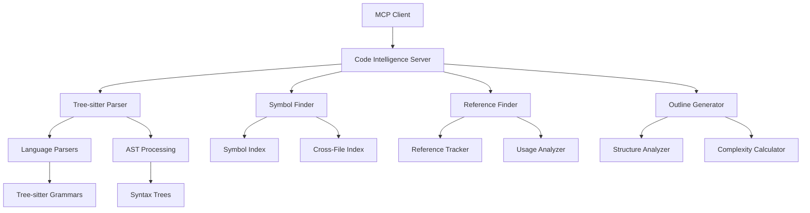

# Phase 10: Code-Intelligence MCP Server

## Overview

The Code-Intelligence MCP server provides advanced code analysis capabilities using Tree-sitter parsing technology. It offers symbol finding, reference tracking, code outlining, and semantic structure analysis across multiple programming languages. This server serves as the foundation for understanding and navigating complex codebases within the MCP ecosystem.

### Key Features

- **Tree-sitter Parsing**: Fast, accurate parsing of source code using Tree-sitter grammars
- **Symbol Finding**: Locate function, class, variable, and type definitions across files
- **Reference Tracking**: Find all references to symbols with context and usage analysis
- **Code Outlining**: Generate hierarchical structure views of code files
- **Semantic Analysis**: Extract semantic relationships and code complexity metrics
- **Multi-Language Support**: Support for TypeScript, JavaScript, Python, Java, C++, and more
- **Call Hierarchy**: Build complete call graphs for functions and methods
- **Cross-File Analysis**: Analyze relationships between files and modules

## Architecture

### Core Components



### Data Flow

1. **File Processing**: Source files are parsed using Tree-sitter for accurate AST generation
2. **Symbol Extraction**: Functions, classes, variables, and types are extracted from ASTs
3. **Index Building**: Symbols and references are indexed for fast lookup
4. **Analysis Processing**: Semantic relationships and complexity metrics are calculated
5. **Query Resolution**: User queries are resolved against the symbol and reference indexes
6. **Result Generation**: Structured results are generated with context and relationships

### Language Support

The server supports multiple programming languages with Tree-sitter grammars:

#### Primary Languages
- **TypeScript**: Full TypeScript syntax and type system support
- **JavaScript**: Modern JavaScript including ES2020+ features
- **Python**: Python 3.x syntax with type hints support
- **Java**: Java 8+ syntax with full language features

#### Extended Languages
- **C++**: Modern C++ with templates and STL support
- **C**: C11 and later standards
- **Go**: Go 1.x language features
- **Rust**: Rust syntax with ownership and lifetime tracking
- **Ruby**: Ruby 2.x and later features
- **PHP**: PHP 7.x and later syntax

## MCP Tools

The Code-Intelligence server provides 6 MCP tools:

### Core Analysis Tools

#### `find_symbol`
Find symbol definitions by name across multiple files.

**Parameters:**
- `name` (string, required): Symbol name to find
- `filePaths` (array, required): Files to search
- `language` (string, optional): Optional language filter

**Returns:**
- `symbolName`: The searched symbol name
- `matches`: Array of symbol definitions found
- `count`: Total number of matches

**Example Match:**
```json
{
  "name": "calculateTotal",
  "type": "function",
  "filePath": "src/calculator.ts",
  "location": "src/calculator.ts:15:1",
  "signature": "calculateTotal(items: number[]): number",
  "visibility": "exported"
}
```

#### `find_references`
Find all references to a symbol across specified files.

**Parameters:**
- `symbolName` (string, required): Symbol to find references for
- `filePaths` (array, required): Files to search

**Returns:**
- `symbolName`: The searched symbol name
- `references`: Array of reference locations with context
- `count`: Total number of references found

**Example Reference:**
```json
{
  "filePath": "src/main.ts",
  "line": 42,
  "column": 15,
  "context": "const result = calculateTotal(items);",
  "isDefinition": false,
  "referenceType": "call"
}
```

#### `get_code_outline`
Generate code structure outline for a file.

**Parameters:**
- `filePath` (string, required): File to analyze

**Returns:**
- `filePath`: Analyzed file path
- `language`: Detected programming language
- `imports`: Array of import statements
- `symbols`: Array of symbols with hierarchical structure
- `complexity`: Code complexity metrics
- `structure`: Hierarchical file structure

#### `analyze_semantic_structure`
Analyze file and return symbols, imports, and complexity metrics.

**Parameters:**
- `filePath` (string, required): File to analyze

**Returns:**
- `filePath`: Analyzed file path
- `language`: Detected programming language
- `metrics`: Analysis metrics including counts and complexity
- `symbols`: All symbols with detailed information
- `imports`: Import statements and dependencies

#### `get_call_hierarchy`
Build call hierarchy for a function.

**Parameters:**
- `functionName` (string, required): Function name to analyze
- `filePaths` (array, required): Files to analyze

**Returns:**
- `function`: Target function information
- `calledBy`: Functions that call this function
- `calls`: Functions called by this function
- `hierarchy`: Complete call tree structure

#### `parse_file`
Parse a file and return AST information.

**Parameters:**
- `filePath` (string, required): File to parse
- `printTree` (boolean, default: false): Include pretty-printed AST

**Returns:**
- `filePath`: Parsed file path
- `language`: Detected programming language
- `hasErrors`: Whether parsing encountered errors
- `errors`: Parsing errors if any
- `tree`: AST tree structure (if requested)

#### `get_supported_languages`
List all supported programming languages.

**Parameters:**
- None

**Returns:**
- `languages`: Array of supported languages with details
- `count`: Total number of supported languages

**Example Language Support:**
```json
{
  "language": "TypeScript",
  "version": "5.0+",
  "features": [
    "classes",
    "interfaces",
    "generics",
    "decorators",
    "modules"
  ],
  "treeSitterGrammar": "tree-sitter-typescript"
}
```

## Configuration

### Environment Variables

```bash
# Parser Configuration
TREE_SITTER_GRAMMAR_PATH=/path/to/tree-sitter/grammars
PARSER_CACHE_SIZE=1000
PARSER_TIMEOUT=30

# Analysis Configuration
MAX_FILE_SIZE=10485760  # 10MB
MAX_SYMBOL_RESULTS=1000
MAX_REFERENCES_PER_SYMBOL=500
ENABLE_CROSS_FILE_ANALYSIS=true

# Performance Configuration
PARALLEL_WORKERS=4
INDEX_CACHE_TTL=3600
SYMBOL_INDEX_UPDATE_INTERVAL=300

# Language-Specific Settings
TYPESCRIPT_CONFIG_PATH=/path/to/tsconfig.json
PYTHON_PATH=python3
JAVA_CLASSPATH=/path/to/classes
```

### Dependencies

#### Node.js Dependencies (package.json)

```json
{
  "dependencies": {
    "@modelcontextprotocol/sdk": "^1.0.0",
    "tree-sitter": "^0.20.0",
    "tree-sitter-typescript": "^0.20.0",
    "tree-sitter-javascript": "^0.20.0",
    "tree-sitter-python": "^0.20.0",
    "tree-sitter-java": "^0.20.0",
    "tree-sitter-cpp": "^0.20.0",
    "tree-sitter-c": "^0.20.0",
    "tree-sitter-go": "^0.20.0",
    "tree-sitter-rust": "^0.20.0",
    "tree-sitter-ruby": "^0.20.0",
    "tree-sitter-php": "^0.20.0"
  },
  "devDependencies": {
    "@types/node": "^20.0.0",
    "typescript": "^5.0.0",
    "jest": "^29.0.0",
    "@types/jest": "^29.0.0"
  }
}
```

#### Tree-sitter Grammars

The server uses Tree-sitter grammars for accurate parsing:

- **tree-sitter-typescript**: TypeScript language support
- **tree-sitter-javascript**: JavaScript language support
- **tree-sitter-python**: Python language support
- **tree-sitter-java**: Java language support
- **tree-sitter-cpp**: C++ language support
- **tree-sitter-c**: C language support
- **tree-sitter-go**: Go language support
- **tree-sitter-rust**: Rust language support
- **tree-sitter-ruby**: Ruby language support
- **tree-sitter-php**: PHP language support

## Usage Examples

### Basic Symbol Finding

```typescript
import { CodeIntelligenceClient } from '@mcp/code-intelligence';

const client = new CodeIntelligenceClient();

// Find function definitions
const functions = await client.findSymbol('calculateTotal', [
  'src/calculator.ts',
  'src/math.ts',
  'src/utils.ts'
]);

console.log(`Found ${functions.count} functions:`);
functions.matches.forEach(func => {
  console.log(`- ${func.name} in ${func.filePath}:${func.location}`);
  console.log(`  Signature: ${func.signature}`);
  console.log(`  Type: ${func.type}`);
});
```

### Reference Tracking

```typescript
// Find all references to a function
const references = await client.findReferences('calculateTotal', [
  'src/calculator.ts',
  'src/main.ts',
  'src/tests/calculator.test.ts'
]);

console.log(`Found ${references.count} references:`);
references.references.forEach(ref => {
  console.log(`- ${ref.filePath}:${ref.line}:${ref.column}`);
  console.log(`  Context: ${ref.context}`);
  console.log(`  Type: ${ref.referenceType}`);
});
```

### Code Outlining

```typescript
// Generate code outline
const outline = await client.getCodeOutline('src/calculator.ts');

console.log(`File: ${outline.filePath}`);
console.log(`Language: ${outline.language}`);
console.log(`Imports: ${outline.imports.length}`);
console.log(`Symbols: ${outline.symbols.length}`);

outline.symbols.forEach(symbol => {
  console.log(`- ${symbol.type}: ${symbol.name} (${symbol.line})`);
});
```

### Semantic Analysis

```typescript
// Analyze file structure and complexity
const analysis = await client.analyzeSemanticStructure('src/calculator.ts');

console.log(`Analysis for ${analysis.filePath}:`);
console.log(`Functions: ${analysis.metrics.functions}`);
console.log(`Classes: ${analysis.metrics.classes}`);
console.log(`Lines: ${analysis.metrics.lines}`);
console.log(`Complexity: ${analysis.metrics.complexity}`);
console.log(`Maintainability: ${analysis.metrics.maintainabilityIndex}`);
```

### Call Hierarchy

```typescript
// Build call hierarchy for a function
const hierarchy = await client.getCallHierarchy('main', [
  'src/main.ts',
  'src/app.ts',
  'src/utils.ts'
]);

console.log(`Call hierarchy for '${hierarchy.function.name}':`);
console.log(`Called by: ${hierarchy.calledBy.length} functions`);
hierarchy.calledBy.forEach(caller => {
  console.log(`- ${caller.functionName} (${caller.location})`);
});

console.log(`Calls: ${hierarchy.calls.length} functions`);
hierarchy.calls.forEach(call => {
  console.log(`- ${call.functionName} (${call.location})`);
});
```

### File Parsing

```typescript
// Parse file and get AST
const parseResult = await client.parseFile('src/calculator.ts', {
  printTree: true
});

if (parseResult.hasErrors) {
  console.log('Parsing errors found:');
  parseResult.errors.forEach(error => {
    console.log(`- ${error.location}: ${error.text}`);
  });
} else {
  console.log('AST tree:');
  console.log(parseResult.tree);
}
```

### Language Support

```typescript
// Check supported languages
const languages = await client.getSupportedLanguages();

console.log(`Supported languages: ${languages.count}`);
languages.languages.forEach(lang => {
  console.log(`- ${lang.language} (${lang.version})`);
  console.log(`  Features: ${lang.features.join(', ')}`);
  console.log(`  Grammar: ${lang.treeSitterGrammar}`);
});
```

## API Reference

### Core Classes

#### `CodeIntelligenceClient`

Main client class for interacting with the Code-Intelligence server.

```typescript
class CodeIntelligenceClient {
  constructor(baseURL?: string);
  
  // Symbol and reference operations
  async findSymbol(name: string, filePaths: string[], language?: string): Promise<FindSymbolResponse>;
  async findReferences(symbolName: string, filePaths: string[]): Promise<FindReferencesResponse>;
  
  // Code structure analysis
  async getCodeOutline(filePath: string): Promise<CodeOutlineResponse>;
  async analyzeSemanticStructure(filePath: string): Promise<SemanticAnalysisResponse>;
  async getCallHierarchy(functionName: string, filePaths: string[]): Promise<CallHierarchyResponse>;
  
  // File parsing
  async parseFile(filePath: string, options?: ParseFileOptions): Promise<ParseFileResponse>;
  
  // Language support
  async getSupportedLanguages(): Promise<SupportedLanguagesResponse>;
}
```

#### `Symbol`

Symbol definition data model.

```typescript
interface Symbol {
  name: string;
  type: SymbolType;
  filePath: string;
  location: string; // line:column format
  signature: string;
  visibility: SymbolVisibility;
  parent?: string;
  children?: Symbol[];
  metadata?: Record<string, any>;
}
```

#### `Reference`

Symbol reference data model.

```typescript
interface Reference {
  symbolName: string;
  filePath: string;
  line: number;
  column: number;
  context: string;
  isDefinition: boolean;
  referenceType: ReferenceType;
}
```

#### `CodeOutline`

Code outline structure.

```typescript
interface CodeOutline {
  filePath: string;
  language: string;
  imports: Import[];
  symbols: Symbol[];
  complexity: ComplexityMetrics;
  structure: FileStructure;
}
```

#### `SemanticAnalysis`

Semantic analysis results.

```typescript
interface SemanticAnalysis {
  filePath: string;
  language: string;
  metrics: {
    imports: number;
    functions: number;
    classes: number;
    interfaces: number;
    lines: number;
    complexity: number;
    maintainabilityIndex: number;
  };
  symbols: Symbol[];
  imports: Import[];
}
```

## Best Practices

### Performance Optimization

1. **Incremental Parsing**: Parse only changed files when possible
2. **Symbol Caching**: Cache symbol indexes for frequently accessed files
3. **Parallel Processing**: Use worker threads for large file analysis
4. **Memory Management**: Limit concurrent parsing operations to prevent memory issues

### Accuracy Considerations

1. **Grammar Updates**: Keep Tree-sitter grammars up to date
2. **Error Handling**: Gracefully handle parsing errors and partial results
3. **Language Detection**: Use file extensions and content analysis for language detection
4. **Cross-File Consistency**: Ensure symbol references work across file boundaries

### Integration Patterns

1. **IDE Integration**: Use results for code navigation and IntelliSense
2. **Refactoring Support**: Leverage symbol analysis for safe refactoring
3. **Documentation Generation**: Use outline structure for automatic documentation
4. **Code Review**: Use reference tracking for impact analysis

## Performance Tuning

### Parser Configuration

```typescript
// Configure Tree-sitter parser
const parserConfig = {
  maxFileSize: 10485760, // 10MB
  timeout: 30000, // 30 seconds
  cacheSize: 1000,
  parallelWorkers: 4,
  grammarPaths: [
    '/path/to/tree-sitter/grammars',
    '/usr/local/lib/tree-sitter'
  ]
};
```

### Index Optimization

```typescript
// Configure symbol and reference indexing
const indexConfig = {
  symbolIndex: {
    updateInterval: 300000, // 5 minutes
    maxEntries: 100000,
    cacheStrategy: 'lru'
  },
  referenceIndex: {
    maxReferencesPerSymbol: 1000,
    crossFileIndexing: true,
    contextWindow: 5 // lines before/after reference
  }
};
```

### Memory Management

```typescript
// Configure memory usage
const memoryConfig = {
  maxConcurrentParsers: 10,
  astNodeLimit: 100000,
  symbolCacheSize: 50000,
  gcInterval: 60000 // 1 minute
};
```

## Troubleshooting

### Common Issues

#### Parsing Failures

**Symptoms**: Files fail to parse or return empty results
**Solutions**:
1. Check if Tree-sitter grammars are installed and accessible
2. Verify file encoding and format (UTF-8 recommended)
3. Check file permissions and accessibility
4. Review file size against configured limits

#### Symbol Not Found

**Symptoms**: Symbol search returns no results for existing symbols
**Solutions**:
1. Verify exact symbol name and case sensitivity
2. Check if files are included in the search scope
3. Ensure language parser is correctly configured
4. Check for parsing errors in target files

#### Performance Issues

**Symptoms**: Slow analysis times or high memory usage
**Solutions**:
1. Reduce file sizes analyzed in parallel
2. Adjust worker pool size based on available resources
3. Enable result caching for repeated queries
4. Review symbol index configuration

#### Memory Leaks

**Symptoms**: Memory usage increases over time
**Solutions**:
1. Ensure AST nodes are properly garbage collected
2. Limit cache sizes and implement eviction policies
3. Monitor worker thread lifecycle
4. Check for circular references in data structures

### Debug Mode

Enable debug logging:

```typescript
// Set debug level
process.env.CODE_INTELLIGENCE_LOG_LEVEL = 'debug';

// Or via configuration
const client = new CodeIntelligenceClient({
  baseURL: 'http://localhost:8000',
  logLevel: 'debug'
});
```

### Health Monitoring

```typescript
// Check system health
const health = await client.healthCheck();

// Monitor performance metrics
const metrics = await client.getPerformanceMetrics();

// Check language parser status
const parserStatus = await client.getParserStatus();
```

## Integration Examples

### Integration with Task Orchestrator

```typescript
// Analyze task complexity before assignment
const analysis = await codeClient.analyzeSemanticStructure(task.filePath);

const complexity = {
  score: analysis.metrics.complexity,
  functions: analysis.metrics.functions,
  classes: analysis.metrics.classes,
  lines: analysis.metrics.lines
};

await taskClient.updateTaskComplexity(task.id, complexity);
```

### Integration with Agent Swarm

```typescript
// Provide code intelligence to agents
const outline = await codeClient.getCodeOutline(filePath);

await swarmClient.shareKnowledge({
  fromAgentId: 'code-intelligence',
  toAgentId: 'implementation-agent',
  knowledgeType: 'code-structure',
  content: {
    filePath,
    outline: outline.structure,
    symbols: outline.symbols,
    complexity: outline.complexity
  }
});
```

### Integration with Context Persistence

```typescript
// Store code analysis results in context
await contextClient.storeConversation({
  messages: [
    { role: 'system', content: 'Code analysis completed' },
    { role: 'user', content: `Analyzed ${filePath}` },
    { role: 'assistant', content: JSON.stringify(analysis) }
  ],
  session_id: `code-analysis-${Date.now()}`,
  metadata: {
    type: 'code-analysis',
    filePath,
    language: analysis.language,
    symbolCount: analysis.symbols.length
  }
});
```

## Migration and Deployment

### Database Migration

```typescript
// Initialize symbol indexes
import { SymbolIndex } from './symbol-index';

const index = new SymbolIndex();
await index.initialize({
  storagePath: '/path/to/symbols.db',
  languages: ['typescript', 'javascript', 'python'],
  rebuildIndex: true
});
```

### Docker Deployment

```dockerfile
FROM node:18-alpine

WORKDIR /app

# Install dependencies
COPY package*.json ./
RUN npm ci --only=production

# Copy Tree-sitter grammars
COPY ./grammars /app/grammars

# Copy source code
COPY . .

# Build TypeScript
RUN npm run build

# Create data directories
RUN mkdir -p /app/data /app/cache

# Expose port
EXPOSE 8000

# Run application
CMD ["node", "dist/index.js"]
```

### Kubernetes Deployment

```yaml
apiVersion: apps/v1
kind: Deployment
metadata:
  name: code-intelligence
spec:
  replicas: 3
  selector:
    matchLabels:
      app: code-intelligence
  template:
    metadata:
      labels:
        app: code-intelligence
    spec:
      containers:
      - name: code-intelligence
        image: code-intelligence:latest
        ports:
        - containerPort: 8000
        env:
        - name: MAX_FILE_SIZE
          value: "10485760"
        - name: PARALLEL_WORKERS
          value: "4"
        resources:
          requests:
            memory: "512Mi"
            cpu: "250m"
          limits:
            memory: "1Gi"
            cpu: "500m"
        volumeMounts:
        - name: grammar-volume
          mountPath: /app/grammars
        - name: cache-volume
          mountPath: /app/cache
      volumes:
      - name: grammar-volume
        persistentVolumeClaim:
          claimName: tree-sitter-grammars
      - name: cache-volume
        persistentVolumeClaim:
          claimName: code-intelligence-cache
```

## Testing

### Unit Tests

```typescript
import { CodeIntelligenceClient } from '../src/client';

describe('CodeIntelligenceClient', () => {
  let client: CodeIntelligenceClient;

  beforeEach(() => {
    client = new CodeIntelligenceClient('http://localhost:8000');
  });

  test('should find symbols in TypeScript file', async () => {
    const result = await client.findSymbol('calculateTotal', ['test/fixtures/calculator.ts']);
    
    expect(result.matches).toBeDefined();
    expect(result.matches.length).toBeGreaterThan(0);
    
    const symbol = result.matches[0];
    expect(symbol.name).toBe('calculateTotal');
    expect(symbol.type).toBe('function');
    expect(symbol.filePath).toBe('test/fixtures/calculator.ts');
  });

  test('should find references to symbols', async () => {
    const result = await client.findReferences('calculateTotal', ['test/fixtures/calculator.ts', 'test/fixtures/main.ts']);
    
    expect(result.references).toBeDefined();
    expect(result.references.length).toBeGreaterThan(0);
    
    const reference = result.references[0];
    expect(reference.symbolName).toBe('calculateTotal');
    expect(reference.isDefinition).toBe(false);
  });

  test('should generate code outline', async () => {
    const result = await client.getCodeOutline('test/fixtures/calculator.ts');
    
    expect(result.filePath).toBe('test/fixtures/calculator.ts');
    expect(result.language).toBe('typescript');
    expect(result.symbols).toBeDefined();
    expect(result.symbols.length).toBeGreaterThan(0);
    expect(result.complexity).toBeDefined();
  });
});
```

### Integration Tests

```typescript
import { setupTestEnvironment } from './test-setup';

describe('Code Intelligence Integration', () => {
  beforeAll(async () => {
    await setupTestEnvironment();
  });

  test('should analyze complex project structure', async () => {
    const client = new CodeIntelligenceClient();
    
    // Analyze multiple files
    const files = [
      'src/main.ts',
      'src/calculator.ts',
      'src/utils.ts',
      'src/types.ts'
    ];
    
    const results = await Promise.all(
      files.map(file => client.analyzeSemanticStructure(file))
    );
    
    // Verify cross-file relationships
    const mainOutline = await client.getCodeOutline('src/main.ts');
    const mainSymbols = mainOutline.symbols.map(s => s.name);
    
    results.forEach(result => {
      const importedSymbols = result.imports.map(imp => imp.name);
      // Verify imports are found in other files
      expect(importedSymbols.every(sym => 
        mainSymbols.includes(sym) || 
        results.some(r => r.symbols.some(s => s.name === sym))
      )).toBe(true);
    });
  });
});
```

### Performance Tests

```typescript
import { performance } from 'perf_hooks';

describe('Performance Tests', () => {
  test('should handle large file parsing efficiently', async () => {
    const client = new CodeIntelligenceClient();
    const startTime = performance.now();
    
    // Parse large file (should be under 10MB)
    const result = await client.parseFile('test/fixtures/large-file.ts');
    
    const endTime = performance.now();
    const parseTime = endTime - startTime;
    
    console.log(`Parsed large file in ${parseTime}ms`);
    
    expect(result.hasErrors).toBe(false);
    expect(parseTime).toBeLessThan(5000); // Should be under 5 seconds
  });

  test('should handle concurrent symbol searches', async () => {
    const client = new CodeIntelligenceClient();
    const startTime = performance.now();
    
    // Perform multiple concurrent searches
    const promises = Array.from({ length: 50 }, (_, i) =>
      client.findSymbol(`symbol${i}`, ['test/fixtures/calculator.ts'])
    );
    
    const results = await Promise.all(promises);
    const endTime = performance.now();
    
    const totalTime = endTime - startTime;
    const avgTime = totalTime / 50;
    
    console.log(`Performed 50 searches in ${totalTime}ms`);
    console.log(`Average time per search: ${avgTime}ms`);
    
    expect(results.length).toBe(50);
    expect(avgTime).toBeLessThan(50); // Should be under 50ms per search
  });
});
```

## Contributing

### Development Setup

```bash
# Clone repository
git clone <repository-url>
cd code-intelligence

# Install dependencies
npm install

# Build Tree-sitter grammars
npm run build:grammars

# Run tests
npm test

# Start development server
npm run dev
```

### Code Style

- Follow TypeScript best practices and strict typing
- Use ESLint and Prettier for code formatting
- Write comprehensive JSDoc comments
- Maintain test coverage above 90%
- Use async/await for all asynchronous operations

### Pull Request Process

1. Fork the repository
2. Create feature branch from main
3. Write tests for new functionality
4. Ensure all tests pass and coverage is maintained
5. Update documentation for any API changes
6. Submit pull request with clear description and testing instructions

### Adding Language Support

To add support for a new language:

1. **Add Tree-sitter Grammar**: Include the appropriate tree-sitter grammar package
2. **Create Language Module**: Implement language-specific parsing logic
3. **Add Tests**: Create comprehensive tests for the new language
4. **Update Documentation**: Document language features and limitations
5. **Update Configuration**: Add language-specific configuration options