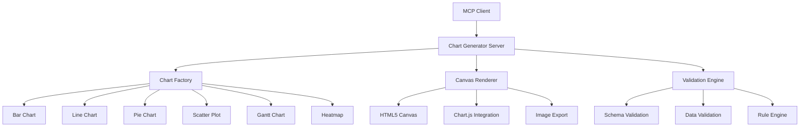

# Phase 11: Chart-Generator MCP Server

## Overview

The Chart-Generator MCP server provides comprehensive chart generation capabilities using Chart.js and HTML5 Canvas. It supports multiple chart types including bar charts, line charts, pie charts, scatter plots, Gantt charts, and heatmaps. The server generates high-quality PNG images with customizable themes and export options.

### Key Features

- **Multiple Chart Types**: Support for bar, line, pie, scatter, Gantt, and heatmap charts
- **High-Quality Rendering**: HTML5 Canvas-based rendering with Chart.js integration
- **Customizable Themes**: Light, dark, and colorblind-friendly themes
- **Flexible Data Formats**: JSON-based data input with comprehensive validation
- **Export Options**: PNG image generation with configurable dimensions
- **Real-time Preview**: Chart configuration validation before rendering
- **Performance Optimization**: Efficient rendering with caching and batch processing
- **Accessibility Support**: Colorblind themes and proper labeling for accessibility

## Architecture

### Core Components



### Chart Types

#### Bar Charts
- **Vertical and horizontal orientations**
- **Grouped and stacked variants**
- **Customizable colors and borders**
- **Error bars and confidence intervals**
- **Logarithmic and linear scales**

#### Line Charts
- **Multiple datasets support**
- **Smooth and stepped line types**
- **Fill areas and gradients**
- **Point customization and markers**
- **Time series and date axis support**

#### Pie Charts
- **Standard pie and donut variants**
- **Exploded slices for emphasis**
- **Customizable colors and labels**
- **Percentage and value display options**
- **Legend positioning and styling**

#### Scatter Plots
- **Bubble size mapping**
- **Trend line support**
- **Customizable point markers**
- **Multiple datasets with different colors**
- **Logarithmic and linear axes**

#### Gantt Charts
- **Project timeline visualization**
- **Task dependencies and milestones**
- **Progress tracking and completion percentages**
- **Customizable date ranges and time scales**
- **Resource allocation visualization**

#### Heatmaps
- **Matrix data visualization**
- **Color intensity mapping**
- **Customizable color scales**
- **Label support for axes**
- **Interactive tooltips and zooming**

## MCP Tools

The Chart-Generator server provides 8 MCP tools (5 required + 3 bonus):

### Core Chart Generation Tools

#### `generate_chart`
Generates a chart image (PNG) with specified type, data, and options.

**Parameters:**
- `type` (string, required): Chart type ('bar', 'line', 'pie', 'scatter', 'gantt', 'heatmap')
- `data` (object, required): Chart data including labels and datasets
- `options` (object, optional): Chart options including title, dimensions, theme, etc.
  - `title` (string, optional): Chart title
  - `width` (number, default: 800): Chart width in pixels
  - `height` (number, default: 600): Chart height in pixels
  - `theme` (string, default: 'light'): Chart theme ('light', 'dark', 'colorblind')
  - `legend` (boolean, default: true): Show legend
  - `xAxisLabel` (string, optional): X-axis label
  - `yAxisLabel` (string, optional): Y-axis label

**Returns:**
- `success`: Boolean indicating if chart was generated successfully
- `imagePath`: Local path to generated PNG image
- `imageBase64`: Base64 encoded image data
- `metadata`: Chart generation metadata including dimensions and file size

**Example Data Format:**
```json
{
  "labels": ["January", "February", "March", "April", "May", "June"],
  "datasets": [
    {
      "label": "Sales 2023",
      "data": [65, 59, 80, 81, 56, 55],
      "backgroundColor": "rgba(54, 162, 235, 0.2)",
      "borderColor": "rgba(54, 162, 235, 1)"
    },
    {
      "label": "Sales 2024",
      "data": [28, 48, 40, 19, 86, 27],
      "backgroundColor": "rgba(255, 99, 132, 0.2)",
      "borderColor": "rgba(255, 99, 132, 1)"
    }
  ]
}
```

#### `list_chart_types`
Lists all available chart types with descriptions and data format requirements.

**Parameters:**
- None

**Returns:**
- `chartTypes`: Array of available chart types with detailed information
- `dataFormats`: Data format specifications for each chart type
- `examples`: Usage examples for each chart type

**Chart Type Information:**
```json
{
  "chartTypes": [
    {
      "type": "bar",
      "description": "Vertical or horizontal bar charts for comparing categories",
      "dataFormat": "{ labels: string[], datasets: [{ label: string, data: number[] }] }",
      "options": ["orientation", "stacked", "grouped", "errorBars"]
    },
    {
      "type": "line",
      "description": "Line charts for showing trends over time",
      "dataFormat": "{ labels: string[], datasets: [{ label: string, data: number[] }] }",
      "options": ["tension", "fill", "stepped", "pointStyle"]
    },
    {
      "type": "pie",
      "description": "Pie or donut charts for showing proportions",
      "dataFormat": "{ labels: string[], datasets: [{ data: number[] }] }",
      "options": ["innerRadius", "outerRadius", "explode", "clockwise"]
    },
    {
      "type": "scatter",
      "description": "Scatter plots for showing correlations between variables",
      "dataFormat": "{ datasets: [{ data: [{ x: number, y: number }] }] }",
      "options": ["showLine", "pointRadius", "bubbleSize"]
    },
    {
      "type": "gantt",
      "description": "Gantt charts for project timelines and scheduling",
      "dataFormat": "[{ task: string, start: Date, end: Date, progress?: number }]",
      "options": ["gridLines", "barThickness", "todayLine"]
    },
    {
      "type": "heatmap",
      "description": "Heatmaps for visualizing matrix data with color intensity",
      "dataFormat": "[{ x: string|number, y: string|number, value: number }]",
      "options": ["colorScale", "showLabels", "radius"]
    }
  ]
}
```

#### `preview_chart_config`
Validates chart configuration without rendering. Returns validation results and warnings.

**Parameters:**
- `type` (string, required): Chart type ('bar', 'line', 'pie', 'scatter', 'gantt', 'heatmap')
- `data` (object, required): Chart data to validate
- `options` (object, optional): Chart options to validate

**Returns:**
- `valid`: Boolean indicating if configuration is valid
- `errors`: Array of validation errors if invalid
- `warnings`: Array of warnings for potential issues
- `chartType`: Validated chart type
- `datasetCount`: Number of datasets in data
- `dimensions`: Chart dimensions and layout information

### Bonus Tools

#### `get_chart_themes`
Lists available chart themes with color palettes and styling options.

**Parameters:**
- `includePreview` (boolean, default: false): Include theme preview samples
- `themeType` (string, optional): Filter by theme type

**Returns:**
- `themes`: Array of available themes with detailed color information
- `defaultTheme`: Currently configured default theme
- `customThemes`: Custom theme definitions if available

#### `export_chart_svg`
Exports chart as SVG instead of PNG for vector graphics support.

**Parameters:**
- `type` (string, required): Chart type
- `data` (object, required): Chart data
- `options` (object, optional): Chart options
- `svgOptions` (object, optional): SVG-specific export options
  - `responsive` (boolean, default: true): Make SVG responsive
  - `preserveAspectRatio` (boolean, default: true): Maintain aspect ratio

**Returns:**
- `success`: Boolean indicating if export was successful
- `svgContent`: SVG content as string
- `metadata`: Export metadata including dimensions

#### `create_chart_template`
Creates reusable chart templates for consistent styling.

**Parameters:**
- `templateName` (string, required): Template identifier
- `chartType` (string, required): Chart type for template
- `defaultOptions` (object, required): Default chart options
- `styling` (object, optional): Styling rules and custom CSS

**Returns:**
- `template`: Created template information
- `templateId`: Unique template identifier
- `previewUrl`: URL to preview template (if available)

#### `apply_chart_template`
Applies a saved template to new chart data.

**Parameters:**
- `templateId` (string, required): Template identifier to apply
- `data` (object, required): New chart data
- `overrideOptions` (object, optional): Options to override from template

**Returns:**
- `success`: Boolean indicating if template was applied successfully
- `chart`: Generated chart with template applied
- `appliedOptions`: Final options after template application

#### `get_chart_history`
Retrieves history of previously generated charts.

**Parameters:**
- `limit` (number, default: 20): Maximum number of charts to return
- `chartType` (string, optional): Filter by chart type
- `dateRange` (string, optional): Filter by date range
- `tags` (array, optional): Filter by tags

**Returns:**
- `charts`: Array of chart generation history
- `totalCount`: Total charts matching criteria
- `statistics`: Chart generation statistics

## Configuration

### Environment Variables

```bash
# Chart Generation Configuration
CHART_DEFAULT_WIDTH=800
CHART_DEFAULT_HEIGHT=600
CHART_DEFAULT_DPI=96
CHART_DEFAULT_THEME=light
CHART_COLOR_PALETTE=default

# Rendering Configuration
CHART_CANVAS_WIDTH=1600
CHART_CANVAS_HEIGHT=1200
CHART_RENDER_TIMEOUT=30000
CHART_MAX_MEMORY_USAGE=512

# Export Configuration
CHART_EXPORT_FORMAT=png
CHART_EXPORT_QUALITY=90
CHART_COMPRESSION_ENABLED=true
CHART_METADATA_ENABLED=true

# Performance Configuration
CHART_CACHE_ENABLED=true
CHART_CACHE_SIZE=100
CHART_CACHE_TTL=3600
CHART_CONCURRENT_GENERATION=5

# File System Configuration
CHART_OUTPUT_DIR=/path/to/charts
CHART_TEMP_DIR=/tmp/charts
CHART_CLEANUP_INTERVAL=3600

# Chart.js Configuration
CHART_JS_VERSION=4.4.0
CHART_ANIMATION_DURATION=1000
CHART_RESIZE_DEBOUNCE=200
```

### Dependencies

#### Node.js Dependencies (package.json)

```json
{
  "dependencies": {
    "@modelcontextprotocol/sdk": "^1.0.0",
    "chart.js": "^4.4.0",
    "canvas": "^2.11.0",
    "jimp": "^0.22.0",
    "uuid": "^9.0.0",
    "sharp": "^0.32.0",
    "color": "^4.2.0",
    "chroma-js": "^2.4.0"
  },
  "devDependencies": {
    "@types/node": "^20.0.0",
    "@types/canvas": "^2.11.0",
    "typescript": "^5.0.0",
    "jest": "^29.0.0",
    "@types/jest": "^29.0.0"
  }
}
```

#### External Libraries

- **Chart.js**: Chart rendering and visualization
- **Canvas API**: HTML5 Canvas for image generation
- **Sharp**: High-performance image processing
- **JIMP**: Image manipulation and processing
- **Color**: Color manipulation and palette generation
- **Chroma-js**: Color contrast and accessibility tools

## Usage Examples

### Basic Bar Chart Generation

```typescript
import { ChartGeneratorClient } from '@mcp/chart-generator';

const client = new ChartGeneratorClient();

// Generate bar chart
const chart = await client.generateChart({
  type: 'bar',
  data: {
    labels: ['Q1', 'Q2', 'Q3', 'Q4'],
    datasets: [
      {
        label: 'Revenue 2023',
        data: [1200000, 1400000, 1300000, 1600000],
        backgroundColor: 'rgba(54, 162, 235, 0.2)',
        borderColor: 'rgba(54, 162, 235, 1)'
      },
      {
        label: 'Revenue 2024',
        data: [1500000, 1700000, 1600000, 1800000],
        backgroundColor: 'rgba(255, 99, 132, 0.2)',
        borderColor: 'rgba(255, 99, 132, 1)'
      }
    ]
  },
  options: {
    title: 'Quarterly Revenue Comparison',
    width: 1200,
    height: 600,
    theme: 'light',
    legend: true,
    xAxisLabel: 'Quarter',
    yAxisLabel: 'Revenue ($)'
  }
});

console.log('Chart generated successfully:', chart.success);
console.log('Image saved to:', chart.imagePath);
console.log('Image size:', chart.metadata.fileSize);
```

### Line Chart with Multiple Datasets

```typescript
// Generate line chart with multiple datasets
const lineChart = await client.generateChart({
  type: 'line',
  data: {
    labels: ['Jan', 'Feb', 'Mar', 'Apr', 'May', 'Jun'],
    datasets: [
      {
        label: 'Product A',
        data: [65, 59, 80, 81, 56, 55],
        borderColor: 'rgb(75, 192, 192)',
        backgroundColor: 'rgba(75, 192, 192, 0.2)',
        fill: true,
        tension: 0.4
      },
      {
        label: 'Product B',
        data: [28, 48, 40, 19, 86, 27],
        borderColor: 'rgb(255, 205, 86)',
        backgroundColor: 'rgba(255, 205, 86, 0.2)',
        fill: true,
        tension: 0.4
      },
      {
        label: 'Product C',
        data: [45, 69, 70, 69, 90, 85],
        borderColor: 'rgb(255, 159, 64)',
        backgroundColor: 'rgba(255, 159, 64, 0.2)',
        fill: true,
        tension: 0.4
      }
    ]
  },
  options: {
    title: 'Product Sales Trend',
    width: 1000,
    height: 500,
    theme: 'light',
    legend: true,
    elements: {
      point: {
        radius: 5,
        hoverRadius: 8
      }
    }
  }
});

console.log('Line chart generated with', lineChart.metadata.datasetCount, 'datasets');
```

### Pie Chart with Exploded Slices

```typescript
// Generate pie chart with emphasis on specific slices
const pieChart = await client.generateChart({
  type: 'pie',
  data: {
    labels: ['Desktop', 'Mobile', 'Tablet', 'Smart TV'],
    datasets: [{
      data: [45, 30, 15, 8, 2],
      backgroundColor: [
        'rgba(255, 99, 132, 0.6)',
        'rgba(54, 162, 235, 0.6)',
        'rgba(255, 205, 86, 0.6)',
        'rgba(75, 192, 192, 0.6)',
        'rgba(255, 159, 64, 0.6)'
      ],
      explode: [0.1, 0, 0, 0, 0.2] // Explode "Smart TV" slice
    }]
  },
  options: {
    title: 'Device Usage Distribution 2024',
    width: 600,
    height: 600,
    theme: 'light',
    legend: {
      position: 'right'
    },
    plugins: {
      legend: {
        display: true
      },
      tooltip: {
        callbacks: {
          label: function(context) {
            return context.label + ': ' + context.parsed + '%';
          }
        }
      }
    }
  }
});

console.log('Pie chart generated with exploded slices');
```

### Gantt Chart for Project Management

```typescript
// Generate Gantt chart for project timeline
const ganttChart = await client.generateChart({
  type: 'gantt',
  data: [
    {
      task: 'Project Planning',
      start: '2024-01-15',
      end: '2024-01-20',
      progress: 100,
      color: 'rgba(54, 162, 235, 0.6)'
    },
    {
      task: 'Development Phase 1',
      start: '2024-01-22',
      end: '2024-02-15',
      progress: 85,
      color: 'rgba(75, 192, 192, 0.6)'
    },
    {
      task: 'Testing Phase',
      start: '2024-02-16',
      end: '2024-03-01',
      progress: 60,
      color: 'rgba(255, 205, 86, 0.6)'
    },
    {
      task: 'Deployment',
      start: '2024-03-02',
      end: '2024-03-15',
      progress: 30,
      color: 'rgba(255, 159, 64, 0.6)'
    }
  ],
  options: {
    title: 'Project Timeline - Q1 2024',
    width: 1200,
    height: 400,
    theme: 'light',
    scales: {
      x: {
        type: 'time',
        time: {
          unit: 'day',
          displayFormats: ['MMM DD']
        }
      }
    },
    plugins: {
      tooltip: {
        callbacks: {
          title: function(context) {
            return context.raw.task;
          }
        }
      }
    }
  }
});

console.log('Gantt chart generated for project timeline');
```

### Heatmap for Data Analysis

```typescript
// Generate heatmap for correlation analysis
const heatmap = await client.generateChart({
  type: 'heatmap',
  data: [
    { x: 'Mon', y: 'Sales', value: 65 },
    { x: 'Mon', y: 'Marketing', value: 59 },
    { x: 'Mon', y: 'Support', value: 42 },
    { x: 'Tue', y: 'Sales', value: 70 },
    { x: 'Tue', y: 'Marketing', value: 65 },
    { x: 'Wed', y: 'Sales', value: 75 },
    { x: 'Wed', y: 'Marketing', value: 68 },
    { x: 'Thu', y: 'Sales', value: 82 },
    { x: 'Thu', y: 'Marketing', value: 72 },
    { x: 'Fri', y: 'Sales', value: 88 },
    { x: 'Fri', y: 'Marketing', value: 75 }
  ],
  options: {
    title: 'Weekly Sales vs Marketing Spend',
    width: 800,
    height: 600,
    theme: 'light',
    scales: {
      x: {
        type: 'category',
        labels: ['Mon', 'Tue', 'Wed', 'Thu', 'Fri']
      },
      y: {
        type: 'linear',
        beginAtZero: true,
        title: 'Amount ($)'
      }
    },
    plugins: {
      tooltip: {
        callbacks: {
          title: function(context) {
            const value = context.raw.v;
            return `${context.parsed.y}: ${context.parsed.x} (${value})`;
          }
        }
      }
    }
  }
});

console.log('Heatmap generated for correlation analysis');
```

### Chart Configuration Validation

```typescript
// Validate chart configuration before generation
const validation = await client.previewChartConfig({
  type: 'bar',
  data: {
    labels: ['Q1', 'Q2', 'Q3', 'Q4'],
    datasets: [{
      label: 'Revenue',
      data: [1000000, 1200000, 900000, 1400000]
    }]
  },
  options: {
    width: 800,
    height: 600,
    theme: 'custom'
  }
});

if (!validation.valid) {
  console.log('Validation errors:', validation.errors);
  console.log('Warnings:', validation.warnings);
} else {
  // Generate chart with validated configuration
  const chart = await client.generateChart({
    type: 'bar',
    data: validation.data,
    options: validation.options
  });
}
```

### SVG Export for Vector Graphics

```typescript
// Export chart as SVG for scalable graphics
const svgChart = await client.exportChartSVG({
  type: 'line',
  data: {
    labels: ['Jan', 'Feb', 'Mar', 'Apr', 'May', 'Jun'],
    datasets: [{
      label: 'User Growth',
      data: [1000, 1200, 1400, 1600, 1800, 2100]
    }]
  },
  options: {
    title: 'User Growth Trend',
    width: 800,
    height: 400,
    theme: 'light'
  },
  svgOptions: {
    responsive: true,
    preserveAspectRatio: true
  }
});

console.log('SVG chart exported for web use');
console.log('SVG content length:', svgChart.svgContent.length);
```

## API Reference

### Core Classes

#### `ChartGeneratorClient`

Main client class for interacting with the Chart-Generator server.

```typescript
class ChartGeneratorClient {
  constructor(baseURL?: string);
  
  // Core chart generation
  async generateChart(options: GenerateChartOptions): Promise<GenerateChartResponse>;
  async listChartTypes(): Promise<ListChartTypesResponse>;
  async previewChartConfig(options: PreviewConfigOptions): Promise<PreviewConfigResponse>;
  
  // Bonus features
  async getChartThemes(options?: GetThemesOptions): Promise<GetThemesResponse>;
  async exportChartSVG(options: ExportSVGOptions): Promise<ExportSVGResponse>;
  async createChartTemplate(options: CreateTemplateOptions): Promise<CreateTemplateResponse>;
  async applyChartTemplate(options: ApplyTemplateOptions): Promise<ApplyTemplateResponse>;
  async getChartHistory(options?: GetHistoryOptions): Promise<GetHistoryResponse>;
}
```

#### `ChartData`

Standard chart data structure.

```typescript
interface ChartData {
  labels: string[];
  datasets: ChartDataset[];
}

interface ChartDataset {
  label?: string;
  data: number[];
  backgroundColor?: string | string[];
  borderColor?: string;
  borderWidth?: number;
  fill?: boolean;
  tension?: number;
  pointRadius?: number;
  pointHoverRadius?: number;
}
```

#### `ChartOptions`

Chart configuration options.

```typescript
interface ChartOptions {
  title?: string;
  width?: number;
  height?: number;
  theme?: 'light' | 'dark' | 'colorblind' | string;
  legend?: boolean | LegendOptions;
  xAxisLabel?: string;
  yAxisLabel?: string;
  responsive?: boolean;
  maintainAspectRatio?: boolean;
  animation?: AnimationOptions;
  scales?: ScaleOptions;
  elements?: ElementOptions;
  plugins?: PluginOptions;
}
```

#### `GenerateChartResponse`

Chart generation response.

```typescript
interface GenerateChartResponse {
  success: boolean;
  imagePath?: string;
  imageBase64?: string;
  metadata?: {
    width: number;
    height: number;
    fileSize: number;
    format: string;
    generationTime: number;
  };
  message?: string;
}
```

## Best Practices

### Data Preparation

1. **Consistent Data Types**: Ensure all data points are numbers for quantitative charts
2. **Label Management**: Use clear, concise labels for axes and data points
3. **Color Selection**: Choose contrasting colors for better visibility
4. **Data Validation**: Validate data completeness and ranges before chart generation
5. **Missing Data Handling**: Decide how to handle null/undefined values

### Chart Design

1. **Appropriate Chart Types**: Select chart types that best represent your data relationships
2. **Simplicity First**: Avoid unnecessary decorations that obscure data
3. **Consistent Styling**: Use consistent colors and fonts across related charts
4. **Accessibility**: Ensure charts are readable with proper contrast and labels
5. **Responsive Design**: Design charts to work on different screen sizes

### Performance Optimization

1. **Data Limits**: Limit the number of data points for performance
2. **Caching**: Enable chart caching for frequently used configurations
3. **Batch Processing**: Generate multiple charts in parallel when possible
4. **Image Optimization**: Use appropriate compression and quality settings
5. **Memory Management**: Clean up temporary files and canvas resources

### Theme Management

1. **Brand Consistency**: Use consistent color schemes and styling
2. **Accessibility**: Provide colorblind-friendly themes
3. **Custom Themes**: Create reusable templates for consistent styling
4. **Context Awareness**: Use light themes in light environments, dark in dark
5. **User Preferences**: Allow theme customization while maintaining brand identity

## Performance Tuning

### Rendering Configuration

```typescript
// Configure rendering performance
const renderConfig = {
  canvasWidth: 1600,
  canvasHeight: 1200,
  devicePixelRatio: 2,
  imageQuality: 90,
  compressionLevel: 6,
  progressiveRendering: true,
  webgl: false // Use Canvas 2D for better compatibility
};
```

### Memory Management

```typescript
// Configure memory usage
const memoryConfig = {
  maxConcurrentCharts: 5,
  canvasPoolSize: 3,
  imageProcessingTimeout: 30000,
  gcInterval: 60000,
  maxImageSize: 10485760 // 10MB
};
```

### Caching Strategy

```typescript
// Configure caching behavior
const cacheConfig = {
  enabled: true,
  maxSize: 100,
  ttl: 3600, // 1 hour
  strategy: 'lru', // least recently used
  compressionEnabled: true,
  persistentCache: true
};
```

## Troubleshooting

### Common Issues

#### Chart Generation Failures

**Symptoms**: Charts fail to generate or return errors
**Solutions**:
1. Check data format and completeness
2. Verify Chart.js installation and compatibility
3. Review Canvas API support in the environment
4. Check available memory and disk space
5. Examine error logs for specific issues

#### Image Quality Issues

**Symptoms**: Generated images are blurry or low quality
**Solutions**:
1. Increase DPI settings for higher resolution
2. Adjust image quality and compression settings
3. Use appropriate chart dimensions for the data
4. Enable anti-aliasing and smoothing options
5. Consider vector formats (SVG) for scalability

#### Performance Issues

**Symptoms**: Slow chart generation or high memory usage
**Solutions**:
1. Reduce data complexity and number of points
2. Optimize chart configuration and animations
3. Enable caching for repeated chart types
4. Use streaming for large datasets
5. Monitor memory usage and implement cleanup

#### Data Validation Errors

**Symptoms**: Configuration validation fails with unclear errors
**Solutions**:
1. Review data structure against chart type requirements
2. Check for missing required fields (labels, datasets)
3. Validate data types and ranges
4. Use preview functionality to debug issues
5. Consult chart type documentation for format requirements

### Debug Mode

Enable debug logging:

```typescript
// Set log level
process.env.CHART_GENERATOR_LOG_LEVEL = 'debug';

// Or via configuration
const client = new ChartGeneratorClient({
  baseURL: 'http://localhost:8000',
  logLevel: 'debug'
});
```

### Health Monitoring

```typescript
// Check system health
const health = await client.healthCheck();

// Monitor performance metrics
const metrics = await client.getPerformanceMetrics();

// Check Chart.js version
const version = await client.getChartJSVersion();
```

## Integration Examples

### Integration with Task Orchestrator

```typescript
// Generate charts for task reports
const taskMetrics = await taskClient.listTasks({
  status: 'completed'
});

const chartData = {
  labels: taskMetrics.tasks.map(t => t.title),
  datasets: [{
    label: 'Completion Time (hours)',
    data: taskMetrics.tasks.map(t => t.completion_time || 0)
  }]
};

const chart = await chartClient.generateChart({
  type: 'bar',
  data: chartData,
  options: {
    title: 'Task Completion Times',
    theme: 'light',
    xAxisLabel: 'Tasks',
    yAxisLabel: 'Time (hours)'
  }
});
```

### Integration with Agent Swarm

```typescript
// Generate charts for swarm performance analysis
const swarmMetrics = await swarmClient.getSwarmMetrics();

const performanceChart = await chartClient.generateChart({
  type: 'line',
  data: {
    labels: swarmMetrics.time_series,
    datasets: [{
      label: 'Active Agents',
      data: swarmMetrics.active_agents
    }, {
      label: 'Tasks Completed',
      data: swarmMetrics.tasks_completed
    }, {
      label: 'Average Response Time',
      data: swarmMetrics.avg_response_time
    }]
  },
  options: {
    title: 'Swarm Performance Over Time',
    theme: 'light',
    elements: {
      point: {
        radius: 6,
        hoverRadius: 10
      }
    }
  }
});
```

### Integration with Context-Persistence

```typescript
// Store chart generation history
const chartHistory = await chartClient.getChartHistory({
  limit: 50,
  dateRange: 'last-30-days'
});

await contextClient.storeConversation({
  messages: [
    { role: 'system', content: 'Chart generation history retrieved' },
    { role: 'user', content: `Retrieved ${chartHistory.count} chart records` }
  ],
  session_id: `chart-history-${Date.now()}`,
  metadata: {
    type: 'chart-history',
    chart_count: chartHistory.count,
    date_range: 'last-30-days'
  }
});
```

## Migration and Deployment

### Database Migration

```typescript
// Initialize chart history database
import { ChartDatabase } from './database';

const db = new ChartDatabase();
await db.initialize();
await db.migrateToLatest();
```

### Docker Deployment

```dockerfile
FROM node:18-alpine

WORKDIR /app

# Install dependencies
COPY package*.json ./
RUN npm ci --only=production

# Copy source code
COPY . .

# Build TypeScript
RUN npm run build

# Create output directory
RUN mkdir -p /app/charts

# Expose port
EXPOSE 8000

# Run application
CMD ["node", "dist/index.js"]
```

### Kubernetes Deployment

```yaml
apiVersion: apps/v1
kind: Deployment
metadata:
  name: chart-generator
spec:
  replicas: 3
  selector:
    matchLabels:
      app: chart-generator
  template:
    metadata:
      labels:
        app: chart-generator
    spec:
      containers:
      - name: chart-generator
        image: chart-generator:latest
        ports:
          - containerPort: 8000
        env:
        - name: CHART_DEFAULT_WIDTH
          value: "800"
        - name: CHART_DEFAULT_HEIGHT
          value: "600"
        - name: CHART_OUTPUT_DIR
          value: "/app/charts"
        resources:
          requests:
            memory: "256Mi"
            cpu: "250m"
          limits:
            memory: "512Mi"
            cpu: "500m"
        volumeMounts:
        - name: charts-volume
          mountPath: /app/charts
      volumes:
      - name: charts-volume
        persistentVolumeClaim:
          claimName: chart-generator-charts
```

## Testing

### Unit Tests

```typescript
import { ChartGeneratorClient } from '../src/client';

describe('ChartGeneratorClient', () => {
  let client: ChartGeneratorClient;

  beforeEach(() => {
    client = new ChartGeneratorClient('http://localhost:8000');
  });

  test('should generate bar chart', async () => {
    const chart = await client.generateChart({
      type: 'bar',
      data: {
        labels: ['A', 'B', 'C'],
        datasets: [{
          label: 'Series 1',
          data: [10, 20, 30]
        }]
      }
    });

    expect(chart.success).toBe(true);
    expect(chart.imagePath).toBeDefined();
    expect(chart.metadata.width).toBe(800);
    expect(chart.metadata.height).toBe(600);
  });

  test('should validate chart configuration', async () => {
    const validation = await client.previewChartConfig({
      type: 'pie',
      data: {
        labels: ['A', 'B'],
        datasets: [{
          data: [50, 50]
        }]
      },
      options: {
        width: -100 // Invalid width
      }
    });

    expect(validation.valid).toBe(false);
    expect(validation.errors.length).toBeGreaterThan(0);
    expect(validation.errors[0]).toContain('width');
  });
});
```

### Integration Tests

```typescript
import { setupTestEnvironment } from './test-setup';

describe('Chart Generator Integration', () => {
  beforeAll(async () => {
    await setupTestEnvironment();
  });

  test('should generate chart from task data', async () => {
    const chartClient = new ChartGeneratorClient();
    const taskClient = new TaskOrchestratorClient();
    
    // Get completed tasks
    const tasks = await taskClient.listTasks({
      status: 'completed'
    });
    
    // Prepare chart data
    const chartData = {
      labels: tasks.tasks.map(t => t.title),
      datasets: [{
        label: 'Completion Time (hours)',
        data: tasks.tasks.map(t => t.completion_time || 0)
      }]
    };
    
    // Generate chart
    const chart = await chartClient.generateChart({
      type: 'bar',
      data: chartData,
      options: {
        title: 'Task Completion Times',
        theme: 'light'
      }
    });
    
    expect(chart.success).toBe(true);
    expect(chart.metadata.datasetCount).toBe(1);
  });

  test('should handle chart generation errors gracefully', async () => {
    const chartClient = new ChartGeneratorClient();
    
    // Try to generate chart with invalid data
    const chart = await chartClient.generateChart({
      type: 'line',
      data: {
        labels: ['A', 'B'],
        datasets: [{
          label: 'Invalid Data',
          data: ['not', 'numbers'] // Invalid data type
        }]
      }
    });
    
    expect(chart.success).toBe(false);
    expect(chart.message).toBeDefined();
    expect(chart.message).toContain('data validation');
  });
});
```

### Performance Tests

```typescript
import { performance } from 'perf_hooks';

describe('Performance Tests', () => {
  test('should generate charts efficiently', async () => {
    const client = new ChartGeneratorClient();
    const startTime = performance.now();
    
    // Generate multiple charts concurrently
    const promises = Array.from({ length: 10 }, (_, i) =>
      client.generateChart({
        type: 'bar',
        data: {
          labels: ['Q1', 'Q2', 'Q3', 'Q4'],
          datasets: [{
            label: `Dataset ${i}`,
            data: Array.from({ length: 4 }, () => Math.random() * 100)
          }]
        }
      })
    );
    
    const results = await Promise.all(promises);
    const endTime = performance.now();
    
    const totalTime = endTime - startTime;
    const avgTime = totalTime / 10;
    
    console.log(`Generated 10 charts in ${totalTime}ms`);
    console.log(`Average time per chart: ${avgTime}ms`);
    
    expect(results.length).toBe(10);
    expect(results.every(r => r.success)).toBe(true);
    expect(avgTime).toBeLessThan(500); // Should be under 500ms per chart
  });

  test('should handle large datasets efficiently', async () => {
    const client = new ChartGeneratorClient();
    const startTime = performance.now();
    
    // Generate chart with large dataset
    const largeDataset = Array.from({ length: 10000 }, (_, i) => ({
      x: i,
      y: Math.sin(i * 0.1) * 100
    }));
    
    const chart = await client.generateChart({
      type: 'scatter',
      data: {
        datasets: [{
          label: 'Large Dataset',
          data: largeDataset
        }]
      }
    });
    
    const endTime = performance.now();
    const processingTime = endTime - startTime;
    
    console.log(`Processed 10,000 points in ${processingTime}ms`);
    
    expect(chart.success).toBe(true);
    expect(processingTime).toBeLessThan(5000); // Should be under 5 seconds
  });
});
```

## Contributing

### Development Setup

```bash
# Clone repository
git clone <repository-url>
cd chart-generator

# Install dependencies
npm install

# Build TypeScript
npm run build

# Run tests
npm test

# Start development server
npm run dev
```

### Code Style

- Follow TypeScript best practices and strict typing
- Use ESLint and Prettier for code formatting
- Write comprehensive JSDoc comments
- Maintain test coverage above 90%
- Use async/await for all asynchronous operations

### Pull Request Process

1. Fork the repository
2. Create feature branch from main
3. Write tests for new functionality
4. Ensure all tests pass and coverage is maintained
5. Update documentation for any API changes
6. Submit pull request with clear description and testing instructions

### Adding Chart Types

To add support for a new chart type:

1. **Create Chart Class**: Implement new chart type in the chart factory
2. **Add Data Validation**: Implement data format validation for the new type
3. **Create Tests**: Write comprehensive tests for the new chart type
4. **Update Documentation**: Document the new chart type and its options
5. **Update Examples**: Add usage examples for the new chart type