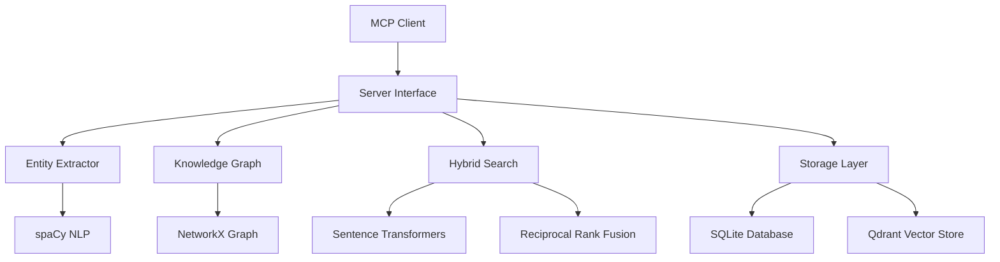

# Phase 6: Context-Persistence MCP Server

## Overview

The Context-Persistence MCP server is a Python-based system that provides intelligent conversation storage, entity extraction, knowledge graph management, and hybrid search capabilities. It serves as the memory layer for the entire MCP ecosystem, enabling persistent context across sessions and agents.

### Key Features

- **Bi-temporal Data Schema**: Tracks both event time and ingestion time for accurate temporal queries
- **Entity Extraction**: Automatically extracts people, organizations, files, functions, and technical concepts
- **Knowledge Graph**: Builds interconnected relationships between entities using NetworkX
- **Hybrid Search**: Combines semantic, keyword, and graph-based search with Reciprocal Rank Fusion
- **Vector Embeddings**: Uses Sentence Transformers for semantic similarity
- **Multi-tier Storage**: SQLite for structured data, Qdrant for vector embeddings

## Architecture

### Core Components



### Data Flow

1. **Input Processing**: Conversations and documents are processed through the entity extractor
2. **Entity Recognition**: spaCy identifies entities and relationships
3. **Graph Construction**: Entities and relationships are added to the knowledge graph
4. **Vector Generation**: Text is converted to embeddings for semantic search
5. **Storage**: Structured data goes to SQLite, vectors to Qdrant
6. **Query Processing**: Search queries are processed through hybrid search combining all methods

### Bi-temporal Schema

The system uses a bi-temporal approach to track both when events occurred and when they were recorded:

```python
class Entity:
    id: str
    name: str
    type: str
    event_time: datetime  # When the event actually occurred
    ingestion_time: datetime  # When the system learned about it
    confidence: float
    metadata: dict
```

## MCP Tools

The Context-Persistence server provides 10 MCP tools:

### Core Storage Tools

#### `store_conversation`
Stores conversation messages with automatic entity extraction.

**Parameters:**
- `messages` (array): Array of conversation messages
- `session_id` (string): Session identifier
- `metadata` (object, optional): Additional metadata

**Returns:**
- `conversation_id`: Unique identifier for stored conversation
- `entities_extracted`: Count of entities extracted
- `processing_time`: Time taken for processing

#### `get_conversation`
Retrieves conversation by ID with full context.

**Parameters:**
- `conversation_id` (string): Conversation identifier
- `include_entities` (boolean, default: true): Include extracted entities
- `include_context` (boolean, default: true): Include contextual information

**Returns:**
- `conversation`: Full conversation data
- `entities`: Related entities (if requested)
- `context`: Contextual information (if requested)

### Entity Management Tools

#### `extract_entities`
Extracts entities from text using spaCy NLP.

**Parameters:**
- `text` (string): Text to analyze
- `entity_types` (array, optional): Specific entity types to extract
- `confidence_threshold` (float, default: 0.7): Minimum confidence score

**Returns:**
- `entities`: Array of extracted entities
- `relationships`: Array of relationships found
- `processing_metadata`: Analysis statistics

#### `search_entities`
Searches for entities using multiple criteria.

**Parameters:**
- `query` (string): Search query
- `entity_types` (array, optional): Filter by entity types
- `limit` (number, default: 10): Maximum results
- `include_related` (boolean, default: true): Include related entities

**Returns:**
- `entities`: Matching entities
- `total_count`: Total matches found
- `search_metadata`: Search performance metrics

### Knowledge Graph Tools

#### `add_entity_relationship`
Adds relationships between entities in the knowledge graph.

**Parameters:**
- `source_entity_id` (string): Source entity identifier
- `target_entity_id` (string): Target entity identifier
- `relationship_type` (string): Type of relationship
- `weight` (float, optional): Relationship strength
- `metadata` (object, optional): Additional information

**Returns:**
- `relationship_id`: Unique identifier for the relationship
- `graph_metrics`: Updated graph statistics

#### `find_entity_path`
Finds shortest paths between entities in the knowledge graph.

**Parameters:**
- `source_entity` (string): Source entity name or ID
- `target_entity` (string): Target entity name or ID
- `max_depth` (number, default: 5): Maximum path length
- `path_type` (string, default: "shortest"): Path finding algorithm

**Returns:**
- `path`: Array of entities in the path
- `path_length`: Number of relationships in path
- `alternative_paths`: Other possible paths

### Search Tools

#### `hybrid_search`
Performs hybrid search combining semantic, keyword, and graph-based methods.

**Parameters:**
- `query` (string): Search query
- `search_types` (array, default: ["semantic", "keyword", "graph"]): Search methods to use
- `limit` (number, default: 10): Maximum results
- `filters` (object, optional): Search filters
- `fusion_weights` (object, optional): Weights for result fusion

**Returns:**
- `results`: Fused search results
- `method_scores`: Scores from each search method
- `fusion_metadata`: Information about fusion process

#### `semantic_search`
Performs semantic search using vector embeddings.

**Parameters:**
- `query` (string): Search query
- `similarity_threshold` (float, default: 0.7): Minimum similarity score
- `limit` (number, default: 10): Maximum results
- `embedding_model` (string, default: "all-MiniLM-L6-v2"): Model to use

**Returns:**
- `results`: Semantically similar results
- `similarity_scores`: Similarity scores for each result
- `query_embedding`: Embedding of the search query

### Utility Tools

#### `get_statistics`
Returns system statistics and performance metrics.

**Parameters:**
- `include_detailed` (boolean, default: false): Include detailed breakdowns
- `time_range` (object, optional): Time range for statistics

**Returns:**
- `entity_counts`: Counts by entity type
- `conversation_counts`: Conversation statistics
- `graph_metrics`: Knowledge graph metrics
- `performance_metrics`: System performance data

#### `health_check`
Performs system health check and diagnostics.

**Parameters:**
- `check_dependencies` (boolean, default: true): Check external dependencies
- `performance_test` (boolean, default: false): Run performance tests

**Returns:**
- `status`: Overall system status
- `component_status`: Status of each component
- `issues`: Any issues found
- `recommendations`: System recommendations

## Configuration

### Environment Variables

```bash
# Database Configuration
CONTEXT_DB_PATH=/path/to/context.db
QDRANT_HOST=localhost
QDRANT_PORT=6333
QDRANT_API_KEY=your-api-key

# NLP Configuration
SPACY_MODEL=en_core_web_sm
SENTENCE_TRANSFORMER_MODEL=all-MiniLM-L6-v2

# Performance Configuration
MAX_CONCURRENT_REQUESTS=10
CACHE_TTL=3600
EMBEDDING_BATCH_SIZE=32

# Logging
LOG_LEVEL=INFO
LOG_FILE=/var/log/context-persistence.log
```

### Dependencies

#### Python Dependencies (pyproject.toml)

```toml
[tool.poetry.dependencies]
python = "^3.12"
fastapi = "^0.104.0"
uvicorn = "^0.24.0"
sqlalchemy = "^2.0.0"
qdrant-client = "^1.7.0"
spacy = "^3.7.0"
sentence-transformers = "^2.2.0"
networkx = "^3.2.0"
numpy = "^1.24.0"
pydantic = "^2.5.0"
```

#### External Services

- **Qdrant Vector Database**: For storing and querying vector embeddings
- **spaCy Models**: NLP models for entity extraction
- **Sentence Transformers**: For generating text embeddings

## Usage Examples

### Basic Conversation Storage

```python
from context_persistence import ContextPersistenceClient

client = ContextPersistenceClient()

# Store a conversation
result = await client.store_conversation(
    messages=[
        {"role": "user", "content": "I need help with Python programming"},
        {"role": "assistant", "content": "I can help you with Python!"}
    ],
    session_id="session_123",
    metadata={"topic": "programming", "language": "python"}
)

print(f"Stored conversation: {result['conversation_id']}")
print(f"Extracted {result['entities_extracted']} entities")
```

### Entity Extraction and Search

```python
# Extract entities from text
entities = await client.extract_entities(
    text="John Doe works at Acme Corp and is developing a new API using FastAPI",
    entity_types=["PERSON", "ORG", "PRODUCT"],
    confidence_threshold=0.8
)

# Search for entities
results = await client.search_entities(
    query="FastAPI",
    entity_types=["PRODUCT"],
    limit=5
)
```

### Knowledge Graph Operations

```python
# Add relationship between entities
await client.add_entity_relationship(
    source_entity_id="john_doe",
    target_entity_id="acme_corp",
    relationship_type="WORKS_FOR",
    weight=0.9,
    metadata={"since": "2023", "role": "developer"}
)

# Find path between entities
path = await client.find_entity_path(
    source_entity="john_doe",
    target_entity="fastapi",
    max_depth=3
)
```

### Hybrid Search

```python
# Perform comprehensive search
results = await client.hybrid_search(
    query="Python web development with FastAPI",
    search_types=["semantic", "keyword", "graph"],
    limit=10,
    fusion_weights={
        "semantic": 0.4,
        "keyword": 0.3,
        "graph": 0.3
    }
)

for result in results['results']:
    print(f"Match: {result['text']}")
    print(f"Score: {result['fusion_score']}")
    print(f"Sources: {result['sources']}")
```

## API Reference

### Core Classes

#### `ContextPersistenceClient`

Main client class for interacting with the Context-Persistence server.

```python
class ContextPersistenceClient:
    def __init__(self, base_url: str = "http://localhost:8000")
    async def store_conversation(self, messages: List[Dict], session_id: str, metadata: Dict = None) -> Dict
    async def get_conversation(self, conversation_id: str, include_entities: bool = True, include_context: bool = True) -> Dict
    async def extract_entities(self, text: str, entity_types: List[str] = None, confidence_threshold: float = 0.7) -> Dict
    async def search_entities(self, query: str, entity_types: List[str] = None, limit: int = 10, include_related: bool = True) -> Dict
    async def add_entity_relationship(self, source_entity_id: str, target_entity_id: str, relationship_type: str, weight: float = None, metadata: Dict = None) -> Dict
    async def find_entity_path(self, source_entity: str, target_entity: str, max_depth: int = 5, path_type: str = "shortest") -> Dict
    async def hybrid_search(self, query: str, search_types: List[str] = ["semantic", "keyword", "graph"], limit: int = 10, filters: Dict = None, fusion_weights: Dict = None) -> Dict
    async def semantic_search(self, query: str, similarity_threshold: float = 0.7, limit: int = 10, embedding_model: str = "all-MiniLM-L6-v2") -> Dict
    async def get_statistics(self, include_detailed: bool = False, time_range: Dict = None) -> Dict
    async def health_check(self, check_dependencies: bool = True, performance_test: bool = False) -> Dict
```

#### `Entity`

Data model for entities extracted from text.

```python
@dataclass
class Entity:
    id: str
    name: str
    type: str
    confidence: float
    start_char: int
    end_char: int
    metadata: Dict[str, Any]
    event_time: datetime
    ingestion_time: datetime
```

#### `Relationship`

Data model for relationships between entities.

```python
@dataclass
class Relationship:
    id: str
    source_entity_id: str
    target_entity_id: str
    relationship_type: str
    weight: float
    metadata: Dict[str, Any]
    created_at: datetime
```

## Best Practices

### Performance Optimization

1. **Batch Processing**: Use batch operations for multiple entity extractions
2. **Caching**: Enable caching for frequently accessed entities
3. **Connection Pooling**: Configure database connection pooling
4. **Async Operations**: Use async/await for all database operations

### Data Quality

1. **Confidence Thresholds**: Set appropriate confidence thresholds for entity extraction
2. **Entity Validation**: Validate entity types and relationships
3. **Regular Maintenance**: Periodically clean up old or low-quality data
4. **Backup Strategy**: Implement regular backups of critical data

### Security Considerations

1. **Access Control**: Implement proper authentication and authorization
2. **Data Encryption**: Encrypt sensitive data at rest and in transit
3. **Audit Logging**: Log all data access and modifications
4. **Input Validation**: Validate all input parameters

## Performance Tuning

### Database Optimization

```python
# Configure connection pool
DATABASE_POOL_SIZE = 20
DATABASE_MAX_OVERFLOW = 30
DATABASE_POOL_TIMEOUT = 30

# Configure Qdrant
QDRANT_BATCH_SIZE = 100
QDRANT_SEARCH_LIMIT = 1000
```

### Embedding Optimization

```python
# Configure sentence transformers
EMBEDDING_MODEL = "all-MiniLM-L6-v2"
EMBEDDING_DEVICE = "cpu"  # or "cuda" for GPU
EMBEDDING_BATCH_SIZE = 32
MAX_SEQUENCE_LENGTH = 512
```

### Search Performance

```python
# Configure search parameters
DEFAULT_SEARCH_LIMIT = 10
MAX_SEARCH_LIMIT = 100
SEARCH_TIMEOUT = 30
CACHE_SEARCH_RESULTS = True
CACHE_TTL = 3600  # 1 hour
```

## Troubleshooting

### Common Issues

#### Entity Extraction Not Working

**Symptoms**: No entities being extracted from text
**Solutions**:
1. Check spaCy model installation: `python -m spacy download en_core_web_sm`
2. Verify model path in configuration
3. Check text encoding and format
4. Review confidence threshold settings

#### Search Performance Issues

**Symptoms**: Slow search responses
**Solutions**:
1. Check Qdrant connection and indexing
2. Optimize embedding batch size
3. Enable result caching
4. Review search complexity and limits

#### Memory Issues

**Symptoms**: High memory usage or crashes
**Solutions**:
1. Reduce batch sizes for processing
2. Enable garbage collection tuning
3. Monitor memory usage patterns
4. Consider streaming for large datasets

### Debug Mode

Enable debug mode for detailed logging:

```python
import logging
logging.basicConfig(level=logging.DEBUG)

# Or via environment variable
CONTEXT_LOG_LEVEL=DEBUG
```

### Health Monitoring

Regular health checks:

```python
# Basic health check
health = await client.health_check()

# Comprehensive check with performance tests
health = await client.health_check(
    check_dependencies=True,
    performance_test=True
)

# Monitor system statistics
stats = await client.get_statistics(include_detailed=True)
```

## Integration Examples

### Integration with Task Orchestrator

```python
# Store task context
await context_client.store_conversation(
    messages=[
        {"role": "system", "content": f"Task: {task_description}"},
        {"role": "user", "content": user_request}
    ],
    session_id=f"task_{task_id}",
    metadata={"task_id": task_id, "type": "task"}
)

# Search for relevant context
context = await context_client.hybrid_search(
    query=task_description,
    limit=5
)
```

### Integration with Agent Swarm

```python
# Store agent interactions
await context_client.store_conversation(
    messages=agent_interactions,
    session_id=f"swarm_{session_id}",
    metadata={"session_type": "swarm", "agents": agent_list}
)

# Extract and store entities from agent outputs
entities = await context_client.extract_entities(
    text=agent_output,
    entity_types=["PERSON", "ORG", "TECHNOLOGY", "CONCEPT"]
)
```

## Migration and Deployment

### Database Migration

```python
# Initialize database with schema
from context_persistence.database import init_database

await init_database(
    db_url="sqlite:///context.db",
    create_tables=True,
    migrate=True
)
```

### Docker Deployment

```dockerfile
FROM python:3.12-slim

WORKDIR /app

# Install system dependencies
RUN apt-get update && apt-get install -y \
    gcc \
    g++ \
    && rm -rf /var/lib/apt/lists/*

# Install Python dependencies
COPY pyproject.toml poetry.lock ./
RUN pip install poetry && poetry install --no-dev

# Download spaCy model
RUN python -m spacy download en_core_web_sm

# Copy application
COPY . .

# Expose port
EXPOSE 8000

# Run application
CMD ["uvicorn", "context_persistence.server:app", "--host", "0.0.0.0", "--port", "8000"]
```

### Kubernetes Deployment

```yaml
apiVersion: apps/v1
kind: Deployment
metadata:
  name: context-persistence
spec:
  replicas: 3
  selector:
    matchLabels:
      app: context-persistence
  template:
    metadata:
      labels:
        app: context-persistence
    spec:
      containers:
      - name: context-persistence
        image: context-persistence:latest
        ports:
        - containerPort: 8000
        env:
        - name: DATABASE_URL
          value: "sqlite:///data/context.db"
        - name: QDRANT_HOST
          value: "qdrant-service"
        resources:
          requests:
            memory: "512Mi"
            cpu: "250m"
          limits:
            memory: "1Gi"
            cpu: "500m"
```

## Testing

### Unit Tests

```python
import pytest
from context_persistence import EntityExtractor

@pytest.mark.asyncio
async def test_entity_extraction():
    extractor = EntityExtractor()
    result = await extractor.extract_entities(
        "John works at Acme Corp",
        confidence_threshold=0.8
    )
    
    assert len(result['entities']) == 2
    assert any(e['name'] == 'John' for e in result['entities'])
    assert any(e['name'] == 'Acme Corp' for e in result['entities'])
```

### Integration Tests

```python
import pytest
from context_persistence import ContextPersistenceClient

@pytest.mark.asyncio
async def test_conversation_storage():
    client = ContextPersistenceClient()
    
    # Store conversation
    result = await client.store_conversation(
        messages=[{"role": "user", "content": "test"}],
        session_id="test_session"
    )
    
    assert 'conversation_id' in result
    
    # Retrieve conversation
    retrieved = await client.get_conversation(result['conversation_id'])
    assert len(retrieved['conversation']) == 1
```

### Performance Tests

```python
import asyncio
import time
from context_persistence import ContextPersistenceClient

async def benchmark_search():
    client = ContextPersistenceClient()
    
    start_time = time.time()
    tasks = []
    
    for i in range(100):
        task = client.hybrid_search(f"test query {i}")
        tasks.append(task)
    
    results = await asyncio.gather(*tasks)
    end_time = time.time()
    
    print(f"Processed 100 searches in {end_time - start_time:.2f} seconds")
    print(f"Average time per search: {(end_time - start_time) / 100:.3f} seconds")
```

## Contributing

### Development Setup

```bash
# Clone repository
git clone <repository-url>
cd context-persistence

# Install dependencies
poetry install

# Download spaCy model
python -m spacy download en_core_web_sm

# Run tests
pytest tests/

# Start development server
uvicorn context_persistence.server:app --reload --host 0.0.0.0 --port 8000
```

### Code Style

- Follow PEP 8 style guidelines
- Use type hints for all functions
- Write comprehensive docstrings
- Maintain test coverage above 90%

### Pull Request Process

1. Fork the repository
2. Create feature branch
3. Write tests for new functionality
4. Ensure all tests pass
5. Update documentation
6. Submit pull request with clear description