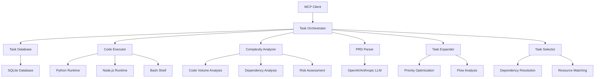

# Phase 7: Task-Orchestrator MCP Server

## Overview

The Task-Orchestrator MCP server is an intelligent task management system that provides comprehensive task lifecycle management, dependency tracking, code execution, and AI-powered task analysis. It serves as the central coordination layer for all development tasks within the MCP ecosystem.

### Key Features

- **Task CRUD Operations**: Complete task lifecycle management with DAG-based dependency tracking
- **Multi-language Code Execution**: Support for Python, JavaScript, TypeScript, Bash, and SQL
- **PRD Parsing**: Intelligent parsing of Product Requirements Documents into structured tasks
- **Complexity Analysis**: Multi-factor complexity scoring with effort estimation
- **AI-Powered Task Expansion**: Automatic subtask generation using LLM integration
- **Smart Task Selection**: Optimal task selection based on dependencies and constraints
- **Git Integration**: Link tasks to git commits for traceability
- **Task Visualization**: JSON and Mermaid format dependency graphs

## Architecture

### Core Components



### Data Flow

1. **Task Creation**: Tasks are created manually or through PRD parsing
2. **Dependency Analysis**: System analyzes and validates task dependencies
3. **Complexity Assessment**: Multi-factor analysis determines task complexity
4. **Task Expansion**: AI generates subtasks and implementation steps
5. **Smart Selection**: Optimal next tasks are selected based on constraints
6. **Execution**: Code is executed in appropriate runtime environments
7. **Tracking**: Progress and results are tracked with git integration

### Database Schema

The system uses SQLite with the following main tables:

```sql
-- Tasks table
CREATE TABLE tasks (
    id INTEGER PRIMARY KEY AUTOINCREMENT,
    title TEXT NOT NULL,
    description TEXT,
    status TEXT NOT NULL DEFAULT 'pending',
    priority INTEGER DEFAULT 0,
    dependencies TEXT DEFAULT '[]',
    tags TEXT DEFAULT '[]',
    code_language TEXT,
    execution_environment TEXT,
    created_at TEXT DEFAULT CURRENT_TIMESTAMP,
    updated_at TEXT DEFAULT CURRENT_TIMESTAMP,
    completed_at TEXT
);

-- Code executions table
CREATE TABLE code_executions (
    id INTEGER PRIMARY KEY AUTOINCREMENT,
    task_id INTEGER NOT NULL,
    language TEXT NOT NULL,
    code TEXT NOT NULL,
    output TEXT,
    error TEXT,
    exit_code INTEGER,
    execution_time REAL,
    timestamp TEXT DEFAULT CURRENT_TIMESTAMP,
    FOREIGN KEY (task_id) REFERENCES tasks(id)
);

-- Git commits table
CREATE TABLE git_commits (
    id INTEGER PRIMARY KEY AUTOINCREMENT,
    task_id INTEGER NOT NULL,
    commit_hash TEXT NOT NULL,
    commit_message TEXT,
    author TEXT,
    timestamp TEXT DEFAULT CURRENT_TIMESTAMP,
    FOREIGN KEY (task_id) REFERENCES tasks(id)
);
```

## MCP Tools

The Task-Orchestrator server provides 13 MCP tools (8 existing + 5 new):

### Core Task Management Tools

#### `create_task`
Creates a new task with optional dependencies and execution environment.

**Parameters:**
- `title` (string, required): Task title
- `description` (string, optional): Task description
- `priority` (number, default: 0): Task priority (0-4)
- `dependencies` (array, default: []): Task IDs this task depends on
- `tags` (array, default: []): Tags for categorization
- `code_language` (string, optional): Programming language for code tasks
- `execution_environment` (string, optional): Execution environment details

**Returns:**
- `task`: Complete task object with generated ID
- `message`: Success confirmation

#### `update_task_status`
Updates the status of a task.

**Parameters:**
- `task_id` (number, required): Task ID to update
- `status` (string, required): New task status ('pending', 'in_progress', 'blocked', 'completed')

**Returns:**
- `task`: Updated task object
- `message`: Status update confirmation

#### `get_task`
Retrieves task details including execution history.

**Parameters:**
- `task_id` (number, required): Task ID to retrieve
- `include_executions` (boolean, default: false): Include code execution history
- `include_analysis` (boolean, default: false): Include code analysis results

**Returns:**
- `task`: Complete task details
- `executions`: Execution history (if requested)
- `commits`: Git commit history (if requested)

#### `list_tasks`
Lists all tasks with optional filtering.

**Parameters:**
- `status` (string, optional): Filter by status
- `code_language` (string, optional): Filter by language
- `include_metrics` (boolean, default: false): Include task metrics

**Returns:**
- `tasks`: Array of task objects
- `count`: Total number of tasks
- `metrics`: Task statistics (if requested)

#### `delete_task`
Deletes a task permanently.

**Parameters:**
- `task_id` (number, required): Task ID to delete

**Returns:**
- `message`: Deletion confirmation

### Code Execution Tools

#### `execute_code`
Executes code in multiple programming languages.

**Parameters:**
- `task_id` (number, required): Associated task ID
- `language` (string, required): Programming language ('python', 'javascript', 'typescript', 'bash', 'sql')
- `code` (string, required): Code to execute
- `timeout` (number, default: 30): Execution timeout in seconds
- `working_directory` (string, optional): Working directory for execution
- `packages` (array, optional): Required packages for installation

**Returns:**
- `execution`: Complete execution result with output, error, and metrics
- `message`: Execution status

### Visualization and Integration Tools

#### `get_task_graph`
Gets dependency graph visualization in JSON or Mermaid format.

**Parameters:**
- `format` (string, default: 'json'): Output format ('json', 'mermaid')

**Returns:**
- `graph`: Graph data in requested format
- `tasks`: All tasks with dependencies
- `edges`: Dependency relationships

#### `link_git_commit`
Links a git commit to a task for traceability.

**Parameters:**
- `task_id` (number, required): Task ID to link commit to
- `commit_hash` (string, required): Git commit hash
- `commit_message` (string, optional): Commit message
- `author` (string, optional): Commit author

**Returns:**
- `message`: Link confirmation

### Phase 7 Enhancement Tools

#### `parse_prd`
Parses Product Requirements Document (PRD) content into structured tasks and dependencies.

**Parameters:**
- `content` (string, required): PRD markdown content to parse
- `project_id` (string, default: 'default-project'): Project identifier for generated tasks
- `generate_tasks` (boolean, default: true): Enable automatic task generation
- `analyze_dependencies` (boolean, default: true): Enable dependency analysis
- `extract_user_stories` (boolean, default: true): Extract user stories from PRD
- `parse_acceptance_criteria` (boolean, default: true): Parse acceptance criteria
- `confidence_threshold` (number, default: 0.7): Confidence threshold for parsing (0-1)

**Returns:**
- `prd`: Parsed PRD structure with features, requirements, and tasks
- `message`: Parsing completion confirmation

#### `analyze_complexity`
Analyzes task complexity using multi-factor scoring.

**Parameters:**
- `task_id` (number, required): Task ID to analyze
- `analyze_dependencies` (boolean, default: true): Enable file dependency analysis
- `estimate_code_volume` (boolean, default: true): Enable code volume estimation
- `assess_risk` (boolean, default: true): Enable technical risk assessment
- `use_historical_data` (boolean, default: true): Enable historical data correlation
- `project_root` (string, optional): Base directory for analysis

**Returns:**
- `complexity`: Comprehensive complexity analysis result
- `message`: Analysis completion confirmation

#### `expand_task`
AI-powered task expansion to generate subtasks, implementation steps, and test tasks.

**Parameters:**
- `task_id` (number, required): Task ID to expand
- `depth` (number, default: 2): Maximum expansion depth
- `max_depth` (number, default: 3): Maximum expansion depth
- `include_tests` (boolean, default: true): Include test task generation
- `include_documentation` (boolean, default: true): Include documentation tasks
- `include_implementation` (boolean, default: true): Include implementation guidance
- `provider` (string, default: 'auto'): LLM provider preference ('openai', 'anthropic', 'auto')
- `model` (string, optional): Model to use for expansion
- `max_tokens` (number, default: 2000): Maximum tokens for LLM response
- `temperature` (number, default: 0.7): Temperature for LLM creativity (0-2)

**Returns:**
- `expansion`: Complete task expansion result with subtasks and guidance
- `message`: Expansion completion confirmation

#### `get_next_task`
Finds next optimal task based on dependencies, complexity constraints, and priority optimization.

**Parameters:**
- `project_id` (string, required): Project ID to select tasks for
- `max_complexity` (number, default: 8): Maximum complexity score allowed
- `max_complexity_limit` (number, default: 8): Maximum complexity threshold
- `preferred_task_types` (array, optional): Preferred task types
- `preferred_languages` (array, optional): Preferred programming languages
- `excluded_tags` (array, optional): Excluded task tags
- `required_tags` (array, optional): Required task tags
- `max_estimated_hours` (number, optional): Maximum estimated hours
- `min_estimated_hours` (number, optional): Minimum estimated hours
- `priority_threshold` (number, optional): Priority threshold
- `enable_grouping` (boolean, default: true): Enable grouping similar tasks
- `minimize_context_switching` (boolean, default: true): Enable context switching minimization
- `hours_available_today` (number, optional): Available working hours today
- `available_developers` (number, optional): Number of available developers

**Returns:**
- `selection`: Optimal task selection with reasoning
- `message`: Selection completion confirmation

#### `estimate_effort`
Estimates effort in hours for a task based on complexity analysis.

**Parameters:**
- `task_id` (number, required): Task ID to estimate effort for
- `analyze_dependencies` (boolean, default: true): Enable file dependency analysis
- `estimate_code_volume` (boolean, default: true): Enable code volume estimation
- `assess_risk` (boolean, default: true): Enable technical risk assessment
- `use_historical_data` (boolean, default: true): Enable historical data correlation
- `project_root` (string, optional): Base directory for analysis

**Returns:**
- `estimatedHours`: Effort estimation in hours
- `message`: Estimation completion confirmation

## Configuration

### Environment Variables

```bash
# Database Configuration
TASK_DB_PATH=/path/to/tasks.db
MCP_HOME=/path/to/mcp/home

# LLM Configuration
OPENAI_API_KEY=your-openai-api-key
ANTHROPIC_API_KEY=your-anthropic-api-key
DEFAULT_LLM_PROVIDER=openai
DEFAULT_LLM_MODEL=gpt-4o

# Code Execution Configuration
PYTHON_EXECUTABLE=python3
NODE_EXECUTABLE=node
BASH_EXECUTABLE=bash
EXECUTION_TIMEOUT=30
MAX_EXECUTION_MEMORY=512MB

# Analysis Configuration
COMPLEXITY_WEIGHTS_CODE_VOLUME=0.35
COMPLEXITY_WEIGHTS_DEPENDENCIES=0.25
COMPLEXITY_WEIGHTS_TECHNICAL_RISK=0.25
COMPLEXITY_WEIGHTS_HISTORICAL_DATA=0.15

# Performance Configuration
MAX_CONCURRENT_TASKS=10
CACHE_TTL=3600
ANALYSIS_TIMEOUT=300
```

### Dependencies

#### Node.js Dependencies (package.json)

```json
{
  "dependencies": {
    "@modelcontextprotocol/sdk": "^1.0.0",
    "sql.js": "^1.11.0",
    "uuid": "^9.0.0",
    "openai": "^4.20.0",
    "@anthropic-ai/sdk": "^0.15.0",
    "markdown-it": "^14.0.0",
    "glob": "^10.3.0"
  },
  "devDependencies": {
    "@types/node": "^20.0.0",
    "typescript": "^5.0.0",
    "jest": "^29.0.0",
    "@types/jest": "^29.0.0"
  }
}
```

#### External Services

- **OpenAI API**: For GPT-based task expansion and analysis
- **Anthropic API**: For Claude-based task expansion and analysis
- **Python Runtime**: For Python code execution
- **Node.js Runtime**: For JavaScript/TypeScript execution

## Usage Examples

### Basic Task Management

```typescript
import { TaskOrchestratorClient } from '@mcp/task-orchestrator';

const client = new TaskOrchestratorClient();

// Create a new task
const task = await client.createTask({
  title: 'Implement user authentication',
  description: 'Add JWT-based authentication system with login and registration',
  priority: 4,
  tags: ['security', 'backend', 'authentication'],
  code_language: 'typescript',
  dependencies: []
});

console.log(`Created task: ${task.task.id}`);

// Update task status
await client.updateTaskStatus(task.task.id, 'in_progress');

// Get task details
const taskDetails = await client.getTask(task.task.id, {
  include_executions: true,
  include_analysis: true
});
```

### Code Execution

```typescript
// Execute Python code
const result = await client.executeCode({
  task_id: task.task.id,
  language: 'python',
  code: `
def calculate_fibonacci(n):
    if n <= 1:
        return n
    return calculate_fibonacci(n-1) + calculate_fibonacci(n-2)

print(calculate_fibonacci(10))
  `,
  timeout: 30
});

console.log('Output:', result.execution.output);
console.log('Execution time:', result.execution.execution_time);

// Execute JavaScript code
const jsResult = await client.executeCode({
  task_id: task.task.id,
  language: 'javascript',
  code: `
const fibonacci = (n) => {
  if (n <= 1) return n;
  return fibonacci(n - 1) + fibonacci(n - 2);
};
console.log(fibonacci(10));
  `
});
```

### PRD Parsing

```typescript
const prdContent = `
# User Authentication System

## Features
### User Registration
- Priority: High
- Description: Allow new users to register with email and password
- Acceptance Criteria:
  - User can register with valid email
  - Password validation is implemented
  - Email verification is sent

### User Login
- Priority: High
- Description: Authenticate existing users
- Acceptance Criteria:
  - Users can login with valid credentials
  - JWT tokens are generated
  - Session management is implemented
`;

const parsedPRD = await client.parsePRD(prdContent, {
  project_id: 'auth-system',
  generate_tasks: true,
  analyze_dependencies: true,
  extract_user_stories: true,
  parse_acceptance_criteria: true,
  confidence_threshold: 0.8
});

console.log('Generated tasks:', parsedPRD.prd.tasks.length);
console.log('Features found:', parsedPRD.prd.features.length);
```

### Complexity Analysis

```typescript
const analysis = await client.analyzeComplexity(task.task.id, {
  analyze_dependencies: true,
  estimate_code_volume: true,
  assess_risk: true,
  use_historical_data: true,
  project_root: '/path/to/project'
});

console.log('Complexity score:', analysis.complexity.score);
console.log('Estimated hours:', analysis.complexity.estimatedHours);
console.log('Risk level:', analysis.complexity.riskAssessment.level);
console.log('Technical debt:', analysis.complexity.riskAssessment.technicalDebt);
```

### Task Expansion

```typescript
const expansion = await client.expandTask(task.task.id, {
  depth: 2,
  include_tests: true,
  include_documentation: true,
  include_implementation: true,
  provider: 'openai',
  model: 'gpt-4o',
  max_tokens: 2000,
  temperature: 0.7
});

console.log('Generated subtasks:', expansion.expansion.subtasks.length);
console.log('Implementation steps:', expansion.expansion.implementationSteps.length);
console.log('Test tasks:', expansion.expansion.testTasks.length);

// Display first subtask
if (expansion.expansion.subtasks.length > 0) {
  const firstSubtask = expansion.expansion.subtasks[0];
  console.log('Subtask:', firstSubtask.title);
  console.log('Description:', firstSubtask.description);
  console.log('Estimated effort:', firstSubtask.estimatedEffort, 'hours');
}
```

### Smart Task Selection

```typescript
const selection = await client.getNextTask('my-project', {
  max_complexity: 7,
  preferred_languages: ['typescript', 'python'],
  excluded_tags: ['blocked', 'waiting'],
  enable_grouping: true,
  minimize_context_switching: true,
  hours_available_today: 6,
  available_developers: 2
});

console.log('Selected task:', selection.selection.selectedTask.title);
console.log('Selection reason:', selection.selection.reasoning.primaryReason);
console.log('Confidence:', selection.selection.selectedTask.successProbability);

// Display alternatives
selection.selection.alternatives.forEach((alt, index) => {
  console.log(`Alternative ${index + 1}: ${alt.title} (score: ${alt.overallScore})`);
});
```

### Task Visualization

```typescript
// Get task graph in Mermaid format
const graph = await client.getTaskGraph({
  format: 'mermaid'
});

console.log('Task dependency graph:');
console.log(graph.graph);

// Get JSON format for custom visualization
const jsonGraph = await client.getTaskGraph({
  format: 'json'
});

console.log('Tasks:', jsonGraph.tasks.length);
console.log('Dependencies:', jsonGraph.edges.length);
```

## API Reference

### Core Classes

#### `TaskOrchestratorClient`

Main client class for interacting with the Task-Orchestrator server.

```typescript
class TaskOrchestratorClient {
  constructor(baseURL?: string);
  
  // Core task management
  async createTask(task: CreateTaskRequest): Promise<CreateTaskResponse>;
  async updateTaskStatus(taskId: number, status: TaskStatus): Promise<UpdateTaskResponse>;
  async getTask(taskId: number, options?: GetTaskOptions): Promise<GetTaskResponse>;
  async listTasks(filters?: ListTasksFilters): Promise<ListTasksResponse>;
  async deleteTask(taskId: number): Promise<DeleteTaskResponse>;
  
  // Code execution
  async executeCode(request: ExecuteCodeRequest): Promise<ExecuteCodeResponse>;
  
  // Visualization and integration
  async getTaskGraph(options?: GetTaskGraphOptions): Promise<GetTaskGraphResponse>;
  async linkGitCommit(request: LinkGitCommitRequest): Promise<LinkGitCommitResponse>;
  
  // Phase 7 enhancements
  async parsePRD(content: string, options?: ParsePRDOptions): Promise<ParsePRDResponse>;
  async analyzeComplexity(taskId: number, options?: AnalyzeComplexityOptions): Promise<AnalyzeComplexityResponse>;
  async expandTask(taskId: number, depth?: number, options?: ExpandTaskOptions): Promise<ExpandTaskResponse>;
  async getNextTask(projectId: string, maxComplexity?: number, options?: GetNextTaskOptions): Promise<GetNextTaskResponse>;
  async estimateEffort(taskId: number, options?: EstimateEffortOptions): Promise<EstimateEffortResponse>;
}
```

#### `Task`

Core task data model.

```typescript
interface Task {
  id: number;
  title: string;
  description?: string;
  status: TaskStatus;
  priority: number;
  dependencies: number[];
  tags: string[];
  code_language?: CodeLanguage;
  execution_environment?: string;
  created_at: string;
  updated_at: string;
  completed_at?: string;
}
```

#### `ComplexityAnalysisResult`

Result of complexity analysis.

```typescript
interface ComplexityAnalysisResult {
  score: number;
  estimatedHours: number;
  factors: ComplexityFactors;
  riskAssessment: RiskAssessment;
  dependencies: FileDependency[];
  estimatedLinesOfCode: number;
  confidence: number;
  metadata: {
    analysisTime: string;
    version: string;
    options: ComplexityAnalysisOptions;
  };
}
```

#### `ExpandedTaskResult`

Result of AI-powered task expansion.

```typescript
interface ExpandedTaskResult {
  originalTaskId: number;
  subtasks: ExpandedSubtask[];
  implementationSteps: ImplementationStep[];
  testTasks: TestTask[];
  documentationTasks: DocumentationTask[];
  metadata: {
    expansionDepth: number;
    provider: string;
    model: string;
    tokenUsage: TokenUsage;
    confidence: number;
    processingTime: number;
    warnings: string[];
  };
}
```

## Best Practices

### Task Management

1. **Clear Task Definitions**: Use descriptive titles and detailed descriptions
2. **Dependency Management**: Minimize circular dependencies and keep DAG structure
3. **Priority Setting**: Use consistent priority scales (0-4) across projects
4. **Tag Usage**: Maintain consistent tagging conventions for better filtering
5. **Regular Updates**: Keep task status current to enable accurate selection

### Code Execution

1. **Security**: Validate and sanitize all code before execution
2. **Resource Limits**: Set appropriate timeouts and memory limits
3. **Error Handling**: Capture and analyze execution errors for debugging
4. **Environment Isolation**: Use sandboxed environments when possible

### AI Integration

1. **API Key Security**: Store LLM API keys securely and rotate regularly
2. **Cost Management**: Monitor token usage and set limits
3. **Prompt Engineering**: Use specific, well-structured prompts for better results
4. **Fallback Strategies**: Implement fallback providers when primary is unavailable

### Performance Optimization

1. **Database Indexing**: Add indexes on frequently queried columns
2. **Caching**: Cache analysis results and expensive computations
3. **Batch Operations**: Use batch operations for multiple task updates
4. **Async Processing**: Use async/await for all I/O operations

## Performance Tuning

### Database Optimization

```typescript
// Configure connection pooling
const dbConfig = {
  maxConnections: 20,
  idleTimeout: 30000,
  acquireTimeout: 60000
};

// Enable WAL mode for better performance
const sqliteConfig = {
  journalMode: 'WAL',
  synchronous: 'NORMAL',
  cacheSize: 10000
};
```

### LLM Integration

```typescript
// Configure LLM providers
const llmConfig = {
  openai: {
    model: 'gpt-4o',
    maxTokens: 2000,
    temperature: 0.7,
    timeout: 30000
  },
  anthropic: {
    model: 'claude-3-5-sonnet-20241022',
    maxTokens: 2000,
    temperature: 0.7,
    timeout: 30000
  }
};
```

### Code Execution

```typescript
// Configure execution environments
const executionConfig = {
  python: {
    executable: 'python3',
    timeout: 30,
    memoryLimit: '512MB',
    workingDirectory: '/tmp/task-execution'
  },
  javascript: {
    executable: 'node',
    timeout: 30,
    memoryLimit: '256MB'
  }
};
```

## Troubleshooting

### Common Issues

#### Task Creation Fails

**Symptoms**: Unable to create tasks or database errors
**Solutions**:
1. Check database file permissions and disk space
2. Verify database schema is properly initialized
3. Check for database locks from previous crashed processes
4. Validate task data structure and required fields

#### Code Execution Timeout

**Symptoms**: Code execution always times out
**Solutions**:
1. Increase timeout values for complex operations
2. Check system resources (CPU, memory)
3. Verify runtime environments are properly installed
4. Review code for infinite loops or blocking operations

#### LLM Integration Issues

**Symptoms**: Task expansion or analysis fails with LLM errors
**Solutions**:
1. Verify API keys are valid and have sufficient credits
2. Check network connectivity to LLM providers
3. Review request format and parameter validation
4. Implement retry logic with exponential backoff

#### Dependency Resolution Problems

**Symptoms**: Task selection doesn't respect dependencies
**Solutions**:
1. Verify dependency graph is correctly built
2. Check for circular dependencies in task data
3. Validate dependency IDs reference existing tasks
4. Review topological sort implementation

### Debug Mode

Enable debug logging:

```typescript
// Set log level
process.env.TASK_ORCHESTRATOR_LOG_LEVEL = 'debug';

// Or via configuration
const client = new TaskOrchestratorClient({
  baseURL: 'http://localhost:8000',
  logLevel: 'debug'
});
```

### Health Monitoring

```typescript
// Check system health
const health = await client.healthCheck();

// Monitor performance metrics
const metrics = await client.getPerformanceMetrics();

// Database health check
const dbHealth = await client.checkDatabaseHealth();
```

## Integration Examples

### Integration with Context-Persistence

```typescript
// Store task context in persistence layer
await contextClient.storeConversation({
  messages: [
    { role: 'system', content: `Task created: ${task.title}` },
    { role: 'user', content: task.description }
  ],
  session_id: `task-${task.id}`,
  metadata: { task_id: task.id, type: 'task_creation' }
});

// Retrieve relevant context for task expansion
const context = await contextClient.hybridSearch({
  query: task.description,
  limit: 5
});
```

### Integration with Agent Swarm

```typescript
// Delegate task to specialized agent
await swarmClient.delegateTask({
  taskId: task.id.toString(),
  description: task.description,
  agentType: 'implementation',
  priority: task.priority
});

// Get task recommendations from swarm
const recommendations = await swarmClient.getNextTask('project-id', {
  maxComplexity: task.complexity?.score || 5
});
```

### Integration with Git Workflow

```typescript
// Link commits to tasks automatically
const commitHash = await gitClient.getLatestCommit();
await taskClient.linkGitCommit({
  task_id: task.id,
  commit_hash: commitHash,
  commit_message: `Complete task: ${task.title}`,
  author: 'developer@example.com'
});

// Generate task graph for documentation
const graph = await taskClient.getTaskGraph({ format: 'mermaid' });
await docsClient.updateDocumentation({
  section: 'task-dependencies',
  content: graph.graph
});
```

## Migration and Deployment

### Database Migration

```typescript
// Initialize database with migration
import { TaskDatabase } from './database';

const db = new TaskDatabase();
await db.initialize();
await db.migrateToLatest();
```

### Docker Deployment

```dockerfile
FROM node:18-alpine

WORKDIR /app

# Install dependencies
COPY package*.json ./
RUN npm ci --only=production

# Copy source code
COPY . .

# Build TypeScript
RUN npm run build

# Create data directory
RUN mkdir -p /data

# Expose port
EXPOSE 8000

# Run application
CMD ["node", "dist/index.js"]
```

### Kubernetes Deployment

```yaml
apiVersion: apps/v1
kind: Deployment
metadata:
  name: task-orchestrator
spec:
  replicas: 3
  selector:
    matchLabels:
      app: task-orchestrator
  template:
    metadata:
      labels:
        app: task-orchestrator
    spec:
      containers:
      - name: task-orchestrator
        image: task-orchestrator:latest
        ports:
        - containerPort: 8000
        env:
        - name: DATABASE_URL
          value: "sqlite:///data/tasks.db"
        - name: OPENAI_API_KEY
          valueFrom:
            secretKeyRef:
              name: api-keys
              key: openai-key
        resources:
          requests:
            memory: "512Mi"
            cpu: "250m"
          limits:
            memory: "1Gi"
            cpu: "500m"
        volumeMounts:
        - name: data-volume
          mountPath: /data
      volumes:
      - name: data-volume
        persistentVolumeClaim:
          claimName: task-orchestrator-data
```

## Testing

### Unit Tests

```typescript
import { TaskOrchestratorClient } from '../src/client';

describe('TaskOrchestratorClient', () => {
  let client: TaskOrchestratorClient;

  beforeEach(() => {
    client = new TaskOrchestratorClient('http://localhost:8000');
  });

  test('should create task', async () => {
    const task = await client.createTask({
      title: 'Test Task',
      description: 'Test description',
      priority: 1
    });

    expect(task.task.title).toBe('Test Task');
    expect(task.task.id).toBeDefined();
    expect(task.task.status).toBe('pending');
  });

  test('should execute code', async () => {
    const result = await client.executeCode({
      task_id: 1,
      language: 'python',
      code: 'print("Hello, World!")'
    });

    expect(result.execution.output).toContain('Hello, World!');
    expect(result.execution.exit_code).toBe(0);
  });
});
```

### Integration Tests

```typescript
import { setupTestEnvironment } from './test-setup';

describe('Task Orchestrator Integration', () => {
  beforeAll(async () => {
    await setupTestEnvironment();
  });

  test('should handle complete task lifecycle', async () => {
    const client = new TaskOrchestratorClient();
    
    // Create task
    const task = await client.createTask({
      title: 'Integration Test Task',
      description: 'Complete lifecycle test'
    });
    
    // Update status
    await client.updateTaskStatus(task.task.id, 'in_progress');
    
    // Execute code
    await client.executeCode({
      task_id: task.task.id,
      language: 'python',
      code: 'print("Task completed")'
    });
    
    // Complete task
    await client.updateTaskStatus(task.task.id, 'completed');
    
    // Verify
    const finalTask = await client.getTask(task.task.id);
    expect(finalTask.task.status).toBe('completed');
    expect(finalTask.task.completed_at).toBeDefined();
  });
});
```

### Performance Tests

```typescript
import { performance } from 'perf_hooks';

describe('Performance Tests', () => {
  test('should handle concurrent task creation', async () => {
    const client = new TaskOrchestratorClient();
    const startTime = performance.now();
    
    const promises = Array.from({ length: 100 }, (_, i) =>
      client.createTask({
        title: `Task ${i}`,
        description: `Performance test task ${i}`
      })
    );
    
    await Promise.all(promises);
    const endTime = performance.now();
    
    const totalTime = endTime - startTime;
    const avgTime = totalTime / 100;
    
    console.log(`Created 100 tasks in ${totalTime}ms`);
    console.log(`Average time per task: ${avgTime}ms`);
    
    expect(avgTime).toBeLessThan(50); // Should be under 50ms per task
  });
});
```

## Contributing

### Development Setup

```bash
# Clone repository
git clone <repository-url>
cd task-orchestrator

# Install dependencies
npm install

# Build TypeScript
npm run build

# Run tests
npm test

# Start development server
npm run dev
```

### Code Style

- Follow TypeScript best practices and strict typing
- Use ESLint and Prettier for code formatting
- Write comprehensive JSDoc comments
- Maintain test coverage above 90%
- Use async/await for all asynchronous operations

### Pull Request Process

1. Fork the repository
2. Create feature branch from main
3. Write tests for new functionality
4. Ensure all tests pass and coverage is maintained
5. Update documentation for any API changes
6. Submit pull request with clear description and testing instructions