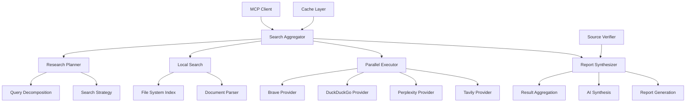

# Phase 8: Search-Aggregator MCP Server

## Overview

The Search-Aggregator MCP server is a comprehensive research and information gathering system that orchestrates multiple search providers, processes local documents, and synthesizes comprehensive reports. It serves as the intelligence gathering layer for the MCP ecosystem, enabling deep research capabilities across web and local sources.

### Key Features

- **Multi-Provider Search**: Integrates with Brave, DuckDuckGo, Perplexity, and Tavily search APIs
- **Research Planning**: Intelligent research plan generation with query decomposition
- **Local Document Search**: Full-text search across project files and documents
- **Parallel Execution**: Concurrent search across multiple providers for comprehensive results
- **Report Synthesis**: AI-powered synthesis of search results into coherent reports
- **Caching System**: Intelligent caching to reduce API calls and improve performance
- **Source Verification**: Automatic verification and credibility assessment of sources

## Architecture

### Core Components



### Data Flow

1. **Research Planning**: User queries are analyzed and decomposed into structured research plans
2. **Provider Selection**: Optimal search providers are selected based on query type and requirements
3. **Parallel Execution**: Searches are executed concurrently across multiple providers
4. **Local Search**: Project files and documents are searched in parallel
5. **Result Aggregation**: Results from all sources are collected and deduplicated
6. **Source Verification**: Source credibility and relevance are assessed
7. **Report Synthesis**: AI synthesizes comprehensive reports with insights and recommendations

### Search Provider Integration

The system integrates with multiple search providers, each with specialized capabilities:

#### Brave Search API
- **Strengths**: Real-time web search, comprehensive indexing
- **Use Cases**: Current information, news, technical documentation
- **Rate Limits**: 100 requests/second

#### DuckDuckGo API
- **Strengths**: Privacy-focused, instant answers, knowledge graph
- **Use Cases**: General knowledge, definitions, quick facts
- **Rate Limits**: Unlimited (within reasonable use)

#### Perplexity API
- **Strengths**: AI-powered search, conversational responses
- **Use Cases**: Complex queries, research, analysis
- **Rate Limits**: Based on subscription tier

#### Tavily API
- **Strengths**: Academic search, deep web access, source diversity
- **Use Cases**: Research, academic content, comprehensive analysis
- **Rate Limits**: Based on subscription tier

## MCP Tools

The Search-Aggregator server provides 9 MCP tools (4 existing + 5 new):

### Core Search Tools

#### `search`
Performs comprehensive search across multiple providers.

**Parameters:**
- `query` (string, required): Search query
- `providers` (array, optional): Specific providers to use
- `max_results` (number, default: 10): Maximum results per provider
- `include_local` (boolean, default: true): Include local document search
- `search_depth` (string, default: 'standard'): Search depth ('basic', 'standard', 'deep')
- `time_range` (string, optional): Time filter for results ('day', 'week', 'month', 'year')

**Returns:**
- `results`: Aggregated search results from all providers
- `provider_results`: Individual provider responses
- `local_results`: Local document search results
- `metadata`: Search performance and statistics

#### `local_search`
Searches across local project files and documents.

**Parameters:**
- `query` (string, required): Search query
- `file_patterns` (array, optional): File patterns to include (*.md, *.js, etc.)
- `exclude_patterns` (array, optional): File patterns to exclude
- `max_results` (number, default: 20): Maximum local results
- `content_types` (array, optional): Content types to search ('code', 'docs', 'config')

**Returns:**
- `results`: Local search results with file paths and snippets
- `total_files_searched`: Number of files scanned
- `search_time`: Time taken for local search

#### `get_search_sources`
Lists available search providers and their capabilities.

**Parameters:**
- `include_status` (boolean, default: false): Include provider status
- `provider_type` (string, optional): Filter by provider type

**Returns:**
- `providers`: Array of available providers with capabilities
- `status`: Provider availability and rate limits

#### `clear_search_cache`
Clears search result cache.

**Parameters:**
- `provider` (string, optional): Specific provider cache to clear
- `older_than` (string, optional): Clear cache older than specified time

**Returns:**
- `cleared_entries`: Number of cache entries cleared
- `cache_size`: Remaining cache size

### Phase 8 Enhancement Tools

#### `plan_research`
Creates a comprehensive research plan for complex queries.

**Parameters:**
- `query` (string, required): Research question or topic
- `research_type` (string, default: 'comprehensive'): Research type ('quick', 'comprehensive', 'academic', 'technical')
- `max_depth` (number, default: 3): Maximum research depth levels
- `include_sources` (array, optional): Specific sources to prioritize
- `exclude_sources` (array, optional): Sources to exclude
- `time_budget` (number, default: 300): Maximum time budget in seconds

**Returns:**
- `research_plan`: Structured research plan with steps
- `estimated_time`: Estimated research duration
- `recommended_providers`: Optimal providers for this research
- `query_breakdown`: Decomposed sub-queries

#### `execute_parallel_search`
Executes searches in parallel across multiple providers with advanced options.

**Parameters:**
- `queries` (array, required): Array of queries to execute
- `provider_configs` (object, optional): Custom configurations per provider
- `timeout_per_provider` (number, default: 30): Timeout per provider in seconds
- `merge_strategy` (string, default: 'intelligent'): Result merging strategy ('simple', 'weighted', 'intelligent')
- `deduplicate` (boolean, default: true): Deduplicate results across providers

**Returns:**
- `parallel_results`: Results from all providers
- `merged_results`: Merged and ranked results
- `provider_performance`: Performance metrics per provider
- `execution_time`: Total execution time

#### `synthesize_report`
Synthesizes search results into comprehensive reports.

**Parameters:**
- `search_results` (array, required): Search results to synthesize
- `report_type` (string, default: 'summary'): Report type ('summary', 'detailed', 'academic', 'executive')
- `include_insights` (boolean, default: true): Include AI-generated insights
- `include_recommendations` (boolean, default: true): Include recommendations
- `format` (string, default: 'markdown'): Output format ('markdown', 'html', 'json')

**Returns:**
- `report`: Synthesized report in requested format
- `insights`: Key insights from the research
- `recommendations`: Actionable recommendations
- `source_analysis`: Analysis of source credibility and relevance

#### `verify_sources`
Verifies credibility and relevance of search sources.

**Parameters:**
- `sources` (array, required): Sources to verify
- `verification_level` (string, default: 'standard'): Verification depth ('basic', 'standard', 'thorough')
- `check_freshness` (boolean, default: true): Check if content is current
- `analyze_bias` (boolean, default: false): Analyze potential bias in sources

**Returns:**
- `verification_results`: Verification results for each source
- `credibility_scores`: Credibility assessment scores
- `freshness_analysis`: Content recency analysis
- `recommendations`: Source quality recommendations

#### `get_research_history`
Retrieves history of previous research sessions.

**Parameters:**
- `session_id` (string, optional): Specific session to retrieve
- `limit` (number, default: 10): Maximum sessions to return
- `time_range` (string, optional): Time filter for history
- `research_type` (string, optional): Filter by research type

**Returns:**
- `sessions`: Array of research sessions
- `total_count`: Total sessions in history
- `statistics`: Research usage statistics

## Configuration

### Environment Variables

```bash
# Search Provider API Keys
BRAVE_API_KEY=your-brave-api-key
DUCKDUCKGO_API_KEY=your-ddg-api-key
PERPLEXITY_API_KEY=your-perplexity-api-key
TAVILY_API_KEY=your-tavily-api-key

# Provider Configuration
BRAVE_API_ENDPOINT=https://api.search.brave.com/res/v1/web/search
DUCKDUCKGO_API_ENDPOINT=https://api.duckduckgo.com/
PERPLEXITY_API_ENDPOINT=https://api.perplexity.ai/
TAVILY_API_ENDPOINT=https://api.tavily.com/

# Performance Configuration
MAX_CONCURRENT_SEARCHES=10
SEARCH_TIMEOUT=30
CACHE_TTL=3600
MAX_RESULTS_PER_PROVIDER=50

# Local Search Configuration
LOCAL_SEARCH_ROOT=/path/to/project
INDEXED_EXTENSIONS=.md,.txt,.js,.ts,.py,.json,.yaml,.yml
EXCLUDE_PATTERNS=node_modules,.git,dist,build

# Synthesis Configuration
SYNTHESIS_MODEL=gpt-4o
SYNTHESIS_TEMPERATURE=0.3
SYNTHESIS_MAX_TOKENS=4000
ENABLE_SOURCE_VERIFICATION=true

# Logging
SEARCH_LOG_LEVEL=INFO
SEARCH_LOG_FILE=/var/log/search-aggregator.log
METRICS_ENABLED=true
```

### Dependencies

#### Node.js Dependencies (package.json)

```json
{
  "dependencies": {
    "@modelcontextprotocol/sdk": "^1.0.0",
    "axios": "^1.6.0",
    "cheerio": "^1.0.0",
    "fuse.js": "^7.0.0",
    "node-cache": "^5.1.0",
    "openai": "^4.20.0",
    "marked": "^9.0.0",
    "glob": "^10.3.0",
    "mime-types": "^2.1.0"
  },
  "devDependencies": {
    "@types/node": "^20.0.0",
    "typescript": "^5.0.0",
    "jest": "^29.0.0",
    "@types/jest": "^29.0.0"
  }
}
```

#### External Services

- **Brave Search API**: Real-time web search capabilities
- **DuckDuckGo API**: Privacy-focused search with instant answers
- **Perplexity API**: AI-powered conversational search
- **Tavily API**: Academic and deep web search capabilities

## Usage Examples

### Basic Web Search

```typescript
import { SearchAggregatorClient } from '@mcp/search-aggregator';

const client = new SearchAggregatorClient();

// Perform comprehensive search
const results = await client.search({
  query: 'TypeScript best practices for large scale applications',
  providers: ['brave', 'perplexity'],
  max_results: 15,
  include_local: true,
  search_depth: 'deep',
  time_range: 'year'
});

console.log('Total results:', results.results.length);
console.log('Provider breakdown:', Object.keys(results.provider_results));

// Display top results
results.results.slice(0, 5).forEach((result, index) => {
  console.log(`${index + 1}. ${result.title}`);
  console.log(`   ${result.snippet}`);
  console.log(`   ${result.url}`);
  console.log(`   Source: ${result.provider}`);
  console.log(`   Score: ${result.relevance_score}`);
});
```

### Local Document Search

```typescript
// Search local project files
const localResults = await client.localSearch({
  query: 'authentication middleware implementation',
  file_patterns: ['*.ts', '*.js', '*.md'],
  exclude_patterns: ['node_modules/**', 'dist/**'],
  max_results: 20,
  content_types: ['code', 'docs']
});

console.log('Files searched:', localResults.total_files_searched);
console.log('Local results:', localResults.results.length);

localResults.results.forEach(result => {
  console.log(`File: ${result.file_path}`);
  console.log(`Line: ${result.line_number}`);
  console.log(`Match: ${result.snippet}`);
  console.log(`Context: ${result.context_before} ... ${result.context_after}`);
});
```

### Research Planning

```typescript
// Create comprehensive research plan
const researchPlan = await client.planResearch({
  query: 'Compare performance of React vs Vue vs Angular for enterprise applications',
  research_type: 'comprehensive',
  max_depth: 3,
  include_sources: ['academic', 'documentation', 'benchmarks'],
  time_budget: 600 // 10 minutes
});

console.log('Research plan:');
console.log('- Estimated time:', researchPlan.estimated_time, 'seconds');
console.log('- Recommended providers:', researchPlan.recommended_providers);

researchPlan.research_plan.steps.forEach((step, index) => {
  console.log(`Step ${index + 1}: ${step.description}`);
  console.log(`  Queries: ${step.queries.join(', ')}`);
  console.log(`  Sources: ${step.sources.join(', ')}`);
});
```

### Parallel Search Execution

```typescript
// Execute multiple queries in parallel
const parallelResults = await client.executeParallelSearch({
  queries: [
    'React performance optimization techniques',
    'Vue.js enterprise architecture patterns',
    'Angular scalability best practices'
  ],
  provider_configs: {
    brave: { max_results: 20 },
    perplexity: { model: 'llama-3-70b-instruct' },
    tavily: { search_depth: 'advanced' }
  },
  timeout_per_provider: 45,
  merge_strategy: 'intelligent',
  deduplicate: true
});

console.log('Parallel search completed in:', parallelResults.execution_time, 'ms');
console.log('Merged results:', parallelResults.merged_results.length);

// Analyze provider performance
Object.entries(parallelResults.provider_performance).forEach(([provider, perf]) => {
  console.log(`${provider}: ${perf.results_count} results in ${perf.response_time}ms`);
});
```

### Report Synthesis

```typescript
// Synthesize comprehensive report
const report = await client.synthesizeReport({
  search_results: parallelResults.merged_results,
  report_type: 'detailed',
  include_insights: true,
  include_recommendations: true,
  format: 'markdown'
});

console.log('=== RESEARCH REPORT ===');
console.log(report.report);

console.log('\n=== KEY INSIGHTS ===');
report.insights.forEach((insight, index) => {
  console.log(`${index + 1}. ${insight.category}: ${insight.statement}`);
  console.log(`   Evidence: ${insight.evidence.join(', ')}`);
});

console.log('\n=== RECOMMENDATIONS ===');
report.recommendations.forEach((rec, index) => {
  console.log(`${index + 1}. ${rec.priority}: ${rec.action_item}`);
  console.log(`   Rationale: ${rec.rationale}`);
});
```

### Source Verification

```typescript
// Verify source credibility
const verification = await client.verifySources({
  sources: report.sources.slice(0, 10), // Verify top 10 sources
  verification_level: 'thorough',
  check_freshness: true,
  analyze_bias: true
});

console.log('Source Verification Results:');
verification.verification_results.forEach(result => {
  console.log(`Source: ${result.url}`);
  console.log(`Credibility Score: ${result.credibility_score}/10`);
  console.log(`Freshness: ${result.freshness_status}`);
  console.log(`Bias Analysis: ${result.bias_analysis}`);
  console.log(`Recommendation: ${result.recommendation}`);
});
```

### Research History Management

```typescript
// Get research history
const history = await client.getResearchHistory({
  limit: 20,
  time_range: 'month',
  research_type: 'comprehensive'
});

console.log('Recent research sessions:');
history.sessions.forEach(session => {
  console.log(`Session: ${session.id}`);
  console.log(`Query: ${session.original_query}`);
  console.log(`Type: ${session.research_type}`);
  console.log(`Duration: ${session.execution_time}s`);
  console.log(`Results: ${session.total_results}`);
  console.log(`Date: ${session.created_at}`);
});
```

## API Reference

### Core Classes

#### `SearchAggregatorClient`

Main client class for interacting with the Search-Aggregator server.

```typescript
class SearchAggregatorClient {
  constructor(baseURL?: string);
  
  // Core search functionality
  async search(options: SearchOptions): Promise<SearchResponse>;
  async localSearch(options: LocalSearchOptions): Promise<LocalSearchResponse>;
  async getSearchSources(options?: GetSourcesOptions): Promise<SourcesResponse>;
  async clearSearchCache(options?: ClearCacheOptions): Promise<ClearCacheResponse>;
  
  // Phase 8 enhancements
  async planResearch(options: PlanResearchOptions): Promise<ResearchPlanResponse>;
  async executeParallelSearch(options: ParallelSearchOptions): Promise<ParallelSearchResponse>;
  async synthesizeReport(options: SynthesizeReportOptions): Promise<SynthesisResponse>;
  async verifySources(options: VerifySourcesOptions): Promise<VerificationResponse>;
  async getResearchHistory(options?: GetHistoryOptions): Promise<HistoryResponse>;
}
```

#### `SearchResult`

Standard search result structure.

```typescript
interface SearchResult {
  title: string;
  url: string;
  snippet: string;
  provider: string;
  relevance_score: number;
  publish_date?: string;
  author?: string;
  content_type?: string;
  metadata?: Record<string, any>;
}
```

#### `ResearchPlan`

Structured research plan for complex queries.

```typescript
interface ResearchPlan {
  original_query: string;
  research_type: string;
  estimated_time: number;
  recommended_providers: string[];
  query_breakdown: QueryBreakdown[];
  research_plan: {
    steps: ResearchStep[];
    strategy: string;
    resources: string[];
  };
}
```

#### `SynthesisReport`

AI-synthesized research report.

```typescript
interface SynthesisReport {
  report: string;
  format: string;
  insights: Insight[];
  recommendations: Recommendation[];
  source_analysis: SourceAnalysis[];
  metadata: {
    synthesis_time: number;
    model_used: string;
    token_usage: TokenUsage;
  };
}
```

## Best Practices

### Search Strategy

1. **Query Optimization**: Use specific, well-structured queries for better results
2. **Provider Selection**: Choose providers based on query type and requirements
3. **Result Validation**: Verify source credibility and content freshness
4. **Parallel Processing**: Use parallel search for comprehensive coverage
5. **Cache Management**: Leverage caching to reduce API calls and costs

### Research Planning

1. **Query Decomposition**: Break complex queries into manageable sub-queries
2. **Source Diversity**: Use multiple types of sources for balanced research
3. **Time Budgeting**: Set appropriate time limits for research tasks
4. **Depth Control**: Adjust search depth based on complexity requirements
5. **Quality Filtering**: Apply relevance and credibility filters to results

### Performance Optimization

1. **Concurrent Requests**: Execute searches in parallel where possible
2. **Timeout Management**: Set appropriate timeouts for different providers
3. **Rate Limiting**: Respect provider rate limits and implement backoff
4. **Result Caching**: Cache frequently accessed results to improve performance
5. **Connection Pooling**: Reuse connections for better performance

### Cost Management

1. **API Usage Monitoring**: Track API calls and costs per provider
2. **Result Limits**: Set appropriate result limits to control costs
3. **Provider Prioritization**: Use cost-effective providers for general queries
4. **Cache Optimization**: Maximize cache hit rates to reduce API calls
5. **Budget Alerts**: Set up alerts for unusual cost patterns

## Performance Tuning

### Search Optimization

```typescript
// Configure search parameters
const searchConfig = {
  maxConcurrentSearches: 10,
  defaultTimeout: 30000,
  retryAttempts: 3,
  backoffMultiplier: 2,
  maxResultsPerProvider: 50,
  deduplicationThreshold: 0.8
};
```

### Caching Strategy

```typescript
// Configure cache behavior
const cacheConfig = {
  ttl: 3600, // 1 hour
  maxSize: 1000, // Maximum cache entries
  evictionPolicy: 'lru', // Least recently used
  compressionEnabled: true,
  persistenceEnabled: true
};
```

### Provider Configuration

```typescript
// Configure provider-specific settings
const providerConfigs = {
  brave: {
    endpoint: 'https://api.search.brave.com/res/v1/web/search',
    maxResults: 20,
    timeout: 15000,
    retryAttempts: 3
  },
  perplexity: {
    endpoint: 'https://api.perplexity.ai/',
    model: 'llama-3-70b-instruct',
    maxResults: 15,
    timeout: 25000
  },
  tavily: {
    endpoint: 'https://api.tavily.com/',
    searchDepth: 'advanced',
    includeImages: false,
    maxResults: 25
  }
};
```

## Troubleshooting

### Common Issues

#### Search Provider Errors

**Symptoms**: API errors from specific providers
**Solutions**:
1. Verify API keys are valid and have sufficient credits
2. Check provider service status and rate limits
3. Review request format and parameter validation
4. Implement retry logic with exponential backoff
5. Monitor provider-specific error responses

#### Slow Search Performance

**Symptoms**: Search requests take too long to complete
**Solutions**:
1. Reduce concurrent search requests
2. Optimize query complexity and specificity
3. Check network connectivity and latency
4. Review caching configuration and hit rates
5. Consider provider-specific performance issues

#### Poor Result Quality

**Symptoms**: Search results are irrelevant or low quality
**Solutions**:
1. Improve query specificity and structure
2. Use appropriate search providers for query type
3. Adjust result ranking and filtering parameters
4. Enable source verification and credibility scoring
5. Review deduplication and merging strategies

#### Cache Issues

**Symptoms**: Cache not working or consuming too much memory
**Solutions**:
1. Check cache directory permissions and disk space
2. Verify cache configuration parameters
3. Monitor cache hit rates and eviction patterns
4. Adjust cache size and TTL settings
5. Consider cache compression for memory efficiency

### Debug Mode

Enable debug logging:

```typescript
// Set log level
process.env.SEARCH_LOG_LEVEL = 'debug';

// Or via configuration
const client = new SearchAggregatorClient({
  baseURL: 'http://localhost:8000',
  logLevel: 'debug'
});
```

### Health Monitoring

```typescript
// Check provider status
const sources = await client.getSearchSources({
  include_status: true
});

// Monitor performance metrics
const metrics = await client.getPerformanceMetrics();

// Check cache health
const cacheHealth = await client.checkCacheHealth();
```

## Integration Examples

### Integration with Task Orchestrator

```typescript
// Research before task creation
const research = await searchClient.planResearch({
  query: 'Best practices for microservices authentication',
  research_type: 'technical'
});

// Create task with research insights
const task = await taskClient.createTask({
  title: 'Implement microservices authentication',
  description: research.research_plan.summary,
  tags: research.research_plan.recommended_tags,
  priority: 4
});
```

### Integration with Context-Persistence

```typescript
// Store research results in context
await contextClient.storeConversation({
  messages: [
    { role: 'system', content: 'Research session initiated' },
    { role: 'user', content: research.original_query },
    { role: 'assistant', content: research.synthesized_report }
  ],
  session_id: `research_${Date.now()}`,
  metadata: {
    type: 'research',
    providers_used: research.providers_used,
    results_count: research.total_results
  }
});
```

### Integration with Agent Swarm

```typescript
// Delegate research to specialized agents
await swarmClient.delegateTask({
  taskId: `research_${Date.now()}`,
  description: 'Conduct comprehensive market analysis',
  agentType: 'research',
  priority: 3,
  dependencies: []
});

// Get research recommendations from swarm
const recommendations = await swarmClient.getNextTask('research-project', {
  preferred_task_types: ['research'],
  max_complexity: 6
});
```

## Migration and Deployment

### Database Migration

```typescript
// Initialize search index
import { SearchIndex } from './search-index';

const index = new SearchIndex();
await index.initialize({
  rootDirectory: '/path/to/project',
  indexConfig: {
    enabledExtensions: ['.md', '.txt', '.js', '.ts'],
    excludePatterns: ['node_modules', '.git', 'dist'],
    updateInterval: 300 // 5 minutes
  }
});
```

### Docker Deployment

```dockerfile
FROM node:18-alpine

WORKDIR /app

# Install dependencies
COPY package*.json ./
RUN npm ci --only=production

# Copy source code
COPY . .

# Build TypeScript
RUN npm run build

# Create cache directory
RUN mkdir -p /app/cache

# Expose port
EXPOSE 8000

# Run application
CMD ["node", "dist/index.js"]
```

### Kubernetes Deployment

```yaml
apiVersion: apps/v1
kind: Deployment
metadata:
  name: search-aggregator
spec:
  replicas: 3
  selector:
    matchLabels:
      app: search-aggregator
  template:
    metadata:
      labels:
        app: search-aggregator
    spec:
      containers:
      - name: search-aggregator
        image: search-aggregator:latest
        ports:
        - containerPort: 8000
        env:
        - name: BRAVE_API_KEY
          valueFrom:
            secretKeyRef:
              name: api-keys
              key: brave-key
        - name: PERPLEXITY_API_KEY
          valueFrom:
            secretKeyRef:
              name: api-keys
              key: perplexity-key
        resources:
          requests:
            memory: "512Mi"
            cpu: "250m"
          limits:
            memory: "1Gi"
            cpu: "500m"
        volumeMounts:
        - name: cache-volume
          mountPath: /app/cache
      volumes:
      - name: cache-volume
        persistentVolumeClaim:
          claimName: search-aggregator-cache
```

## Testing

### Unit Tests

```typescript
import { SearchAggregatorClient } from '../src/client';

describe('SearchAggregatorClient', () => {
  let client: SearchAggregatorClient;

  beforeEach(() => {
    client = new SearchAggregatorClient('http://localhost:8000');
  });

  test('should perform basic search', async () => {
    const results = await client.search({
      query: 'TypeScript best practices'
    });

    expect(results.results).toBeDefined();
    expect(results.results.length).toBeGreaterThan(0);
    expect(results.provider_results).toBeDefined();
  });

  test('should search local files', async () => {
    const results = await client.localSearch({
      query: 'authentication',
      file_patterns: ['*.ts', '*.js']
    });

    expect(results.results).toBeDefined();
    expect(results.total_files_searched).toBeGreaterThan(0);
  });
});
```

### Integration Tests

```typescript
import { setupTestEnvironment } from './test-setup';

describe('Search Aggregator Integration', () => {
  beforeAll(async () => {
    await setupTestEnvironment();
  });

  test('should execute complete research workflow', async () => {
    const client = new SearchAggregatorClient();
    
    // Plan research
    const plan = await client.planResearch({
      query: 'Microservices architecture patterns',
      research_type: 'comprehensive'
    });
    
    // Execute parallel search
    const searchResults = await client.executeParallelSearch({
      queries: plan.research_plan.query_breakdown.map(q => q.query)
    });
    
    // Synthesize report
    const report = await client.synthesizeReport({
      search_results: searchResults.merged_results,
      report_type: 'detailed'
    });
    
    // Verify results
    expect(plan.research_plan.steps.length).toBeGreaterThan(0);
    expect(searchResults.merged_results.length).toBeGreaterThan(0);
    expect(report.report).toBeDefined();
    expect(report.insights.length).toBeGreaterThan(0);
  });
});
```

### Performance Tests

```typescript
import { performance } from 'perf_hooks';

describe('Performance Tests', () => {
  test('should handle concurrent searches efficiently', async () => {
    const client = new SearchAggregatorClient();
    const startTime = performance.now();
    
    const promises = Array.from({ length: 50 }, (_, i) =>
      client.search({
        query: `Performance test query ${i}`,
        max_results: 10
      })
    );
    
    await Promise.all(promises);
    const endTime = performance.now();
    
    const totalTime = endTime - startTime;
    const avgTime = totalTime / 50;
    
    console.log(`Executed 50 searches in ${totalTime}ms`);
    console.log(`Average time per search: ${avgTime}ms`);
    
    expect(avgTime).toBeLessThan(1000); // Should be under 1 second per search
  });
});
```

## Contributing

### Development Setup

```bash
# Clone repository
git clone <repository-url>
cd search-aggregator

# Install dependencies
npm install

# Build TypeScript
npm run build

# Run tests
npm test

# Start development server
npm run dev
```

### Code Style

- Follow TypeScript best practices and strict typing
- Use ESLint and Prettier for code formatting
- Write comprehensive JSDoc comments
- Maintain test coverage above 90%
- Use async/await for all asynchronous operations

### Pull Request Process

1. Fork the repository
2. Create feature branch from main
3. Write tests for new functionality
4. Ensure all tests pass and coverage is maintained
5. Update documentation for any API changes
6. Submit pull request with clear description and testing instructions