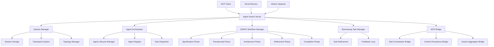
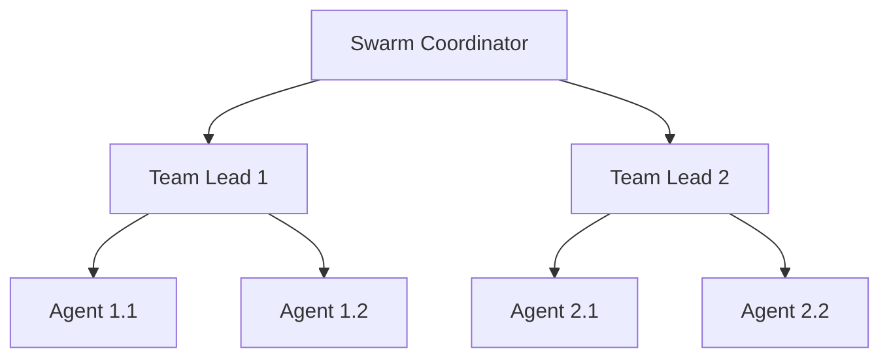
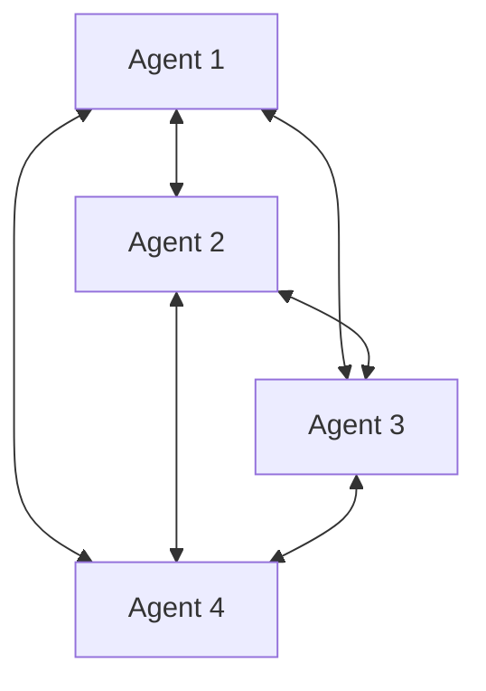
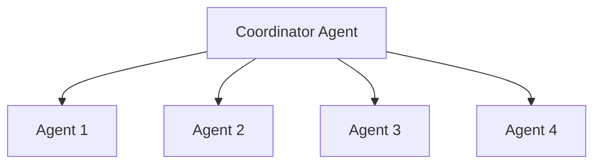

# Phase 9: Agent-Swarm MCP Server

## Overview

The Agent-Swarm MCP server is a sophisticated multi-agent coordination system that manages distributed AI agents, orchestrates complex workflows, and enables intelligent task delegation across specialized agents. It implements the SPARC methodology (Specification → Pseudocode → Architecture → Refinement → Completion) and supports various swarm topologies for optimal agent collaboration.

### Key Features

- **Multi-Agent Coordination**: Manage and coordinate multiple specialized AI agents
- **SPARC Workflow**: Complete workflow execution with Specification, Pseudocode, Architecture, Refinement, and Completion phases
- **Dynamic Topologies**: Support for hierarchical, mesh, star, and dynamic topologies
- **Session Management**: Persistent swarm sessions with checkpointing and recovery
- **Tiered Memory**: Working, episodic, and persistent memory tiers for agents
- **Worker Spawning**: Parallel worker agents for high-throughput task processing
- **Boomerang Pattern**: Task refinement loops with feedback-driven improvements
- **MCP Integration**: Seamless integration with other MCP servers for enhanced capabilities
- **Agent Routing**: Keyword-based intelligent task routing to appropriate agents

## Architecture

### Core Components



### Agent Types and Specializations

The system supports six types of specialized agents:

#### Research Agents
- **Capabilities**: Information gathering, literature review, data collection, competitive intelligence
- **Tools**: Web search, document analysis, data synthesis
- **Use Cases**: Market research, technology investigation, competitive analysis

#### Architect Agents
- **Capabilities**: System design, technical specifications, solution planning
- **Tools**: Architecture design, integration planning, performance modeling
- **Use Cases**: System architecture, API design, solution planning

#### Implementation Agents
- **Capabilities**: Code development, algorithm design, system integration
- **Tools**: Code generation, API development, database design
- **Use Cases**: Feature implementation, bug fixes, performance optimization

#### Testing Agents
- **Capabilities**: Test strategy, test case creation, quality assurance
- **Tools**: Test automation, performance testing, security testing
- **Use Cases**: Unit testing, integration testing, end-to-end testing

#### Review Agents
- **Capabilities**: Code review, quality assessment, compliance checking
- **Tools**: Static analysis, best practice enforcement, risk assessment
- **Use Cases**: Code quality gates, security reviews, compliance checks

#### Documentation Agents
- **Capabilities**: Technical documentation, user guides, API documentation
- **Tools**: Document generation, knowledge base creation, process documentation
- **Use Cases**: API docs, user manuals, developer guides

### Swarm Topologies

#### Hierarchical Topology


#### Mesh Topology


#### Star Topology


## MCP Tools

The Agent-Swarm server provides 33 MCP tools (27 existing + 6 new):

### Core Agent Management Tools

#### `list_agents`
Lists all available agents in the swarm.

**Parameters:**
- `status` (string, optional): Filter agents by status ('idle', 'busy', 'learning', 'error', 'maintenance')
- `type` (string, optional): Filter agents by type ('research', 'architect', 'implementation', 'testing', 'review', 'documentation')

**Returns:**
- `agents`: Array of agent objects with status, capabilities, and current tasks
- `count`: Total number of agents matching criteria

#### `get_agent_status`
Gets detailed status information for a specific agent.

**Parameters:**
- `agentId` (string, required): Agent ID to get status for

**Returns:**
- `agent`: Complete agent information including performance metrics and learning data
- `current_tasks`: Tasks currently assigned to the agent
- `performance_metrics`: Agent performance statistics

#### `delegate_task`
Delegates a task to a specialized agent.

**Parameters:**
- `taskId` (string, required): Unique task identifier
- `description` (string, required): Task description
- `agentType` (string, required): Target agent type
- `priority` (number, default: 1): Task priority (0-4)
- `dependencies` (array, default: []): Task dependencies

**Returns:**
- `task`: Delegated task with assignment details
- `agent`: Information about the assigned agent
- `message`: Delegation confirmation

#### `get_task_status`
Gets the status of a specific task.

**Parameters:**
- `taskId` (string, required): Task ID to get status for

**Returns:**
- `task`: Complete task status information
- `execution_history`: Task execution timeline
- `result_quality`: Quality assessment of completed work

#### `list_tasks`
Lists all tasks with optional filtering.

**Parameters:**
- `status` (string, optional): Filter by status ('pending', 'assigned', 'running', 'completed', 'failed', 'cancelled')
- `agentType` (string, optional): Filter by agent type
- `limit` (number, default: 50): Maximum number of tasks to return

**Returns:**
- `tasks`: Array of task objects
- `count`: Total number of tasks matching criteria

### Workflow and Orchestration Tools

#### `execute_sparc_workflow`
Executes a complete SPARC workflow.

**Parameters:**
- `projectDescription` (string, required): High-level project description
- `requirements` (array, optional): Project requirements
- `constraints` (array, optional): Project constraints

**Returns:**
- `workflow`: Complete SPARC workflow execution results
- `phases`: Results from each SPARC phase
- `artifacts`: Generated artifacts and deliverables

#### `send_boomerang_task`
Sends a task back to a previous agent for refinement.

**Parameters:**
- `taskId` (string, required): Task ID to send back
- `targetAgent` (string, required): Target agent ID or type
- `feedback` (string, required): Feedback for refinement
- `priority` (number, default: 2): Priority for boomerang task

**Returns:**
- `message`: Boomerang task confirmation
- `taskId`: Original task ID
- `targetAgent`: Target agent information

#### `create_agent_team`
Creates a team of agents for coordinated work.

**Parameters:**
- `teamName` (string, required): Name of agent team
- `teamType` (string, required): Type of team ('research', 'development', 'review', 'mixed')
- `agentTypes` (array, required): Types of agents to include in team
- `description` (string, optional): Team description

**Returns:**
- `team`: Created team information
- `agents`: Agents assigned to the team
- `coordination_strategy`: Team coordination approach

#### `route_plan`
Plans which MCP server will be used for a given goal.

**Parameters:**
- `goal` (string, required): User goal or task
- `category` (string, optional): Optional hint ('search', 'code', 'task', 'git')

**Returns:**
- `route`: Selected MCP server route
- `tool`: Specific tool to use
- `available`: Whether the route is available
- `serverPath`: Server configuration status

#### `delegate`
Delegates a goal to the appropriate MCP server.

**Parameters:**
- `goal` (string, required): User goal or query
- `category` (string, optional): Optional hint for routing
- `limit` (number, default: 5): Max search results (for search routes)

**Returns:**
- `result`: Delegation result from target server
- `route`: Route taken
- `execution_time`: Time taken for delegation

### Integration and Communication Tools

#### `integrate_with_mcp_server`
Integrates with an existing MCP server.

**Parameters:**
- `serverName` (string, required): Name of MCP server to integrate with
- `serverType` (string, required): Type of MCP server
- `autoDelegate` (boolean, default: true): Whether to automatically delegate appropriate tasks

**Returns:**
- `integration`: Integration configuration and status
- `capabilities`: Available capabilities from integrated server
- `message`: Integration confirmation

#### `get_agent_capabilities`
Gets capabilities and specializations of a specific agent type.

**Parameters:**
- `agentType` (string, required): Agent type to get capabilities for

**Returns:**
- `agentType`: Agent type information
- `capabilities`: Array of specialized capabilities
- `tools`: Available tools for this agent type

#### `share_knowledge`
Shares knowledge between agents in the swarm.

**Parameters:**
- `fromAgentId` (string, required): Source agent ID
- `toAgentId` (string, optional): Target agent ID (optional, for broadcast leave empty)
- `knowledgeType` (string, required): Type of knowledge being shared
- `content` (object, required): Knowledge content
- `context` (object, optional): Context information

**Returns:**
- `message`: Knowledge sharing confirmation
- `knowledge_id`: Unique identifier for shared knowledge
- `recipients`: List of agents that received the knowledge

### Phase 9 Enhancement Tools

#### `swarm_session_create`
Creates a new swarm session with specified topology.

**Parameters:**
- `projectId` (string, required): Project ID for this session
- `name` (string, required): Session name
- `topology` (string, required): Swarm topology type ('hierarchical', 'mesh', 'star', 'dynamic')
- `description` (string, optional): Session description
- `maxAgents` (number, default: 10): Maximum number of agents

**Returns:**
- `session`: Created session information
- `topology_config`: Topology configuration details
- `agent_assignments`: Initial agent assignments

#### `swarm_session_resume`
Resumes a paused or saved swarm session.

**Parameters:**
- `sessionId` (string, required): Session ID to resume
- `checkpointId` (string, optional): Checkpoint ID to resume from

**Returns:**
- `session`: Resumed session information
- `restored_state`: Restored session state
- `active_agents`: Currently active agents

#### `swarm_checkpoint`
Creates a checkpoint of current swarm session state.

**Parameters:**
- `sessionId` (string, required): Session ID to checkpoint
- `reason` (string, default: 'manual'): Reason for checkpoint

**Returns:**
- `checkpoint`: Checkpoint information
- `session_state`: Captured session state
- `timestamp`: Checkpoint creation time

#### `swarm_session_list`
Lists all swarm sessions with optional filters.

**Parameters:**
- `projectId` (string, optional): Filter by project ID
- `status` (string, optional): Filter by status ('initializing', 'active', 'paused', 'completed', 'failed', 'terminated')
- `topology` (string, optional): Filter by topology

**Returns:**
- `sessions`: Array of session objects
- `count`: Total sessions matching criteria
- `statistics`: Session statistics

#### `spawn_worker_agents`
Spawns parallel worker agents for task processing.

**Parameters:**
- `agentType` (string, required): Type of workers to spawn
- `count` (number, default: 3): Number of workers to spawn
- `poolId` (string, optional): Worker pool ID (creates new pool if not specified)

**Returns:**
- `workers`: Array of spawned worker agents
- `pool_id`: Worker pool identifier
- `spawn_status`: Spawning operation status

#### `worker_pool_create`
Creates a new worker pool for managing parallel agents.

**Parameters:**
- `name` (string, required): Pool name
- `agentType` (string, required): Agent type for this pool
- `minWorkers` (number, default: 1): Minimum number of workers
- `maxWorkers` (number, default: 10): Maximum number of workers
- `loadBalanceStrategy` (string, default: 'least-loaded'): Load balancing strategy ('round-robin', 'least-loaded', 'random', 'weighted', 'priority')

**Returns:**
- `pool`: Created worker pool information
- `configuration`: Pool configuration details
- `initial_workers`: Initially spawned workers

#### `worker_pool_stats`
Gets statistics for a worker pool.

**Parameters:**
- `poolId` (string, required): Pool ID to get stats for

**Returns:**
- `pool_id`: Pool identifier
- `stats`: Comprehensive pool statistics
- `performance_metrics`: Worker performance data

#### `memory_store_tiered`
Stores value in tiered memory (working/episodic/persistent).

**Parameters:**
- `key` (string, required): Memory key
- `value` (object, required): Value to store
- `tier` (string, default: 'working'): Memory tier ('working', 'episodic', 'persistent')
- `category` (string, default: 'context'): Memory category ('task', 'learning', 'interaction', 'context', 'pattern', 'knowledge')
- `agentId` (string, optional): Associated agent ID
- `importance` (number, default: 0.5): Importance score (0-1)
- `tags` (array, optional): Tags for categorization
- `isPinned` (boolean, default: false): Prevent auto-demotion

**Returns:**
- `entry`: Stored memory entry information
- `tier`: Memory tier used
- `storage_metadata`: Storage operation metadata

#### `memory_retrieve`
Retrieves value from tiered memory.

**Parameters:**
- `key` (string, required): Memory key to retrieve
- `tier` (string, optional): Specific tier to search (searches all if not specified)

**Returns:**
- `value`: Retrieved value or null if not found
- `metadata`: Entry metadata
- `access_history`: Access history for this key

#### `memory_search`
Searches memory by criteria.

**Parameters:**
- `tier` (string, optional): Filter by tier
- `category` (string, optional): Filter by category
- `agentId` (string, optional): Filter by agent ID
- `tags` (array, optional): Filter by tags
- `minImportance` (number, optional): Minimum importance score
- `limit` (number, default: 10): Maximum results to return

**Returns:**
- `results`: Array of matching memory entries
- `count`: Total matches found
- `search_metadata`: Search operation metadata

#### `memory_stats`
Gets tiered memory statistics.

**Parameters:**
- None

**Returns:**
- `stats`: Comprehensive memory statistics
- `tier_usage`: Usage statistics per tier
- `performance_metrics`: Memory performance data

## Configuration

### Environment Variables

```bash
# Swarm Configuration
SWARM_MAX_AGENTS=50
SWARM_DEFAULT_TOPOLOGY=hierarchical
SWARM_SESSION_TIMEOUT=3600
SWARM_CHECKPOINT_INTERVAL=300

# Agent Configuration
AGENT_LIFECYCLE_CHECK_INTERVAL=60
AGENT_LEARNING_RATE=0.01
AGENT_PERFORMANCE_WINDOW=100
AGENT_MAX_CONCURRENT_TASKS=5

# Memory Configuration
MEMORY_WORKING_TIER_SIZE=1000
MEMORY_EPISODIC_TIER_SIZE=10000
MEMORY_PERSISTENT_TIER_SIZE=100000
MEMORY_DEMOTION_INTERVAL=3600

# Worker Pool Configuration
WORKER_POOL_DEFAULT_SIZE=3
WORKER_POOL_MAX_SIZE=20
WORKER_SPAWN_TIMEOUT=30
WORKER_LOAD_BALANCE_STRATEGY=least-loaded

# SPARC Workflow Configuration
SPARC_PHASE_TIMEOUT=1800
SPARC_MAX_ITERATIONS=3
SPARC_FEEDBACK_ENABLED=true
SPARC_ARTIFACT_RETENTION=7

# MCP Integration
MCP_BRIDGE_TIMEOUT=30000
MCP_AUTO_DELEGATION=true
MCP_RETRY_ATTEMPTS=3
MCP_RETRY_BACKOFF=1000

# Logging and Monitoring
SWARM_LOG_LEVEL=INFO
SWARM_METRICS_ENABLED=true
SWARM_AUDIT_LOG=true
SWARM_PERFORMANCE_TRACKING=true
```

### Dependencies

#### Node.js Dependencies (package.json)

```json
{
  "dependencies": {
    "@modelcontextprotocol/sdk": "^1.0.0",
    "eventemitter3": "^5.0.0",
    "uuid": "^9.0.0",
    "sqlite3": "^5.1.0",
    "node-cron": "^3.0.0",
    "lodash": "^4.17.0"
  },
  "devDependencies": {
    "@types/node": "^20.0.0",
    "@types/uuid": "^9.0.0",
    "@types/lodash": "^4.14.0",
    "typescript": "^5.0.0",
    "jest": "^29.0.0",
    "@types/jest": "^29.0.0"
  }
}
```

#### External Services

- **Task Orchestrator MCP**: For task management and execution
- **Context Persistence MCP**: For memory and knowledge storage
- **Search Aggregator MCP**: For research and information gathering
- **External MCP Servers**: Optional integrations (context7, mcp-code-checker)

## Usage Examples

### Basic Agent Management

```typescript
import { AgentSwarmClient } from '@mcp/agent-swarm';

const client = new AgentSwarmClient();

// List available agents
const agents = await client.listAgents({
  type: 'implementation',
  status: 'idle'
});

console.log('Available implementation agents:', agents.count);
agents.agents.forEach(agent => {
  console.log(`- ${agent.name} (${agent.id}): ${agent.capabilities.join(', ')}`);
});

// Get detailed agent status
const agentStatus = await client.getAgentStatus('agent-123');
console.log('Agent performance:', agentStatus.agent.performanceMetrics);
```

### Task Delegation

```typescript
// Delegate task to specialized agent
const task = await client.delegateTask({
  taskId: 'task-456',
  description: 'Implement REST API for user management with authentication',
  agentType: 'implementation',
  priority: 4,
  dependencies: ['task-455'] // Depends on database schema
});

console.log(`Task delegated to agent: ${task.agent.id}`);
console.log(`Expected completion: ${task.estimatedCompletion}`);

// Get task status
const status = await client.getTaskStatus('task-456');
console.log('Current status:', status.task.status);
console.log('Progress:', status.execution_history);
```

### SPARC Workflow Execution

```typescript
// Execute complete SPARC workflow
const workflow = await client.executeSPARCWorkflow({
  projectDescription: 'Build a microservices-based e-commerce platform',
  requirements: [
    'Support user authentication and authorization',
    'Handle product catalog with search and filtering',
    'Process orders and payments',
    'Scale horizontally for high traffic'
  ],
  constraints: [
    'Must use Node.js and TypeScript',
    'Deploy to AWS',
    'Handle 10,000 concurrent users'
  ]
});

console.log('SPARC Workflow Results:');
console.log('Specification:', workflow.phases.specification);
console.log('Pseudocode:', workflow.phases.pseudocode);
console.log('Architecture:', workflow.phases.architecture);
console.log('Refinement:', workflow.phases.refinement);
console.log('Completion:', workflow.phases.completion);
```

### Swarm Session Management

```typescript
// Create new swarm session
const session = await client.swarmSessionCreate({
  projectId: 'ecommerce-platform',
  name: 'E-commerce Development Session',
  topology: 'hierarchical',
  description: 'Develop microservices e-commerce platform',
  maxAgents: 15
});

console.log('Session created:', session.session.id);
console.log('Topology:', session.topology_config.type);

// Add agents to session
await client.spawnWorkerAgents({
  agentType: 'implementation',
  count: 5,
  poolId: `session-${session.session.id}-impl`
});

await client.spawnWorkerAgents({
  agentType: 'testing',
  count: 3,
  poolId: `session-${session.session.id}-test`
});

// Create checkpoint
const checkpoint = await client.swarmCheckpoint({
  sessionId: session.session.id,
  reason: 'Major milestone completed'
});

console.log('Checkpoint created:', checkpoint.checkpoint.id);
```

### Memory Management

```typescript
// Store learning in tiered memory
await client.memoryStoreTiered({
  key: 'api-design-pattern-learned',
  value: {
    pattern: 'Repository pattern with dependency injection',
    context: 'Used in user service implementation',
    effectiveness: 'high'
  },
  tier: 'episodic',
  category: 'learning',
  agentId: 'agent-architect-789',
  importance: 0.8,
  tags: ['architecture', 'patterns', 'api'],
  isPinned: true
});

// Search memory
const searchResults = await client.memorySearch({
  category: 'learning',
  agentId: 'agent-architect-789',
  tags: ['patterns'],
  minImportance: 0.7,
  limit: 10
});

searchResults.results.forEach(result => {
  console.log(`Found: ${result.key} (${result.importance})`);
  console.log(`Content: ${JSON.stringify(result.value)}`);
});

// Get memory statistics
const stats = await client.memoryStats();
console.log('Memory usage by tier:', stats.tier_usage);
console.log('Total entries:', stats.total_entries);
```

### Worker Pool Management

```typescript
// Create worker pool
const pool = await client.workerPoolCreate({
  name: 'api-development-pool',
  agentType: 'implementation',
  minWorkers: 2,
  maxWorkers: 8,
  loadBalanceStrategy: 'least-loaded'
});

console.log('Worker pool created:', pool.pool.id);
console.log('Initial workers:', pool.initial_workers.length);

// Get pool statistics
const poolStats = await client.workerPoolStats(pool.pool.id);
console.log('Active workers:', poolStats.stats.active_workers);
console.log('Tasks completed:', poolStats.stats.tasks_completed);
console.log('Average task time:', poolStats.stats.avg_task_time);
```

### Knowledge Sharing

```typescript
// Share knowledge between agents
await client.shareKnowledge({
  fromAgentId: 'agent-research-123',
  toAgentId: 'agent-architect-456',
  knowledgeType: 'research-findings',
  content: {
    topic: 'authentication best practices',
    findings: [
      'JWT tokens are preferred over sessions',
      'Implement rate limiting',
      'Use HTTPS everywhere'
    ],
    sources: ['security-guidelines.com', 'owasp.org']
  },
  context: {
    project: 'ecommerce-platform',
    urgency: 'high'
  }
});

// Broadcast knowledge to all agents
await client.shareKnowledge({
  fromAgentId: 'agent-lead-789',
  knowledgeType: 'project-update',
  content: {
    milestone: 'Authentication module completed',
    next_phase: 'Product catalog development'
  }
  // No toAgentId means broadcast
});
```

### Boomerang Pattern

```typescript
// Send task back for refinement
await client.sendBoomerangTask({
  taskId: 'task-api-123',
  targetAgent: 'agent-architect-456',
  feedback: 'API implementation needs better error handling and input validation',
  priority: 3
});

console.log('Boomerang task sent for refinement');

// The architect agent will receive the task and can:
// 1. Analyze the feedback
// 2. Refine the implementation approach
// 3. Send back improved solution
// 4. Update the original task with improvements
```

## API Reference

### Core Classes

#### `AgentSwarmClient`

Main client class for interacting with the Agent-Swarm server.

```typescript
class AgentSwarmClient {
  constructor(baseURL?: string);
  
  // Agent management
  async listAgents(options?: ListAgentsOptions): Promise<ListAgentsResponse>;
  async getAgentStatus(agentId: string): Promise<GetAgentStatusResponse>;
  async delegateTask(options: DelegateTaskOptions): Promise<DelegateTaskResponse>;
  async getTaskStatus(taskId: string): Promise<GetTaskStatusResponse>;
  async listTasks(options?: ListTasksOptions): Promise<ListTasksResponse>;
  
  // Workflow and orchestration
  async executeSPARCWorkflow(options: ExecuteSPARCOptions): Promise<SPARCResponse>;
  async sendBoomerangTask(options: BoomerangOptions): Promise<BoomerangResponse>;
  async createAgentTeam(options: CreateTeamOptions): Promise<CreateTeamResponse>;
  
  // Routing and delegation
  async routePlan(options: RoutePlanOptions): Promise<RoutePlanResponse>;
  async delegate(options: DelegateOptions): Promise<DelegateResponse>;
  
  // Integration and communication
  async integrateWithMCPServer(options: IntegrationOptions): Promise<IntegrationResponse>;
  async getAgentCapabilities(agentType: string): Promise<CapabilitiesResponse>;
  async shareKnowledge(options: ShareKnowledgeOptions): Promise<ShareKnowledgeResponse>;
  
  // Phase 9 enhancements
  async swarmSessionCreate(options: SessionCreateOptions): Promise<SessionCreateResponse>;
  async swarmSessionResume(options: SessionResumeOptions): Promise<SessionResumeResponse>;
  async swarmCheckpoint(options: CheckpointOptions): Promise<CheckpointResponse>;
  async swarmSessionList(options?: SessionListOptions): Promise<SessionListResponse>;
  async spawnWorkerAgents(options: SpawnWorkersOptions): Promise<SpawnWorkersResponse>;
  async workerPoolCreate(options: CreatePoolOptions): Promise<CreatePoolResponse>;
  async workerPoolStats(poolId: string): Promise<PoolStatsResponse>;
  async memoryStoreTiered(options: MemoryStoreOptions): Promise<MemoryStoreResponse>;
  async memoryRetrieve(key: string, tier?: string): Promise<MemoryRetrieveResponse>;
  async memorySearch(options: MemorySearchOptions): Promise<MemorySearchResponse>;
  async memoryStats(): Promise<MemoryStatsResponse>;
}
```

#### `Agent`

Agent data model.

```typescript
interface Agent {
  id: string;
  name: string;
  type: AgentType;
  status: AgentStatus;
  capabilities: string[];
  currentTasks: Task[];
  performanceMetrics: PerformanceMetrics;
  learningData: LearningData;
  createdAt: string;
  lastActive: string;
}
```

#### `SPARCWorkflowResult`

SPARC workflow execution result.

```typescript
interface SPARCWorkflowResult {
  projectDescription: string;
  phases: {
    specification: SpecificationResult;
    pseudocode: PseudocodeResult;
    architecture: ArchitectureResult;
    refinement: RefinementResult;
    completion: CompletionResult;
  };
  artifacts: WorkflowArtifact[];
  executionTime: number;
  success: boolean;
}
```

#### `SwarmSession`

Swarm session data model.

```typescript
interface SwarmSession {
  id: string;
  projectId: string;
  name: string;
  topology: TopologyType;
  status: SessionStatus;
  agents: Agent[];
  tasksCompleted: number;
  tasksTotal: number;
  startedAt: string;
  lastActiveAt: string;
  checkpoints: Checkpoint[];
  config: SessionConfig;
}
```

## Best Practices

### Swarm Organization

1. **Topology Selection**: Choose appropriate topology based on project complexity and team size
2. **Agent Specialization**: Use specialized agents for specific task types
3. **Load Balancing**: Distribute tasks evenly across capable agents
4. **Session Management**: Use sessions for complex, multi-phase projects
5. **Checkpointing**: Create regular checkpoints for long-running sessions

### Memory Management

1. **Tier Strategy**: Use working memory for immediate tasks, episodic for experiences, persistent for knowledge
2. **Importance Scoring**: Assign appropriate importance scores for memory retention
3. **Regular Cleanup**: Demote or archive old memory entries
4. **Knowledge Sharing**: Share important learnings across agents
5. **Privacy Considerations**: Be mindful of sensitive data in persistent memory

### Performance Optimization

1. **Parallel Processing**: Use worker pools for high-throughput scenarios
2. **Resource Management**: Monitor and optimize agent resource usage
3. **Caching**: Cache frequently accessed data and computations
4. **Async Operations**: Use async/await for all concurrent operations
5. **Timeout Management**: Set appropriate timeouts for different operations

### Workflow Design

1. **SPARC Methodology**: Follow Specification → Pseudocode → Architecture → Refinement → Completion
2. **Feedback Loops**: Use boomerang pattern for iterative improvement
3. **Quality Gates**: Implement quality checks between phases
4. **Artifact Management**: Track and manage artifacts from each phase
5. **Rollback Strategy**: Plan for rollback points and recovery

## Performance Tuning

### Swarm Configuration

```typescript
// Configure swarm behavior
const swarmConfig = {
  maxAgents: 50,
  defaultTopology: 'hierarchical',
  sessionTimeout: 3600000, // 1 hour
  checkpointInterval: 300000, // 5 minutes
  agentLifecycleCheckInterval: 60000, // 1 minute
  performanceTrackingWindow: 100
};
```

### Memory Optimization

```typescript
// Configure memory tiers
const memoryConfig = {
  workingTier: {
    maxSize: 1000,
    evictionPolicy: 'lru',
    ttl: 3600 // 1 hour
  },
  episodicTier: {
    maxSize: 10000,
    evictionPolicy: 'lfu', // least frequently used
    ttl: 86400 // 24 hours
  },
  persistentTier: {
    maxSize: 100000,
    compressionEnabled: true,
    indexingEnabled: true
  }
};
```

### Worker Pool Optimization

```typescript
// Configure worker pools
const poolConfig = {
  defaultSize: 3,
  maxSize: 20,
  spawnTimeout: 30000,
  loadBalanceStrategy: 'least-loaded',
  healthCheckInterval: 30000,
  maxIdleTime: 600000 // 10 minutes
};
```

## Troubleshooting

### Common Issues

#### Agent Communication Failures

**Symptoms**: Agents not responding or communication timeouts
**Solutions**:
1. Check network connectivity between swarm components
2. Verify agent status and health checks
3. Review message routing and addressing
4. Check for deadlocks or circular dependencies
5. Implement retry logic with exponential backoff

#### Session Management Problems

**Symptoms**: Sessions not persisting or checkpoint failures
**Solutions**:
1. Check database permissions and disk space
2. Verify session configuration and timeouts
3. Review checkpoint creation and restoration logic
4. Check for concurrent session conflicts
5. Validate session state serialization

#### Memory Issues

**Symptoms**: Memory not storing or retrieving correctly
**Solutions**:
1. Check memory tier configuration and limits
2. Verify key formatting and validation
3. Review demotion and eviction policies
4. Check for memory leaks or corruption
5. Validate search indexing and queries

#### Performance Degradation

**Symptoms**: Slow response times or high resource usage
**Solutions**:
1. Monitor agent performance metrics and bottlenecks
2. Optimize task distribution and load balancing
3. Review worker pool sizing and configuration
4. Check for memory leaks or excessive caching
5. Profile and optimize critical code paths

### Debug Mode

Enable debug logging:

```typescript
// Set log level
process.env.SWARM_LOG_LEVEL = 'debug';

// Or via configuration
const client = new AgentSwarmClient({
  baseURL: 'http://localhost:8000',
  logLevel: 'debug'
});
```

### Health Monitoring

```typescript
// Check swarm health
const health = await client.getSwarmHealth();

// Monitor agent performance
const metrics = await client.getPerformanceMetrics();

// Check memory health
const memoryHealth = await client.getMemoryHealth();

// Monitor worker pools
const poolStats = await client.workerPoolStats('default-pool');
```

## Integration Examples

### Integration with Task Orchestrator

```typescript
// Delegate complex task to swarm
const taskResult = await swarmClient.executeSPARCWorkflow({
  projectDescription: 'Implement user authentication system'
});

// Create tasks in orchestrator from swarm results
for (const phase of Object.values(taskResult.phases)) {
  await taskClient.createTask({
    title: phase.title,
    description: phase.description,
    priority: phase.priority,
    tags: phase.tags
  });
}
```

### Integration with Context-Persistence

```typescript
// Store swarm session in context
await contextClient.storeConversation({
  messages: [
    { role: 'system', content: 'Swarm session started' },
    { role: 'user', content: session.projectDescription }
  ],
  session_id: `swarm-${session.id}`,
  metadata: {
    type: 'swarm_session',
    topology: session.topology,
    agents: session.agents.length
  }
});

// Store agent learning in persistent memory
for (const agent of session.agents) {
  if (agent.learningData.insights.length > 0) {
    await contextClient.memoryStore({
      key: `agent-${agent.id}-insights`,
      value: agent.learningData.insights,
      tier: 'persistent',
      category: 'learning'
    });
  }
}
```

### Integration with Search-Aggregator

```typescript
// Use swarm for research tasks
const researchTask = await swarmClient.delegateTask({
  taskId: `research-${Date.now()}`,
  description: 'Research competitor authentication solutions',
  agentType: 'research'
});

// Research agent can use search aggregator
const searchResults = await searchClient.executeParallelSearch({
  queries: [
    'OAuth 2.0 best practices',
    'JWT security considerations',
    'Multi-factor authentication trends'
  ]
});

// Store research results in swarm memory
await swarmClient.memoryStoreTiered({
  key: 'auth-research-findings',
  value: searchResults.merged_results,
  tier: 'episodic',
  category: 'research'
});
```

## Migration and Deployment

### Database Migration

```typescript
// Initialize swarm database
import { SwarmDatabase } from './database';

const db = new SwarmDatabase();
await db.initialize();
await db.migrateToLatest();
```

### Docker Deployment

```dockerfile
FROM node:18-alpine

WORKDIR /app

# Install dependencies
COPY package*.json ./
RUN npm ci --only=production

# Copy source code
COPY . .

# Build TypeScript
RUN npm run build

# Create data directories
RUN mkdir -p /app/data /app/logs

# Expose port
EXPOSE 8000

# Run application
CMD ["node", "dist/index.js"]
```

### Kubernetes Deployment

```yaml
apiVersion: apps/v1
kind: Deployment
metadata:
  name: agent-swarm
spec:
  replicas: 3
  selector:
    matchLabels:
      app: agent-swarm
  template:
    metadata:
      labels:
        app: agent-swarm
    spec:
      containers:
      - name: agent-swarm
        image: agent-swarm:latest
        ports:
        - containerPort: 8000
        env:
        - name: SWARM_MAX_AGENTS
          value: "50"
        - name: SWARM_DEFAULT_TOPOLOGY
          value: "hierarchical"
        resources:
          requests:
            memory: "1Gi"
            cpu: "500m"
          limits:
            memory: "2Gi"
            cpu: "1000m"
        volumeMounts:
        - name: data-volume
          mountPath: /app/data
        - name: logs-volume
          mountPath: /app/logs
      volumes:
      - name: data-volume
        persistentVolumeClaim:
          claimName: agent-swarm-data
      - name: logs-volume
        persistentVolumeClaim:
          claimName: agent-swarm-logs
```

## Testing

### Unit Tests

```typescript
import { AgentSwarmClient } from '../src/client';

describe('AgentSwarmClient', () => {
  let client: AgentSwarmClient;

  beforeEach(() => {
    client = new AgentSwarmClient('http://localhost:8000');
  });

  test('should list agents', async () => {
    const agents = await client.listAgents();
    
    expect(agents.agents).toBeDefined();
    expect(agents.count).toBeGreaterThanOrEqual(0);
  });

  test('should delegate task', async () => {
    const task = await client.delegateTask({
      taskId: 'test-task-1',
      description: 'Test task description',
      agentType: 'implementation'
    });

    expect(task.task.id).toBeDefined();
    expect(task.task.agentId).toBeDefined();
  });
});
```

### Integration Tests

```typescript
import { setupTestEnvironment } from './test-setup';

describe('Agent Swarm Integration', () => {
  beforeAll(async () => {
    await setupTestEnvironment();
  });

  test('should execute complete SPARC workflow', async () => {
    const client = new AgentSwarmClient();
    
    const workflow = await client.executeSPARCWorkflow({
      projectDescription: 'Build a simple REST API'
    });
    
    expect(workflow.success).toBe(true);
    expect(workflow.phases.specification).toBeDefined();
    expect(workflow.phases.pseudocode).toBeDefined();
    expect(workflow.phases.architecture).toBeDefined();
    expect(workflow.phases.refinement).toBeDefined();
    expect(workflow.phases.completion).toBeDefined();
  });

  test('should manage swarm session lifecycle', async () => {
    const client = new AgentSwarmClient();
    
    // Create session
    const session = await client.swarmSessionCreate({
      projectId: 'test-project',
      name: 'Test Session',
      topology: 'hierarchical'
    });
    
    // Create checkpoint
    const checkpoint = await client.swarmCheckpoint({
      sessionId: session.session.id,
      reason: 'Test checkpoint'
    });
    
    // Resume session
    const resumed = await client.swarmSessionResume({
      sessionId: session.session.id,
      checkpointId: checkpoint.checkpoint.id
    });
    
    expect(resumed.session.id).toBe(session.session.id);
    expect(resumed.session.status).toBe('active');
  });
});
```

### Performance Tests

```typescript
import { performance } from 'perf_hooks';

describe('Performance Tests', () => {
  test('should handle concurrent task delegation efficiently', async () => {
    const client = new AgentSwarmClient();
    const startTime = performance.now();
    
    const promises = Array.from({ length: 100 }, (_, i) =>
      client.delegateTask({
        taskId: `perf-test-${i}`,
        description: `Performance test task ${i}`,
        agentType: 'implementation'
      })
    );
    
    await Promise.all(promises);
    const endTime = performance.now();
    
    const totalTime = endTime - startTime;
    const avgTime = totalTime / 100;
    
    console.log(`Delegated 100 tasks in ${totalTime}ms`);
    console.log(`Average time per task: ${avgTime}ms`);
    
    expect(avgTime).toBeLessThan(100); // Should be under 100ms per task
  });
});
```

## Contributing

### Development Setup

```bash
# Clone repository
git clone <repository-url>
cd agent-swarm

# Install dependencies
npm install

# Build TypeScript
npm run build

# Run tests
npm test

# Start development server
npm run dev
```

### Code Style

- Follow TypeScript best practices and strict typing
- Use ESLint and Prettier for code formatting
- Write comprehensive JSDoc comments
- Maintain test coverage above 90%
- Use async/await for all asynchronous operations

### Pull Request Process

1. Fork the repository
2. Create feature branch from main
3. Write tests for new functionality
4. Ensure all tests pass and coverage is maintained
5. Update documentation for any API changes
6. Submit pull request with clear description and testing instructions